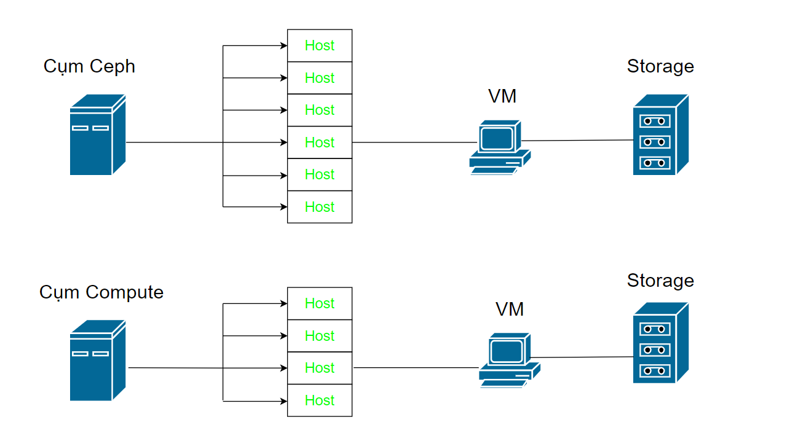

# BÁO CÁO HỖ TRỢ ỨNG CỨU THÔNG TIN TẠI CÔNG TY VNPost

# 1.Mô hình hệ thống 



Hệ thống hiện tại đang chia thành 2 bao gồm cụm Ceph và cụm Compute 

**Cụm Ceph**

- Bao gồm 6 host 
- Ram nhỏ 
- Storage lưu trữ lớn 
- Storage cục bộ không chia sẻ dữ liệu 

**Cụm Compute**

- Bao gồm 4 host
- Ram lớn hơn so với Cụm Ceph
- Disk chỉ lưu trữ OS chứ không bao gồm data
- Sử dụng Tủ đĩa SAN có thể chia sẻ lưu trữ data

# 2. Thông tin tìm hiểu trong quá trình hỗ trợ 

## 2.1.Kết nối SSL VPN bằng phần mềm GlobalProtect trên PC

Sử dụng tài liệu hướng dẫn nội bộ

## 2.2. Tìm hiểu tủ đĩa SAN , NAS , storage , CEPH , San Sw, mô hình HA

- SAN , CEPH đọc dữ liệu ở dạng block còn NAS đọc dữ liệu ở dạng file dữ liệu 
- Tốc độ đọc của tủ đĩa SAN nhanh hơn CEPH và NAS 
- Khi các thiết bi kết nối với tủ đĩa SAN cần kết nối qua 1 con SAN SW 
- Khi các thiết bị kết nối đến NAS hay CEPH thì cần thông qua SW Leaf-spine
- Có nói về storage trên mỗi loại nhưng e chưa nhớ 
- Giá thành của SAN đắt hơn nhiều so với 2 loại kia 
- CEPH sẽ sử dụng mô hình HA , với việc có 3 server CEPH , 1 con chính và 2 con trực chờ con 1 chết để lên thay

## 2.3.Các cách để di chuyển dữ liệu từ VM cũ sang 1 VM mới 

1. Tháo ổ đĩa trên vm cũ rồi mount vào vm mới - nhược điểm : nếu có lỗi k thể cancle - gây ảnh hưởng đến storage , phù hợp với dữ liệu lưu trung trên 1 SAN
2. sử dụng scp - download qua mạng từ vm cũ về vm mới - yêu cầu tạo ổ đĩa mới trên vm sau đó mount ổ đĩa mới trên vm mới để lấy không gian lưu trữ 

## 2.4.Mục đích clone VM 
- Rút ngắn thời gian cài đặt 
- Kế thừa các vm cũ đã cài đặt 
- Hạn chế việc môi trường vm không đồng nhất


## Thao tác sử dụng cơ bản trên VSphere
1. Power : Bao gồm những hành động bật, tắt , tạm dừng , reset , tắt cứng , tắt bằng hệ thống và restart bằng hệ thống 

2. Snapshot: Bản snapshot trên VM giúp quản trị viên có thể reverse lại dữ liệu về thời điểm tạo snapshot , sử dụng trong trường hợp update nhưng gặp lỗi , khi đó ta reverses lại về thời điểm ta tạo snapshot để update lại nhằm sửa lại lỗi trước đo s
Tuy nhiên trong trường hợp tạo snapshot nhưng OS dính mã độc hoặc bị tấn công gây ảnh hưởng đến hệ điều hành làm mất dữ liệu hoặc mất thông tin, bản snapshot có thể không thể sử dụng 

3. di chuyển storage hay các host 
4. Clone : để tối ưu thời gian khi xây dựng hệ thống , ta sẽ clone những VM cũ cùng loại để tăng tiến độ 
5. Template: Tạo các mẫu OS , các mẫu này sẽ đóng gói các VM mẫu vào từng gói , nhằm di chuyển và xây dựng hệ thống mới dễ dàng , có thể tải về usb và đem sang deploy hệ thống mới 
6. Edit setting : chỉnh sửa các thông số của 1 VM , bao gồm cpu,ram,ổ đĩa,card mạng , .....

# 3. Công việc hỗ trợ 

## 3.1. Thay đổi IP và VLAN theo phân hoạch sẵn

- Thao tác trên Redhat, Ubuntu, Windows
- Cấu hình IP và VLAN mặt trong đúng với mô hình 
- Kiểm tra đã thông dải khi ping qua gateway 
- Báo lại trường hợp dải chưa thông hoặc chưa được cấp dải 

Sử dụng lệnh dưới để có thể đổi IP nhanh hơn 

```
ip addr add 172.22.5.12/25 dev ens192
ip route add default via 172.22.5.126 dev ens192

```

## 3.2. Thêm ổ đĩa và phân vùng ổ đĩa mới trên VM

- `lsblk` : show disk dang co tren he thong , sau khi kiểm tra được tên ổ đĩa mới trên hệ thống ta sẽ tạo phần vùng mới trên ổ đĩa đó 
- `fdisk /dev/sdb` : tạo phân vùng mới trên ổ đĩa 
- `mkfs.ext4 /dev/sdb1` : Fomat định dạng lại ổ đĩa vừa phân vùng 
- `mount /dev/sdc1 /mnt/mydisk` : Mount ổ đĩa mới vào hệ thống 
- Để cho ổ đĩa mount tự động ta cần cấu hình trong file fstab 

## 3.3. Clone VM

- Rename VM cũ , tắt card mạng để tránh trùng IP sau khi cài IP trên VM mới 
- Clone VM cũ ra VM mới , trong quá trình set up ta cũng nên tắt connect card mạng của con mới , sau khi cài đặt IP thì mới bật 

## 3.4. Phân tích Migrate VM

1. Migrate HTTC-Web-02/HTTC-Web-03/HTKH-Web-01/HTKH-Web-03
Từ DS_95_3916 - host 10.193.32.95
Sang  DS_98_3916 - host 10.193.32.98
Mục đích giải phóng memory do host 95 gần đầy memory

2. Migrate CAS-L2-01 / remote-Mtips
Từ DS_94_3916 - host 10.193.32.94
Sang DS_98_3916 - host 10.193.32.98
Mục đích giải phóng Storage do host 94 gần đầy memory


## 3.5. Cài đặt Repo local trên VM

- Tải bản OS đầy đủ của phiên bản OS
- Mount ổ đĩa vào hệ thống cần cài repo
- Cấu hình file config đường dẫn repo cài đặt 
- Lưu lại ổ đĩa hoặc Umount trong trường hợp cần thiết 