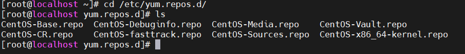

# Tìm hiểu về YUM

# 1. Tổng quan về YUM

## 1.1. Khái niệm
**YUM (Yellowdog Updater Modified)** là một mã nguồn mở command-line, được dùng để quản lý các package trên Linux dựa trên RPM (RedHat Package Manager). Nó giúp người quản trị Linux dễ dàng cài đặt, gỡ bỏ, cập nhật các phiên bản của các phần mềm trên hệ thống.

YUM được phát triển và phát hành dưới dạng [mã nguồn mở] (open source), có nghĩa là bất kỳ ai cũng có thể tải mã nguồn xuống và thay đổi mã code bên trong để tạo ra một phiên bản nâng cấp khác. YUM sử dụng kho lưu trữ (repo) của bên thứ ba để tự động cài đặt các package bằng cách xử lý những phụ thuộc (dependencies) của chúng.


Mặc dù có thể lấy các gói cài từ mã nguồn mở trên mạng internet , tuy nhiên ta cũng có thể tạo ra một `Yum server` cho riêng mình và sử dụng 
Để có thể tạo được riêng cho mình 1 kho lưu trữ , ta cần tải các gói cài đặt về kho , tạo thông tin cấu trúc cho kho lưu trữ nhằm truy vấn dễ dàng và nhanh hơn trong việc tìm gói cài . Sau khi có được kho lưu trữ riêng thì ta sẽ public gói cài để `yum client` có thể lấy gói cài 

Từ phía client ta cần khai báo `yum server` , giúp cho client có liên kết để khi truy vấn tìm gói cài sẽ chủ động liên kết với `yum server` 

## 1.2. Một số lệnh thường dùng với YUM

- **yum install**: Dùng để cài đặt package
- **yum update**: Dùng để cập nhật package
- **yum check update**: Dùng để kiểm tra package đang có bản update nào hay không
- **yum upgrade**: Có công dụng giống lệnh update, nhưng nó có thêm cờ obsoletes.
- **yum remove, yum erase**: Xóa package ra khỏi hệ thống, xóa luôn những phần mềm phụ thuộc.
- **yum list**: Hiển thị thông tin chi tiết các package
- **yum search**: Tìm kiếm một package theo tên
- **yum install**: Cài đặt lại các package


# 2. Tạo kho lưu trữ packages cho YUM

**YUM Server**
1. Ta sẽ tạo 1 folder với tên là softwaresdt để lưu trữ gói cài đặt 

```
mkdir /softwaresdt
```
Copy các file cài đặt từ ổ đĩa quang 

```
cp /mnt/Packages/*.rpm /softwaresdt/
```

2. Tạo thông tin cấu trúc cho kho lưu trữ , giúp truy vấn dữ liệu nhanh hơn giúp giảm thời gian tìm các gói cài đặt trong kho

```
createrepo --update /softwaresdt/
```


Sau khi tạo thông tin cấu trúc cho repo , ta sẽ thấy thêm mới 1 folder repodata, bây giờ ta đã có kho phần mềm


3. Public repo với client

**YUM Client**
4. Khai báo yum server với yum client

Ta sẽ di chuyển đến foler yum.repos.d. Ở đây chứa các file `.repo` , đây là các `yum server`
Trong trường hợp ta dùng internet để cài đặt các gói thì các yum server trên là nơi trả về gói cài đặt

```
cd /etc/yum.repos.d/
ls 
```


Tạm thời di chuyển các repo khác sang folder khác 

```
mv *.repo /tmp 
```
Tạo file khai báo kho riêng và khai báo đường dẫn

```
vi dt.repo
```
Nội dung thêm vào file dt.repo

```
[soft]
# Đường dẫn lấy gói cài đặt chính
baseurl=file:///softwaresdt
# Đường dẫn lấy gói cài đặt phụ (ở đây không có nên không khai báo)
mirrorurl=0
# enable kho repo
enabled=1
# kiểm tra sự toàn vẹn gói cài đặt 
gpgcheck=0
```

5. Refresh lại yum server 

```
yum clean all
```


# 3.Cách sử dụng YUM

## 3.1.Cài đặt package

```
yum install bind
```


## 3.2.Xóa một package

```
yum remove bind
```


## 3.3.Cập nhật package

```
yum update mysql
```


Nếu muốn cập nhật toàn bộ package trên hệ thống thì chạy lệnh sau


```
yum update
```

## 3.4.Lấy danh sách package

```
yum list openssh
```


Nếu bạn muốn tìm phiên bản chính xác thì sử dụng thêm version ở phía sau tên gói.

```
yum list openssh-4.3p2
```
Tìm các package có sãn trên repo.
```
yum list available
```


Xem tất cả package đã cài trên hệ thống.
```
yum list installed
```


Xem tất cả các package có trên repo và đã cài đặt.

```
yum list all
```

## 3.5.Tìm kiếm package

```
yum search samba
```


## 3.6.Xem thông tin của package

```
yum info vsftpd
```


## 3.7.Tìm package theo thông tin cung cấp

Thông tin cung cấp ở đây có thể là tên file, tên các file nằm trong package, hoặc package đó chứa một command nào đó.

```
yum provides “*bin/top”
```
## 3.8.Kiểm tra phiên bản mới

Kiểm tra xem có bao nhiêu packages đã cài đặt trên server có phiên bản update mới trên kho (repo).

```
yum check-update
```

## 3.9.Hiển thị tất cả Group Packages
Trong Linux thì số lượng các package sẽ được đưa vào một nhóm cụ thể. Ví dụ nhóm Installed Group sẽ chứa những package đã cài đặt, nhóm Available Groups sẽ chứa những package có sẵn để cài đặt.

Lệnh sau sẽ hiển thị những nhóm đó.

```
yum grouplist
```

## 3.10.Liệt kê repo có sẵn

Để xem tất cả những kho repo nào có sẵn trong hệ thống thì bạn chạy lệnh sau.
```
yum repolist
```
Nếu bạn muốn liệt kê luôn cả những repo bị disable thì thêm tham số all.

```
yum repolist all
```

## 3.11.Cài đặt package ở repo bị disabled

Để cài đặt một package nằm trong repo nào đó thì bạn có thể sử dụng lệnh này. Như ví dụ dưới đây mình cần cài đặt package tên là phpmyadmin nằm trong repo epel.

```
yum --enablerepo=epel install phpmyadmin
```
## 3.12. Tương tác với Shel


```
yum shell
```


*Tài liệu tham khảo*

[1] [https://kdata.vn/tin-tuc/yum-trong-linux-la-gi-cach-su-dung-lenh-yum-trong-linux](https://kdata.vn/tin-tuc/yum-trong-linux-la-gi-cach-su-dung-lenh-yum-trong-linux)