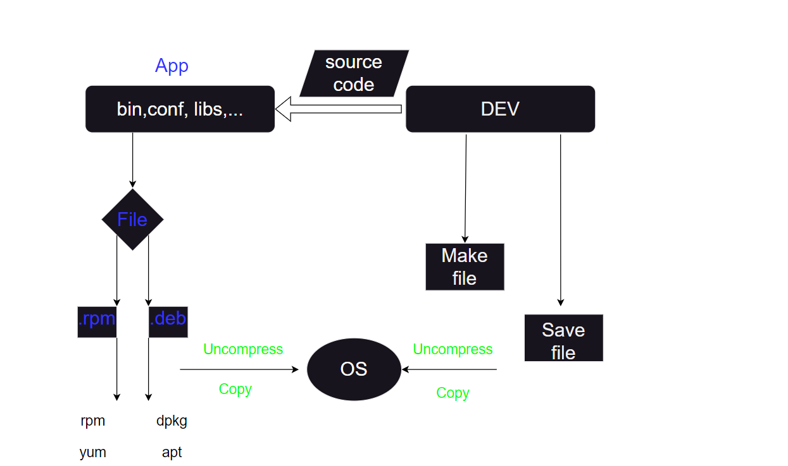

# TÌM HIỂU CÁC CÁCH CÀI ĐẶT PHẦN MỀM TRÊN LINUX
# 1. Cấu tạo file cài đặt

Phần mềm cài đặt trên Linux thường được đóng gói dưới dạng các tập tin có định dạng đặc biệt, gọi là gói phần mềm. Các gói phần mềm này chứa tất cả các tệp tin cần thiết để cài đặt và chạy phần mềm trên hệ thống Linux.

Cấu trúc chung của một gói phần mềm Linux bao gồm:

1. Metadata:

- Thông tin mô tả gói phần mềm, bao gồm tên, phiên bản, nhà phát triển, mô tả, v.v.
- Danh sách các phụ thuộc, tức là các gói phần mềm khác cần được cài đặt trước khi cài đặt gói này.
- Danh sách các tập tin sẽ được cài đặt vào hệ thống, bao gồm vị trí cài đặt của mỗi tập tin.
- Script cài đặt và gỡ cài đặt, thực hiện các tác vụ cần thiết để cài đặt hoặc gỡ cài đặt phần mềm.

2. Tệp tin:

- Các tệp tin thực thi (binaries) của phần mềm.
- Các tệp tin thư viện (libraries) cần thiết cho phần mềm hoạt động.
- Các tệp tin tài liệu (documentation) hướng dẫn cách sử dụng phần mềm.
- Các tệp tin cấu hình (configuration files) để tùy chỉnh phần mềm theo nhu cầu của người dùng.

3. Script:

Script cài đặt (install script): Thực hiện các bước cần thiết để cài đặt phần mềm vào hệ thống, bao gồm tạo thư mục, sao chép tệp tin, tạo liên kết tượng trưng, v.v.
Script gỡ cài đặt (uninstall script): Thực hiện các bước cần thiết để gỡ cài đặt phần mềm khỏi hệ thống, bao gồm xóa tệp tin, thư mục, liên kết tượng trưng, v.v.

# 2.Các cách cài đặt trên Linux

Như phần trên giới thiệu ta có thể thấy được thành phần của một app trước khi cài đặt . Ở đây ta có thể thấy có ít nhất 4 cách cài đặt 

1. rpm/dpkg

Đây là 2 tool cấp thấp cài đặt các gói cài đặt tùy thuộc vào từng hệ điều hành . Với tool này ta có nhiều hạn chế trong việc cài đặt , đặc biệt có rất nhiều gói cài đặt phụ thuộc sẽ phải cài trước khi ta có thể cài được gói ta mong muốn. Chính vì thế `yum/apt` được sinh ra để hỗ trợ việc cài đặt có thể nhanh hơn 

2. yum/apt

Đây là 2 tool cao cấp hơn hỗ trợ cài đặt , với 2 tool trên , việc cài đặt đối với quản trị viên sẽ nhanh gọn hơn nhiều khi sử dụng `rpm/dpkg`. Đặc biệt khi cài đặt tool sẽ hỗ trợ tìm các gói cài đặt phụ thuộc cần thiết và cài đặt 

3. Make file 

Đối với các gói cài đặt luôn có những mã nguồn mở chứa source code của chúng , ta có thể lấy về cài chọn lại các tính năng mình mong muốn , sau đó đóng gói lại tạo ra 1 gói cài đặt riêng có độ tương thích cao hơn và tối ưu hơn đối với hệ điều hành và hệ thống đang sử dụng 

4. Save file 

Đối với cách này, ta sẽ kế thừa lại từ cách số 3 khi đã tạo ra được 1 gói cài đặt tương thích nhất với hệ thống , ta sẽ lưu trữ lại vào 1 repo để có thể kế thừa lại và cài đặt lại trên nhiều hệ thống khác 

