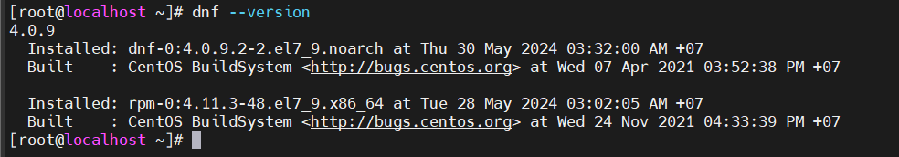

# Tìm hiểu về DNF

# 1.Tổng quan về DNF
## 1.1.DNF là gì 
DNF trong Linux là viết tắt của dnf (Dandified Yum). Đây là trình quản lý gói mặc định cho các bản phân phối Linux dựa trên RPM (Red Hat Package Manager) như Fedora, CentOS và Red Hat Enterprise Linux. DNF là phiên bản nâng cấp và thay thế cho Yum, mang đến nhiều cải tiến về hiệu suất, tính năng và độ ổn định.

## 1.2.So sánh với YUM

|Tính năng	|DNF|	Yum|
|---|---|---|
|Hiệu suất|	Nhanh hơn Yum|	Chậm hơn DNF|
|Tính năng|	Hỗ trợ nhiều kho lưu trữ hơn, quản lý kho lưu trữ dễ dàng hơn, hỗ trợ mô-đun, v.v.|	Ít tính năng hơn DNF|
|Độ ổn định|	Ổn định hơn Yum|	Ít ổn định hơn DNF|

## 1.3.Chức năng chính của DNF:

- Cài đặt, gỡ cài đặt, cập nhật và quản lý phần mềm trên hệ thống Linux.
- Tìm kiếm thông tin về các gói phần mềm.
- Quản lý kho lưu trữ gói.
- Giải quyết các phụ thuộc gói.
- Cung cấp giao diện dòng lệnh đơn giản và dễ sử dụng.

# 2.Cách sử dụng DNF

## 2.1.Cài đặt DNF
DNF không có sẵn trong kho lưu trữ mặc định của RHEL/CentOS Tuy nhiên, bạn có thể cài đặt lệnh dnf trên hệ thống của bạn bằng cách làm theo các bước sau.

Để cài đặt DNF trên hệ thống RHEL/CentOS, bạn cần trước tiên cài đặt và kích hoạt kho lưu trữ epel-release. 

```
yum install epel-release
```

Sau khi kích hoạt kho lưu trữ ta sẽ cài đặt dns

```
yum install dnf
```

Kiểm tra lại phiên bản đã cài đặt 

```
dnf --version
```



## 2.2.Cài đặt phần mềm:
```
sudo dnf install <ten_goi>
```
## 2.3.Gỡ cài đặt phần mềm:
```
sudo dnf remove <ten_goi>
```
## 2.4.Cập nhật phần mềm:
```
sudo dnf update
```
## 2.5.Tìm kiếm thông tin về phần mềm:
```
sudo dnf info <ten_goi>
```
## 2.6.Hiển thị danh sách các kho lưu trữ gói:
```
sudo dnf repolist
```


*Tài liệu tham khảo*

[1] [https://datalinks.vn/dnf-la-gi/](https://datalinks.vn/dnf-la-gi/)