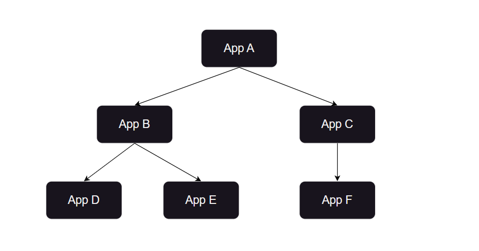
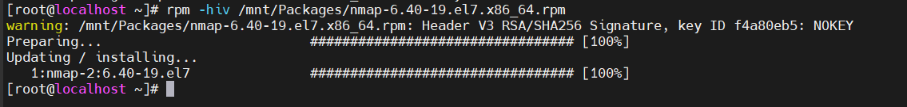
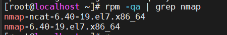
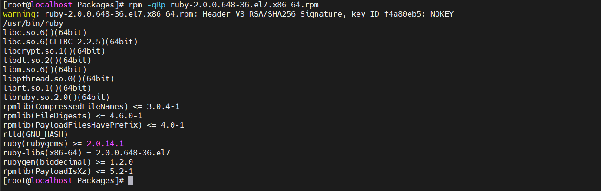
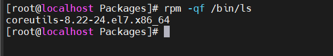
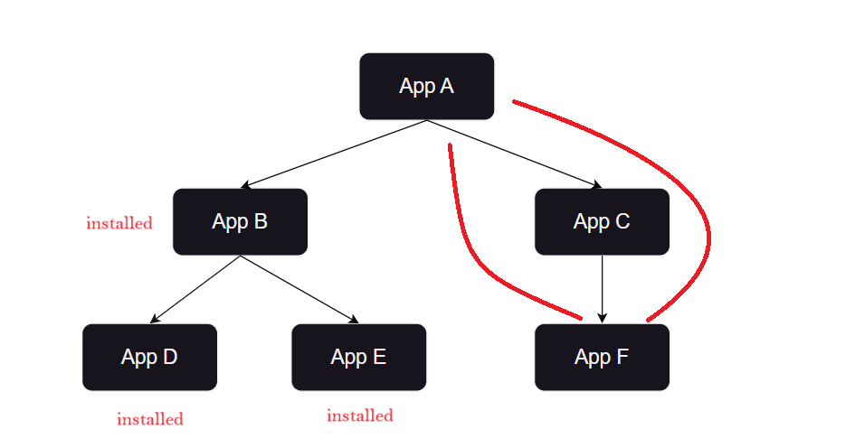
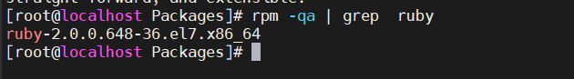
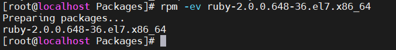

# TÌM HIỂU CÁC CÁCH CÀI ĐẶT PHẦN MỀM TRÊN LINUX
## 1. Cấu tạo file cài đặt và các cách cài đặt trên Linux
### Cấu tạo file cài đặt 
Phần mềm cài đặt trên Linux thường được đóng gói dưới dạng các tập tin có định dạng đặc biệt, gọi là gói phần mềm. Các gói phần mềm này chứa tất cả các tệp tin cần thiết để cài đặt và chạy phần mềm trên hệ thống Linux.

Cấu trúc chung của một gói phần mềm Linux bao gồm:

1. Metadata:

- Thông tin mô tả gói phần mềm, bao gồm tên, phiên bản, nhà phát triển, mô tả, v.v.
- Danh sách các phụ thuộc, tức là các gói phần mềm khác cần được cài đặt trước khi cài đặt gói này.
- Danh sách các tập tin sẽ được cài đặt vào hệ thống, bao gồm vị trí cài đặt của mỗi tập tin.
- Script cài đặt và gỡ cài đặt, thực hiện các tác vụ cần thiết để cài đặt hoặc gỡ cài đặt phần mềm.

2. Tệp tin:

- Các tệp tin thực thi (binaries) của phần mềm.
- Các tệp tin thư viện (libraries) cần thiết cho phần mềm hoạt động.
- Các tệp tin tài liệu (documentation) hướng dẫn cách sử dụng phần mềm.
- Các tệp tin cấu hình (configuration files) để tùy chỉnh phần mềm theo nhu cầu của người dùng.

3. Script:

Script cài đặt (install script): Thực hiện các bước cần thiết để cài đặt phần mềm vào hệ thống, bao gồm tạo thư mục, sao chép tệp tin, tạo liên kết tượng trưng, v.v.
Script gỡ cài đặt (uninstall script): Thực hiện các bước cần thiết để gỡ cài đặt phần mềm khỏi hệ thống, bao gồm xóa tệp tin, thư mục, liên kết tượng trưng, v.v.

### Các cách cài đặt trên Linux


# 2.RPM

## 2.1.Tổng quan về RPM
RPM(Red Hat Package Manager) là một mã nguồn mở quản lý các gói trên hệ thống Red Hat.Một RPM package một là file chứa các chương trình thực thi, các scripts, tài liệu, và một số file cần thiết khác. Công cụ RPM cho phép người dùng cài đặt, cập nhật, gở cài đặt, truy vấn, xác minh và quản lý các gói rpm trên hệ điều hành Unix/Linux.

### Cấu trúc của một RPM package như sau

`<name>-<version>-<release>.<architecture>.rpm`

*Ví dụ: telnet-0.17-65.el7_8.x86_64.rpm*

- **telnet**: Package name
- **0.17**: Package Version
- **65.el7_8**: Package release
- **x86_64**: Package architecture
- **.rpm**: Package type

### Các chế độ của lệnh RPM

- **Install**: Lệnh này được sử dụng để cài đặt bất kỳ các gói RPM
- **Remove**: Lệnh này dùng để xoá, loại bỏ hoặc huỷ cài đặt bất ký gói RPM nào.
- **Upgrade**: Lệnh này để cập nhật goi RPM hiện có
- **Verify**: Lệnh này dùng để xác minh gói RPM
- **Query**: Lệnh này dùng để truy vấn bất kỳ gói RPM nào


### Một số trang web có thể tải gói cài đặt RPM

- rpmfind.net
- redhat.com
- freshrpms.net
- rpm.pbone.net

## 2.2. Cách sử dụng RPM

Để cài đặt bằng RPM có nhiều nguồn lựa chọn để tải bộ cài đặt về , tuy nhiên ta cũng có thể sử dụng những bộ cài có sẵn trong CD-ROM. Trong ổ đĩa có hầu hết các ứng dụng đáp ứng nhu cầu sử dụng và tương thích với thiết bị 

Để lấy các bộ cài từ CD-ROM ta cần mount ổ đĩa quang vào thư mục `mnt`, đây là thư mục để gắn các hệ thống tập tin tạm thời . Ta dùng lệnh sau để mount ổ đĩa quang vào thư mục `mnt`

```
sudo mount /dev/cdrom /mnt
```


Tất cả các bộ cài đặt nằm trong thư mục Packages 

```
ls /mnt
```


Ta có thể thấy nó chứa hơn 4000 file cài đặt 

```
ls /mnt/Packages/ | wc -l
ls /mnt/Packages
```


**Kiểm tra độ an toàn của gói cài**

Sử dụng lệnh `–checksig` để kiểm tra tính an toàn và nguồn gốc của nó 

```
rpm --checksig telnet-0.17-65.el7_8.x86_64.rpm
```


**Option `-i`: Cài đặt phần mềm**

```
rpm -i /mnt/Packages/nmap-6.40-19.el7.x86_64.rpm
```


Thông thường khi cài đặt có thể bạn sẽ gặp lỗi `dependencies`. Đây là lỗi xảy ra khi gói cài đặt bạn đang muốn cài đặt bị phụ thuộc vào các gói cài đặt khác , nghĩa là cần phải cài đặt các gói phụ thuộc trước để có thể cài đặt gói ban đầu muốn cài 

Trong trường hợp thiết bị có sẵn các gói phụ thuộc thì ta sẽ tìm và cài theo bản cài mà thiết bị có, còn nếu như không có bản cài phụ thuộc như yêu cầu thì ta sẽ tìm bộ cài trên các nguồn khác 

Ta sẽ tìm thử bộ cài phụ thuộc ở ví dụ trên 
```
ls /mnt/Packages/ | grep "libpcap"
```


Trong nhiều trường hợp khi báo có 1 gói cài đặt phụ thuộc nhưng khi cài gói phụ thuộc đó lại cần phải cài những gói phụ thuộc khác , khi đó ta cần cài đầy đủ các gói phụ thuộc được yêu cầu theo thứ tự từ dưới lên trên 



**Option `-h` : Hiển thị thanh tiến trình khi cài đặt**

```
rpm -hi /mnt/Packages/libpcap-1.5.3-12.el7.x86_64.rpm
```


.png>)

**Option `-v` :Hiển thị chi tiết trong quá trình cài đặt**

```
rpm -vi /mnt/Packages/nmap-ncat-6.40-19.el7.x86_64.rpm
```
.png)


Thông thường ta sẽ kết hợp 2 option trên để hiển thị kết quả cài đặt đầy đủ hơn 

```
rpm -hiv /mnt/Packages/nmap-6.40-19.el7.x86_64.rpm
```



**Option `-q` : Truy vấn tất cả các gói rpm đã được cài trong hệ thống**

```
rpm -qa
```
Ý nghĩa các option : q : query, a : all installed packages


Nếu bạn muốn xác đinh một package đặc biệt nào đó thôi, thì dùng lệnh sau

```
rpm -qa | grep 'package'
```


Truy vấn một package đặt biệt nào đó sử dụng `rpm -q` .Câu lệnh ở trên là câu lệnh list các `installed package`. Sau khi cài đặt xong package rpm ta có thể kiểm tra gói đó bằng cách sử dụng option -q và package name chính xác của nó. Ta cần phải điền chính xác tên, nếu không nó sẽ báo gói này chưa cài.

```
rpm -q nmap
```


**Option `-qi`: Xem thông tin của gói RPM đã cài đặt sử dụng**

`Option i : view infomation`

```
rpm -qi nmap
```


**Option `-qip`: Xem thông tin của gói RPM chưa cài đặt sử dụng**

```
rpm -qip ruby-2.0.0.648-36.el7.x86_64.rpm
```


```
Option
q : query
i : view infomation
p : package name
```

**Option `-qRp` :Kiểm tra các phụ thuộc trước khi cài đặt**

```
-q: Truy vấn gói
-p: Liệt kê các phần phụ mà gói này cung cấp
-R: Liệt kê các tthành phần mà gói này phụ thuộc.
```

Ta sẽ xem thử các gói cài đặt phụ thuộc của gói cài đặt sau
```
rpm -qRp ruby-2.0.0.648-36.el7.x86_64.rpm
```




**Option `-qf`: Kiểm tra chương trình chạy thuộc gói cài đặt nào**

```
rpm -qf /bin/ls
```


**Option `-qlp` : Kiểm tra phần mềm có những gói cài đặt nào**

```
rpm -qlp ruby-2.0.0.648-36.el7.x86_64.rpm
```

Nếu phần mềm đã cài đặt thì ta chỉ dùng option `ql`

```
rpm -ql ruby-2.0.0.648-36.el7.x86_64.rpm
```


**Option `--nodeps`: Cài đặt gói RPM không phụ thuộc**

```
rpm -hiv --nodeps ruby-2.0.0.648-36.el7.x86_64.rpm
```

Như phía trên ta vừa kiểm tra gói ruby có rất nhiều gói cài đặt phụ thuộc , tuy nhiên với option `--nodeps` thì đã có thể bỏ qua các gói phụ thuộc và cài đặt thành công . Tuy nhiên thì phần mềm sau khi cài đặt có thể sẽ không sử dụng được . 



Ví dụ như trong trường hợp dưới đây , 3 gói phụ thuộc B,D,E đã cài đặt xong , tuy nhiên khi cài đặt gói F thì gói phụ thuộc báo về lại là gói A , vậy ta sẽ dùng option `--nodeps` trong trường hợp này 


**Option `--force`: Ghi đè lên gói tin hiện có**

**Option `replacefile`:Ghi đè lên tập tin thuộc sở hữu của gói khác**


**Option `-U`: Update một rpm package**

```
rpm -Uvh nmap-6.40-19.el7.x86_64.rpm
```


**Option `-e` :Gỡ bỏ một rpm package**

```
rpm -ev ruby-2.0.0.648-36.el7.x86_64.rpm
```
Trong ví dụ trên ta sẽ không thể gỡ được cài đặt phần mềm ,do gói này là gói cài đặt . Để chỉ định đúng gói mà mình muốn gỡ , ta cần truy vấn gói đó để có thể tìm được đúng tên gói có thể gỡ 

```
rpm -qa | grep  ruby
```


Sau khi có tên phần mềm ta có thể gỡ được gói cài đặt

```
rpm -ev ruby-2.0.0.648-36.el7.x86_64
```




# 3.Dpkg

File có phần mở rộng DEB là file Debian Software Package (gói phần mềm Debian). Chúng được sử dụng chủ yếu trong các hệ điều hành dựa trên Unix, bao gồm Ubuntu


*Tài liệu tham khảo*

[1] [https://linux1-2.blogspot.com/2013/05/rpm-cau-lenh-dung-cai-at-go-bo-update.html](https://linux1-2.blogspot.com/2013/05/rpm-cau-lenh-dung-cai-at-go-bo-update.html)

[2] [https://securityzone.vn/t/rpm-va-yum.388/](https://securityzone.vn/t/rpm-va-yum.388/)