# CÀI ĐẶT HỆ ĐIỀU HÀNH ROKKY

# 1. Tải bản cài 
Truy cập link : `https://rockylinux.org/download` và chọn bản cài phù hợp 

# 2. Bắt đầu cài đặt 

Khi bạn thấy màn hình boot Rocky Linux, hãy chọn Install Rocky Linux.

**Cấu hình cài đặt**
1. Chọn ngôn ngữ cài đặt cho Rocky Linux    
Chọn ngôn ngữ: Nhấp vào ngôn ngữ ưa thích của bạn khi được nhắc và chọn Continue.

2. Cấu hình Keyboard   
Ở bước này, bạn nhấn biểu tượng `Keyboard` bên dưới mục `Localization`

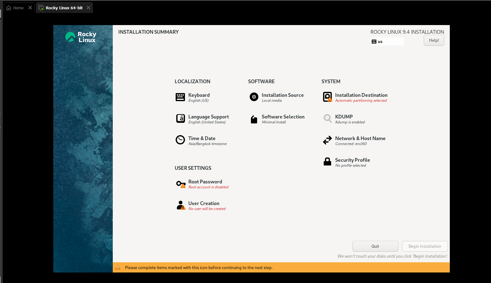

Ngôn ngữ mặc định cho bàn phím sẽ là tiếng Anh, bạn có thể thêm những ngôn ngữ khác từ nút dấu cộng `(+)` ở dưới cùng.    
Sau khi hoàn tất phần này, nhấn “Done” ở trên bên trái để chuyển sang bước tiếp theo.

3. Cấu hình hỗ trợ ngôn ngữ    
Kế tiếp, nhấn chọn biểu tượng “Language Support” để thiết lập hỗ trợ ngôn ngữ.

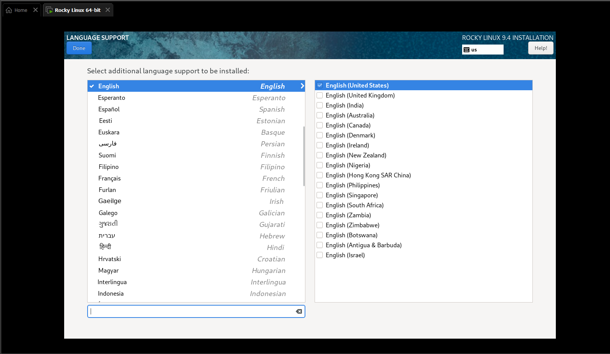

4. Cấu hình ngày giờ hệ thống   
Tiếp theo, bạn nhấn chọn “Time & Date” để thiết lập ngày giờ cho hệ điều hành

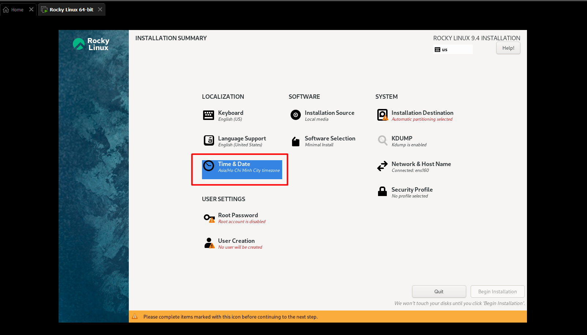

Sau khi chọn chọn vị trí của bạn từ bản đồ thế giới và thiết lập ngày giờ, nhấn chọn “Done” để hoàn tất.

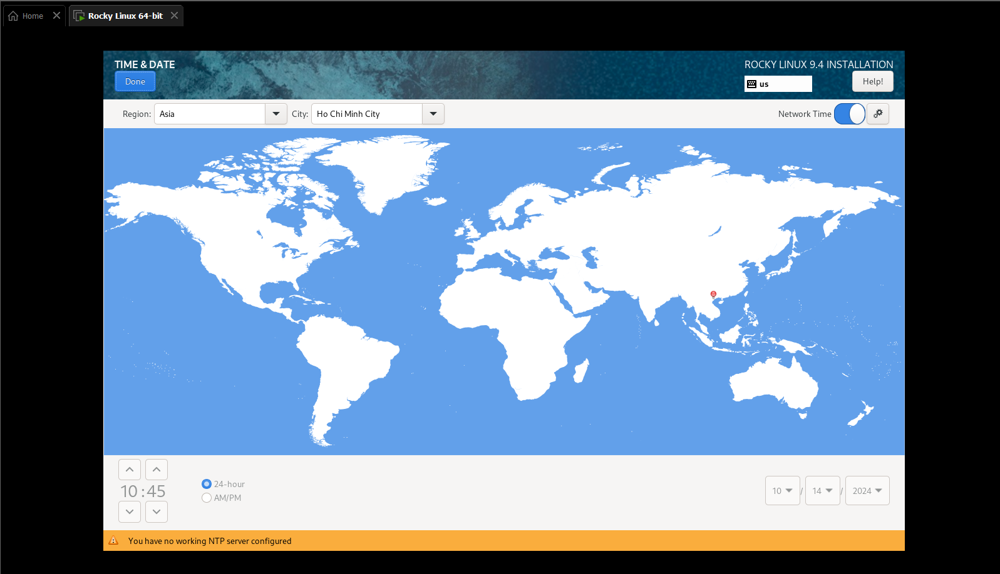

5. Cấu hình phân vùng ổ đĩa    
Một trong những bước đáng chú ý nhất của quá trình cài đặt hệ điều hành là cấu hình phần vùng cho ổ cứng. Tại menu `SYSTEM`, nhấn chọn biểu tượng `Installation Destination`

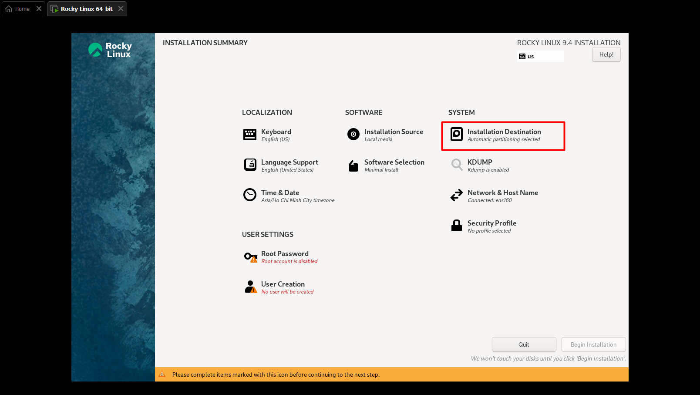

Theo mặc định, phân vùng sẽ được thiếp lập tự động

6. Thiết lập Network và Hostname    
Sau bước tạo phân vùng, bạn cần thiết lập networking và hostname cho server bằng cách chọn biểu tượng `Network & Hostname` từ menu `SYSTEM`.

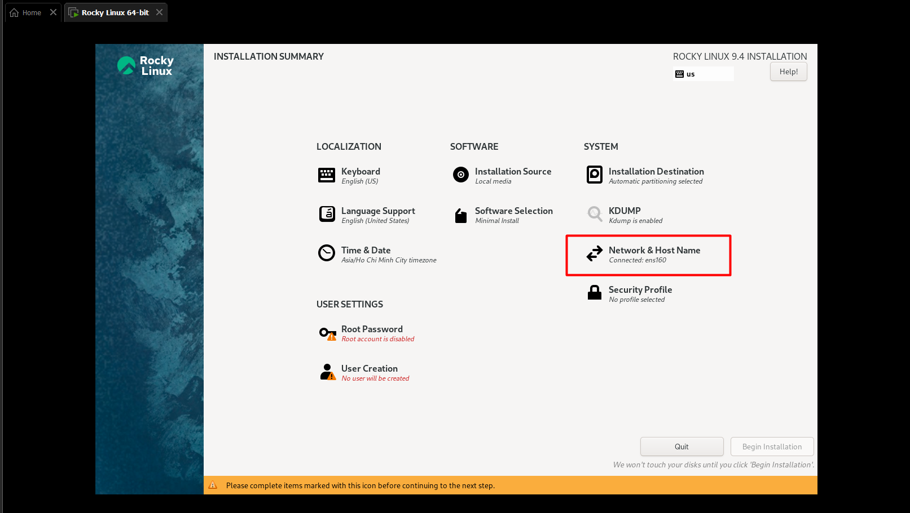

Ở phần này, bạn có thể tùy ý thiết lập nhận IP động từ DHCP server hoặc chủ động cấu hình IP tĩnh

Tại mục Hostname: nhập tên máy chủ (Ví dụ: thienbd.smcl). Sau đó nhấp chuột vào Apply

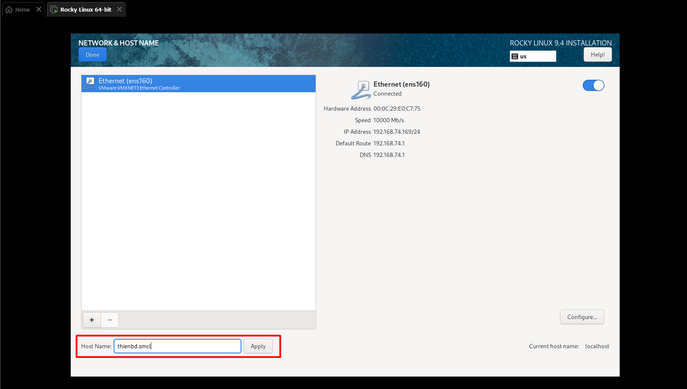

Nhấn “Apply” để lưu hostname và cuối cùng click “Done” để lưu lại mọi thay đổi.

7. Cấu hình User Settings
Đầu tiên là cấu hình mật khẩu cho user root. Nhấn “Done” để sang bước kế tiếp.

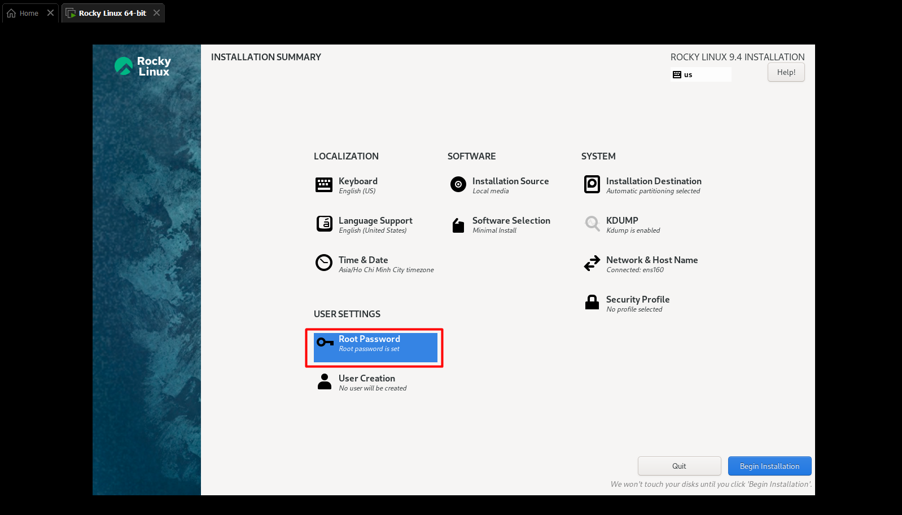

8. Tạo user nếu muốn 

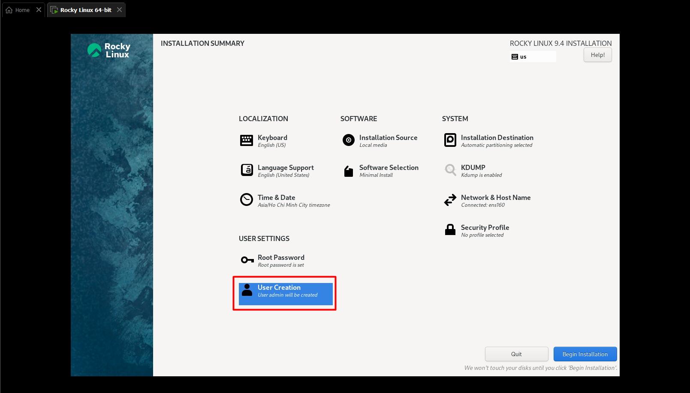

9. Cài đặt và hoàn tất
Sau khi hoàn thành tất các các bước cấu hình trước đó, từ cửa sổ `INSTALLATION SUMMARY`, bạn click `Begin Installation`để khởi chạy tiến trình cài đặt.

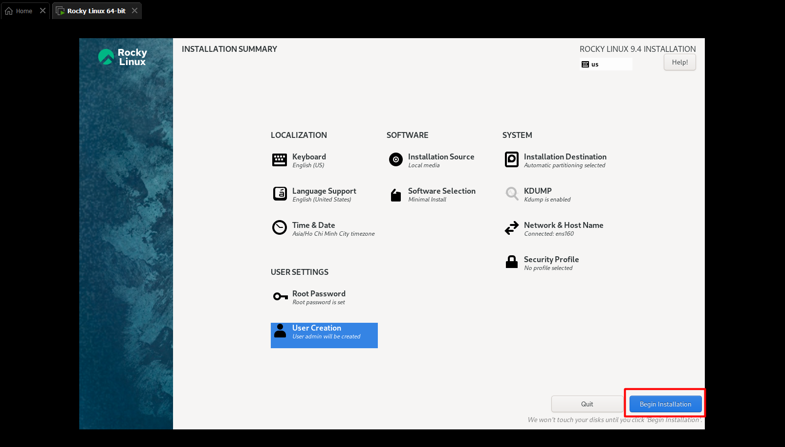

# 3. Cài đặt bonding 

Để thiết lập bonding ta truy cập `Network & Hostname` từ menu `SYSTEM`

Bấm dấu cộng dưới góc để hiện tùy chọn tạo thêm `bonding` 

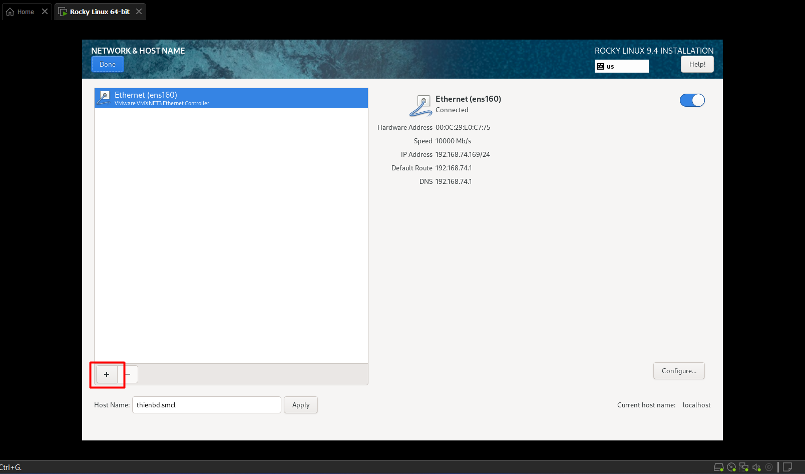

Hiện bảng tùy chọn lựa chọn `bonding` và bấm `Add`

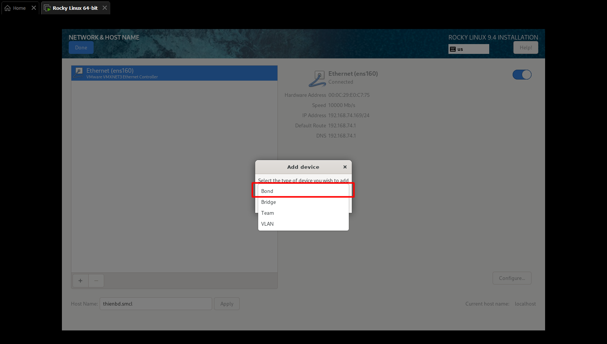

Trong bảng điều khiển chuyển sang mục `IPv4`, chọn nút `Add` và thêm địa chỉ IP manual theo quy hoạch 

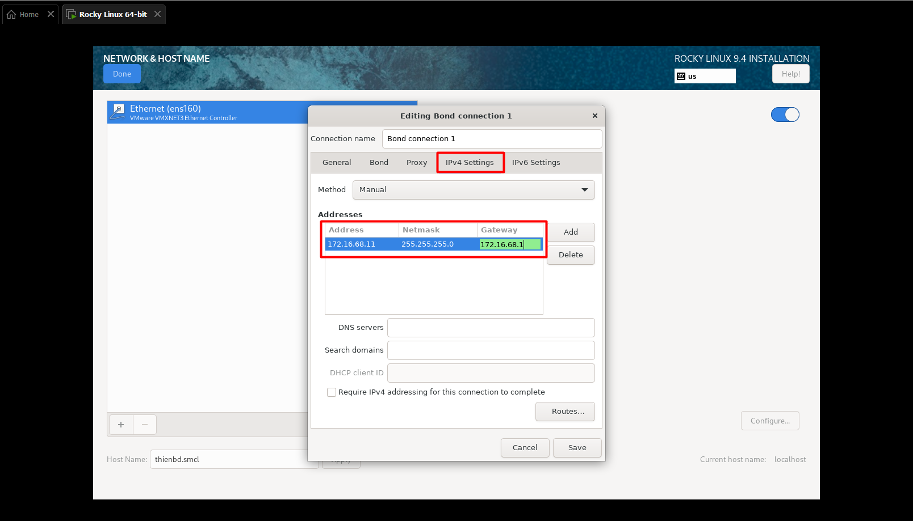