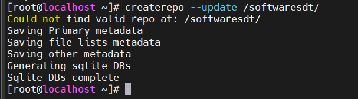
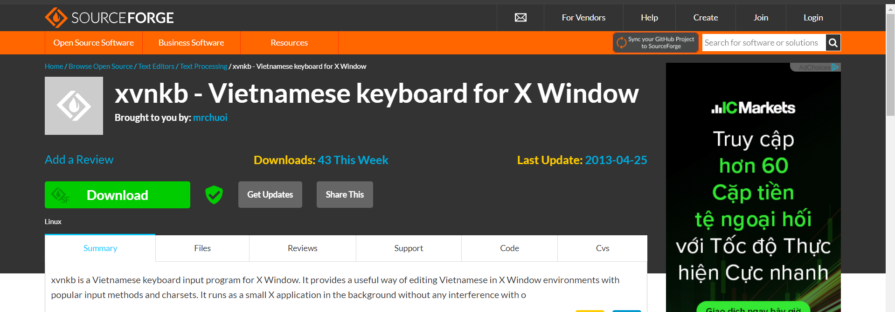
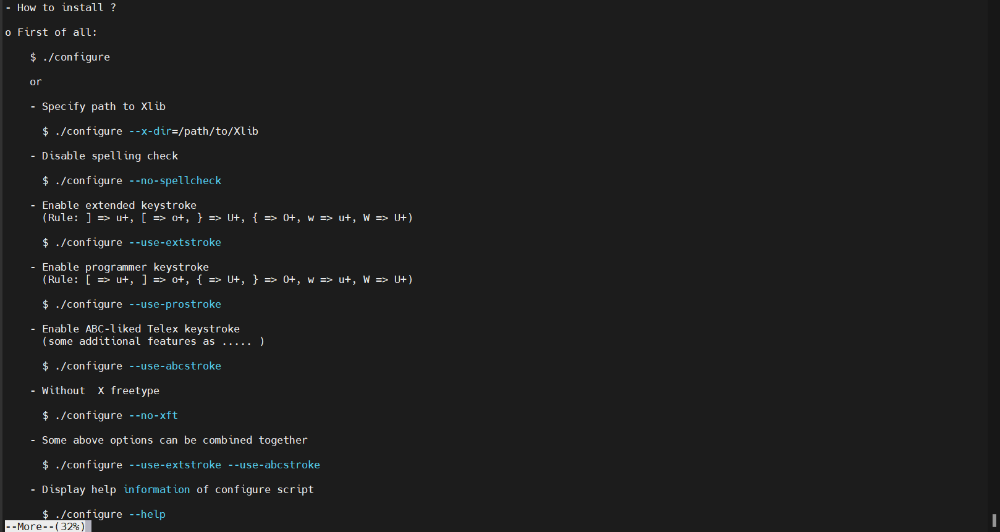
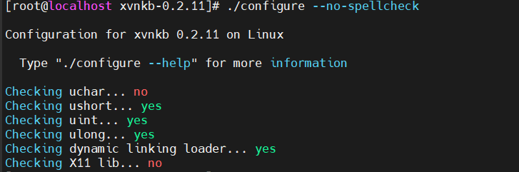
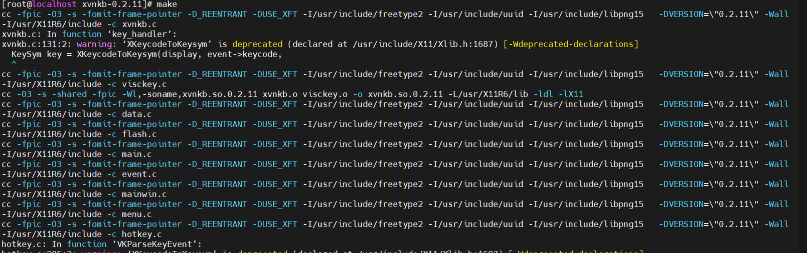

Đây là cách cài đặt bằng cách tải `source code` từ repo về và chỉnh sửa theo nhu cầu sử dụng


Trước tiên ta cũng tạo 1 repo local trên thiết bị 

**YUM Server**
1. Ta sẽ tạo 1 folder với tên là softwaresdt để lưu trữ gói cài đặt 

```
mkdir /softwaresdt
```
Copy các file cài đặt từ ổ đĩa quang 

```
cp /mnt/Packages/*.rpm /softwaresdt/
```

2. Tạo thông tin cấu trúc cho kho lưu trữ , giúp truy vấn dữ liệu nhanh hơn giúp giảm thời gian tìm các gói cài đặt trong kho

```
createrepo --update /softwaresdt/
```


Sau khi tạo thông tin cấu trúc cho repo , ta sẽ thấy thêm mới 1 folder repodata, bây giờ ta đã có kho phần mềm


3. Public repo với client

**YUM Client**
4. Khai báo yum server với yum client

Ta sẽ di chuyển đến foler yum.repos.d. Ở đây chứa các file `.repo` , đây là các `yum server`
Trong trường hợp ta dùng internet để cài đặt các gói thì các yum server trên là nơi trả về gói cài đặt

```
cd /etc/yum.repos.d/
ls 
```


Tạm thời di chuyển các repo khác sang folder khác 

```
mv *.repo /tmp 
```
Tạo file khai báo kho riêng và khai báo đường dẫn

```
vi dt.repo
```
Nội dung thêm vào file dt.repo

```
[soft]
# Đường dẫn lấy gói cài đặt chính
baseurl=file:///softwaresdt
# Đường dẫn lấy gói cài đặt phụ (ở đây không có nên không khai báo)
mirrorurl=0
# enable kho repo
enabled=1
# kiểm tra sự toàn vẹn gói cài đặt 
gpgcheck=0
```

5. Refresh lại yum server 

```
yum clean all
```


Sau khi cài đặt xong repo local thì ta sẽ đi tải những sources code trên những trang chủ chính thống về 
Thông thường các sources code sẽ có đầy đủ trên trang web : `https://sourceforge.net/`


Ta sẽ tiến hành tải 1 sources code về máy window , ví dụ như `xvnkb`



Sau khi tải về ta dùng phần mềm Winscp để chuyển gói vào centos 7


File được nén với định dạng `.tar.bz2`


Ta giải nén bằng dòng lệnh sau 

```
tar -xjf xvnkb-0.2.11.tar.bz2
```

Ta sẽ xem thử trong file giải nén có những gì 


Trong 1 file cài đặt thì luôn có những gói cài đặt khác nhau , những file thông tin khác nhau . Tuy nhiên , luôn luôn có những file cố định giống nhau trong những file sources code mà ta tải về , bào gồm 

- **INSTALL file**: File hướng dẫn quá trình cài đặt
- **README file** : Đây là file hướng dẫn, giới thiệu về phần mềm , dùng làm gì có tính năng gì 
- **configure file** : Biên dịch phần mềm 
- **Makefile**: 


Để biên dịch được phần mềm tải về ta cần thư viện và công cụ biên dịch `( complier: gcc ,gcc-C++)`

Để cài đặt tool biên dịch phần mềm ta dùng câu lệnh 

```
yum install gcc
```

Thư viện cài đặt đối với từng gói cài đặt sẽ khác nhau , để có thể tìm được các thư viện phù hợp ta cần chạy file `configure` để check xem có thiếu thư viện nào , file này sẽ kiểm tra hệ thống xem những thư viện nào cần thiết

# 2.Các bước tạo file cài đặt 

## 2.1.Trình tự các bước 
- **Bước 1** : Đọc file `README` và file `INSTALL` để biết cách cài 

- **Bước 2** : Chạy file `configure` để check xem có thiếu thư viện nào , file này sẽ kiểm tra hệ thống xem những thư viện nào cần thiết và báo về 

Câu lệnh chạy file

```
./configure
```


Như kết quả trả về ta thấy đang thiếu thư viện `X11`

Kết thúc quá trình chạy sẽ tạo ra file `Makefile`


Lệnh `./configure` chạy thành công sẽ có dòng `Type "make" to compile`

- **Bước 3** : Biên dịch bằng lệnh "make" nó sẽ lấy thông tin từ `Msakefile` . `Makefile` có vài trò hướng dẫn lệnh make để tiến hành và tạo ra files chạy của chương trình (bin files). 
- **Bước 4** : Sau khi thu thập đủ nguyên liệu cấu thành 1 ứng dụng ta copy các file đó sang hệ thống bằng lệnh "make install"  // make install --> copy (bin,libs,config) --> system(OS)

để cài đặt thì cần có thư viện , bộ tool cài đặt ( sẽ là ngôn ngữ C hoặc C++ )

## 2.2.Điểm đặc biệt 

Như các bước ở trên ta thấy khá dài dòng , thay vì dùng công cụ `yum` có vẻ là nhanh gọn và tiện lợi hơn rất nhiều . Tuy nhiên điểm nổi bật ở phương pháp này là ta có thể lựa chọn các `option` cài đặt của gói phần mềm , nhằm mục đích tối ưu phần mềm , giảm dung lượng , tăng độ tương thích với hệ thống , ngoài ra tăng độ bảo mật hơn trong khi cài đặt 

**Cách để chọn option tính năng cài đặt**

Để có thể chọn được các option ta mở file INSTALL , ở đây sẽ có các option cụ thể để ta có thể lựa chọn giúp tối ưu nhất chương trình chạy 




Ta sẽ chạy lệnh `./configure` kèm theo option


Trong trường hợp báo thiếu thư viện sẽ không có thông báo sử dụng lệnh `make`



Ta tìm thử các gói thư viện phụ thuộc thì có 1 số gói sau 


Tuy nhiên ta đang tạo gói cài đặt đứng vai trò là người phát triển , vì vậy ta cần cài gói có đuối `-devel`

```
yum install libX11-devel
```

Sau khi cài đặt thư viện bị thiếu và chạy lệnh configure , ta có thể chạy lệnh make để tạo bộ hướng dẫn Makefile , kết quả sẽ trả về như sau 



Trong trường hợp mình muốn chọn lại option cho chương trình , bản make cũ sẽ bị sáo trộn không được sạch , nếu tiếp tục thực hiện sẽ dẫn đến lỗi . Để làm sạch mã nguồn file make ta dùng lệnh sai 

```
make clean
```
Cuối cùng để đóng gói file chương trình ta dùng lệnh `make install`


Kết quả trả về là 1 file chạy `xvnkb-0.2.11`


