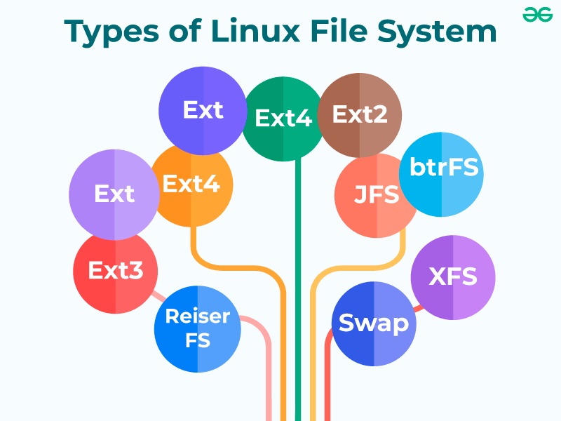

# TÌM HIỂU VỀ CÁC KIỂU FILE HỆ THỐNG 

# 1. Hệ thống tập tin Linux là gì?

Hệ thống tệp lưu trữ tập hợp dữ liệu hoặc tệp được lưu trữ trong ổ cứng hoặc thiết bị lưu trữ của máy tính. Các hệ thống này xác định vị trí và định vị của các tệp trong thiết bị lưu trữ, điều này giải thích khá nhiều về tầm quan trọng của các hệ thống tệp. Linux cung cấp một bộ hệ thống tệp chuyên dụng lưu trữ mọi bit dữ liệu cần thiết để khởi động các hệ thống Linux.    
Hệ thống tệp Linux hoạt động ở chế độ nền và liên tục làm việc để duy trì dữ liệu trong hệ thống. Chúng khá giống với hệ thống tệp chung, nơi chúng có sẵn dưới dạng lớp tích hợp của HĐH Linux. Cùng với việc ghi công và quản lý dữ liệu chính, nó cũng cung cấp các dịch vụ trong việc duy trì thông tin như tên tệp, kích thước, ngày tạo và các chi tiết khác.




# 2.Cấu trúc hệ thống tệp Linux
Một hệ thống tập tin chủ yếu bao gồm 3 lớp. Từ trên xuống dưới:

**1. Hệ thống tệp logic**  
Hệ thống tệp logic hoạt động như giao diện giữa các ứng dụng người dùng và chính hệ thống tệp. Nó tạo điều kiện thuận lợi cho các hoạt động thiết yếu như mở, đọc và đóng tập tin. Về cơ bản, nó đóng vai trò là giao diện người dùng thân thiện với người dùng, đảm bảo rằng các ứng dụng có thể tương tác với hệ thống tệp theo cách phù hợp với mong đợi của người dùng.

**2. Hệ thống tệp ảo**  
Hệ thống tệp ảo (VFS) là một lớp quan trọng cho phép hoạt động đồng thời của nhiều phiên bản của hệ thống tệp vật lý. Nó cung cấp một giao diện được tiêu chuẩn hóa, cho phép các hệ thống tệp khác nhau cùng tồn tại và hoạt động đồng thời. Lớp này trừu tượng hóa sự phức tạp cơ bản, đảm bảo tính tương thích và gắn kết giữa các triển khai hệ thống tệp khác nhau.

**3. Hệ thống tệp vật lý**   
Hệ thống tệp vật lý chịu trách nhiệm quản lý và lưu trữ hữu hình các khối bộ nhớ vật lý trên đĩa. Nó xử lý các chi tiết cấp thấp về lưu trữ và truy xuất dữ liệu, tương tác trực tiếp với các thành phần phần cứng. Lớp này đảm bảo việc phân bổ và sử dụng hiệu quả các tài nguyên lưu trữ vật lý, góp phần nâng cao hiệu suất và độ tin cậy tổng thể của hệ thống tệp.


# 3. Các loại File system type

**1. Hệ thống tập tin Ext, Ext2, Ext3 và Ext4**

Hệ thống tệp Ext là viết tắt của Extended File System . Nó chủ yếu được phát triển cho MINIX OS . Hệ thống tệp Ext là phiên bản cũ hơn và không còn được sử dụng nữa do một số hạn chế.

Ext2 là hệ thống tệp Linux đầu tiên cho phép quản lý hai terabyte dữ liệu. Ext3 được phát triển thông qua Ext2; đây là phiên bản nâng cấp của Ext2 và có khả năng tương thích ngược. Nhược điểm chính của Ext3 là không hỗ trợ máy chủ vì hệ thống tệp này không hỗ trợ phục hồi tệp và ảnh chụp nhanh đĩa.

Hệ thống tệp Ext4 là hệ thống tệp nhanh hơn trong số tất cả các hệ thống tệp Ext. Đây là tùy chọn rất tương thích với ổ đĩa SSD (ổ đĩa thể rắn) và là hệ thống tệp mặc định trong bản phân phối Linux.

**2. File System JFS**

JFS là viết tắt của Journaled File System , được IBM phát triển cho AIX Unix . Đây là giải pháp thay thế cho hệ thống tệp Ext. Nó cũng có thể được sử dụng thay cho Ext4, nơi cần sự ổn định với ít tài nguyên. Đây là hệ thống tệp tiện dụng khi sức mạnh CPU bị hạn chế.

**3. File System ReiserFS**

ReiserFS là một giải pháp thay thế cho hệ thống tệp Ext3. Nó có hiệu suất được cải thiện và các tính năng nâng cao. Trước đây, ReiserFS được sử dụng làm hệ thống tệp mặc định trong SUSE Linux, nhưng sau đó đã thay đổi một số chính sách, vì vậy SUSE đã quay trở lại Ext3. Hệ thống tệp này hỗ trợ động phần mở rộng tệp, nhưng có một số nhược điểm về hiệu suất.

**4. File System XFS**

Hệ thống tệp XFS được coi là JFS tốc độ cao, được phát triển để xử lý I/O song song. NASA vẫn sử dụng hệ thống tệp này với máy chủ lưu trữ lớn (máy chủ 300+ Terabyte).

**5. File System Btrfs**

Btrfs là viết tắt của hệ thống tệp B tree . Nó được sử dụng cho khả năng chịu lỗi, hệ thống sửa chữa, quản trị vui vẻ, cấu hình lưu trữ mở rộng, v.v. Nó không phù hợp với hệ thống sản xuất.

**6. Swap File System**

Swap File System được sử dụng để phân trang bộ nhớ trong hệ điều hành Linux trong quá trình ngủ đông hệ thống. Một hệ thống không bao giờ ở trạng thái ngủ đông thì cần có không gian hoán đổi bằng với kích thước RAM của nó .

# 4. Cách phân biệt loại file system type

**1. Sử dụng lệnh df**
```
$ df -Th 
HOẶC 
$ df -Th | grep "^/dev"
```
**2. Sử dụng lệnh fsck**

```
fsck -N /dev/sdb1
```

**3. Sử dụng lệnh lsblk**

```
lsblk-f
```

**4. Sử dụng lệnh mount**
```
mount | grep "^/dev"
```

**5. Sử dụng lệnh blkid**

```
blkid /dev/sda3
```

**6. Sử dụng lệnh file**
```
sudo file -sL /dev/sda3
```

**7. Sử dụng File fstab**

`/ etc/fstab` là file thông tin hệ thống chứa thông tin kiểu file system

dùng lệnh sau để show thông tin file 
```
cat /etc/fstab
```


*Tài liệu tham khảo*

[1] [https://www.javatpoint.com/linux-file-system](https://www.javatpoint.com/linux-file-systems)   
[2] [https://www.geeksforgeeks.org/linux-file-system/](https://www.geeksforgeeks.org/linux-file-system/)