# 50 Linux Command 

| 1-10 | 11-20 | 21-30 | 31-40 | 41-50 |
|-----|-----|-----|-----|-----|
|1.man| 11.mv |21.alias |31.sed |41.bzcat-bzmore|
|2.pwd |12.rename |22.tee	|32.find|42.who|
|3.cd| 13.head|	23.grep|33.locate|43.su|
|4.ls|14.tail|24.cut|34.date|44.useradd|
|5.mkdir|15.cat|25.tr|35.cal	|45.userdel|
|6.rmdir|16.tac|26.wc|36.sleep|46.usermod|
|7.file|17.more và less|27.sort|37.time|47.passwd|
|8.touch|18.strings|28.uniq|38.gzip & gunzip|48.groupmod|
|9.rm|19.echo|29.comm|39.zcat & zmore|49.groupdel|
|10.cp|20.type & which|30.od|40.bzip2-bunzip2|50.vigr|


# 1. Lệnh man (manual - hướng dẫn sử dụng)
Hầu hết các file và lệnh Unix đều có trang `man` khá tốt để giải thích việc sử dụng chúng. Nó cung cấp thông tin và chi tiết về tên, tóm tắt, mô tả, các option, trạng thái đầu ra, giá trị trả về, lỗi, file, thông tin phiên bản, ví dụ, tác giả,...

**Cú pháp cơ bản**
```
man [tên lệnh hoặc chương trình]
```
## 1.1. man $command
Xem thông tin của 1 lệnh nào đó: tác dụng, các option, ...

Gõ `q` để thoát.  
*Ví dụ*: man ls


# 2. Lệnh pwd (Print Working Directory)
Lệnh pwd dùng để hiển thị đường dẫn đến thu mục hiện tại đang làm việc 

Option:

- *-L(logical)* : Sử dụng biến môi trường PWD, ngay cả khi nó chứa các liên kết tượng trưng
- *-P(physical)* : Tránh sử dụng tất cả các liên kết tượng trưng

Lưu ý: Lệnh 'pwd' thường được sử dụng mà không có tùy chọn và không bao giờ được sử dụng với đối số

# 3. Lệnh cd (Change Directory)

Lệnh cd được sử dụng để thay đổi các thư mục làm việc, di chuyển đến thư mục đích.   
*Cú pháp cho lệnh cd như sau:*
```
cd [OPTIONS] directory
```
- **cd /duongdanthumuclamviec** : di chuyển đến thư mục làm việc  
    - Đường dẫn tuyệt đối : Tên đường dẫn đầy đủ đến thư mục ,bắt đầu tư thư mục root  
    - Đường dẫn tương đối: Thư mục con trong đường dẫn tuyệt đối 
- **cd** : Di chuyển về thư mục gốc ()
- **cd~**:  Di chuyển về thư mục chính
- **cd-**: Di chuyển về thư mục làm việc trước đó
- **cd ..**: Di chuyển về thư mục 
- **cd ' thu muc'** : Di chuyển đến thư mục có dấu cách

# 4. Lệnh ls (list)
Liệt kê các file và folder trong thư mục đang làm việc

*Cú pháp của lệnh ls*
```
ls [OPTIONS]  [FILES]
```
## 4.1. ls   
Hiển thị các tệp tin và thư mục trong thư mục.

```
[root@localhost ~]# ls
```


## 4.2. ls -t
Hiển thị các thư mục và file theo thời gian chỉnh sửa.

```
[root@localhost ~]# ls -t
```
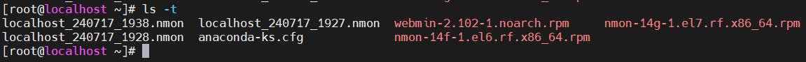

Để show ra các file cuối cùng được chỉnh sửa. Thêm `head -(số_file)`

```
[root@localhost ~]# ls -t | head -1
```
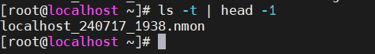

## 4.3. ls -1
Hiển thị mỗi mục trên 1 dòng

```
[root@localhost ~]# ls -1
```

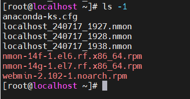

## 4.4. ls -l
Hiển thị tất cả thông tin các mục

```
[root@localhost ~]# ls -l
```
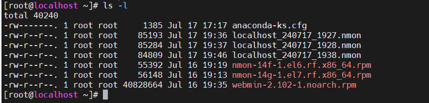

Trong đó:

- Kí tự đầu tiên: định dạng:
    - `-`: file bình thường
    - `d`: thư mục
    - `s`: file socket
    - `l`: link file
- Trường 1: File permission
- Trường 2: Số lượng liên kết đến tệp hay thư mục đó
- Trường 3: Chủ sở hữu của tệp, thư mục
- Trường 4: Nhóm của tệp, thư mục
- Trường 5: Kích thước của tệp, thư mục đó(đơn vị: byte)
- Trường 6: Thời gian sửa đổi cuối cùng
- Trường 7: Tên của tệp, thư mục

## 4.5. ls -lh
Giống `ls -l` nhưng hiển thị trường 5 (kích thước) ở dạng dễ đọc. M là MB, K là KB, G là GB.

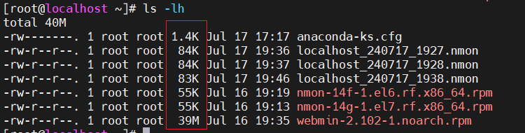

## 4.6. ls -a
Như lệnh ls nhưng hiển thị cả những file ẩn. Trong Linux, các file có tên bắt đầu bằng dấu chấm được coi là file ẩn và nó không hiển thị cùng các file bình thường.

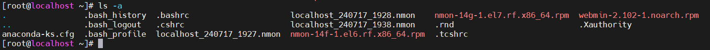

## 4.7 ls -ld
Hiển thị thông tin thư mục.

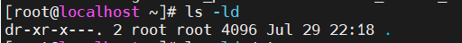


## 4.8. ls -r
Giống ls nhưng sắp xếp ngược lại. Có thể kết hợp với option -l và -t để được kết quả như sau:

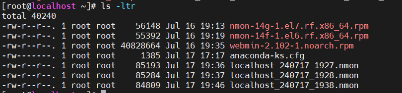

## 4.9. ls -i
Liệt kê kèm số lượng `inone`

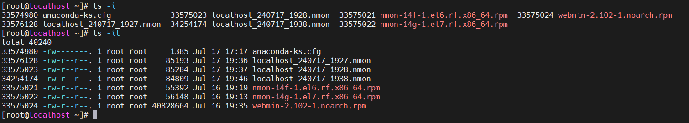

## 4.10. ls -F
Nếu chỉ cần biết các mục là file hay thư mục ta sử dụng `ls -F`:

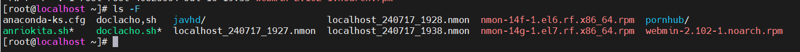

Trong đó:

- `/` : Thư mục
- `Nothing` : tệp bình thường
- `*` : Tập tin thực thi
- `@` : link file

## 4.11. ls -S
Hiển thị danh sách nội dung theo kích thước giảm dần.

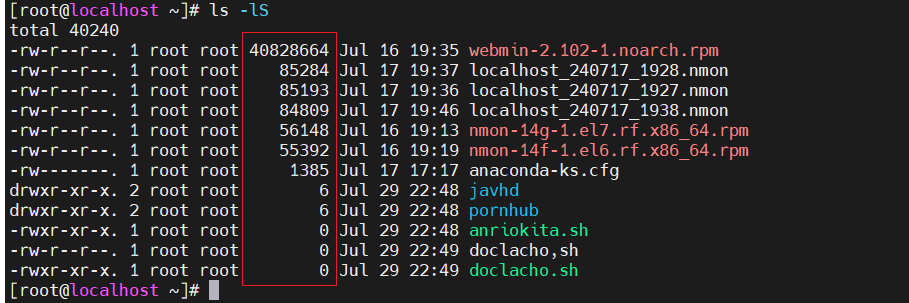

# 5. Lệnh mkdir (make directory - tạo thư mục)
## 5.1. Một số thông tin

- `mkdir --version`: Hiển thị thông tin phiên bản, giấy phép, tác giả.

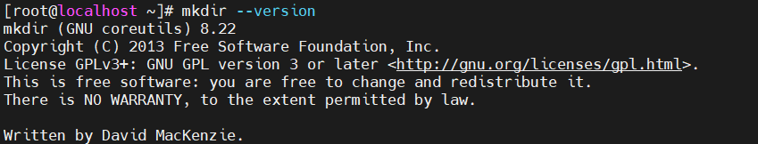

- `mkdir --help`: Hiển thị 1 số thông tin trợ giúp

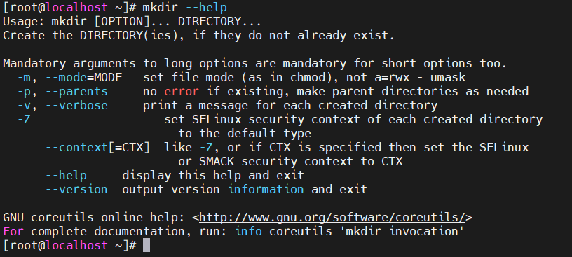

## 5.2. mkdir <ten_thu_muc>
Tạo thư mục tại vị trí thư mục đang đứng.
Có thể tạo nhiều thư mục cùng lúc:

```
mkdir D1 D2 D3       // Tạo 3 thư mục D1 D2 D3 cùng lúc
```

## 5.3. mkdir -v <ten_thu_muc>
Tạo thư mục và hiển thị thông báo tạo thư mục.

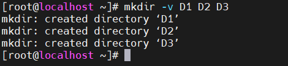
## 5.4 mkdir -p
Tạo thư mục kèm thư mục cha khi cần thiết.

```
mkdir -v -p /S1/S2/S3
```

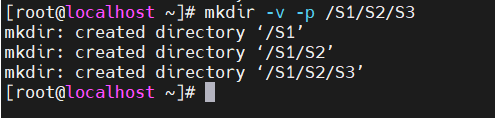

## 5.5. mkdir -m
Đặt permission cho thư mục ngay khi tạo. (tương tự như lệnh chmod)

```
[root@localhost ~]# mkdir -m a=rwx S5

[root@localhost ~]# ls -l | grep "S5"
drwxrwxrwx. 2 root   root      4096 Dec 24 22:45 S5
```

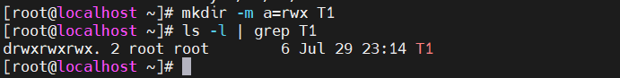

# 6. Lệnh rmdir (remove directory - Xóa thư mục)
## 6.1. rmdir
Xóa thư mục rỗng.

```
[root@localhost D1]# rmdir T1
```

Khi dùng lệnh này với thư mục không rỗng sẽ xảy ra lỗi:

## 6.2. Một số thông tin
Cũng giống lệnh `mkdir`. `rmdir` có thể sử dụng option --version và --help

## 6.3. rmdir -p <thu_muc>
Trong tùy chọn này, đối số thư mục được coi là tên đường dẫn trong đó tất cả các thành phần sẽ bị xóa. Nếu chúng đã trống thì sẽ lần lượt xóa từ thành phần cuối cùng.

*Ví dụ*

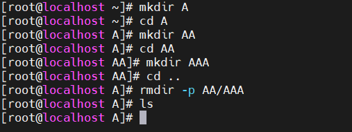


# 6.4. rmdir -v <thu_muc>

Tùy chọn này hiển thị thông tin xóa thư mục.

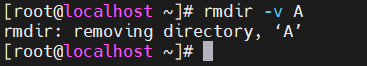

# 7. Lệnh file

```
file [option] [file_name]
```
Lệnh `file` được sử dụng để xác định loại tệp.
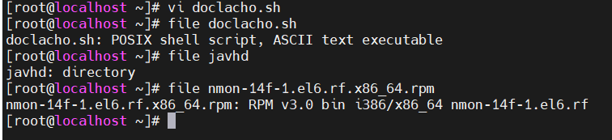

Lệnh `file` sử dụng tệp `magic` chứa các mẫu để nhận dạng các loại tệp. Tệp `magic` nằm ở `/usr/share/file/magic.`

Để thêm thông tin chi tiết :` # man 5 magic`

Các Option:

## 7.1. file -b (-b = -brrief) - tóm tắt
Hiển thị kiểu file 1 cách đơn giản, ngắn gọn.

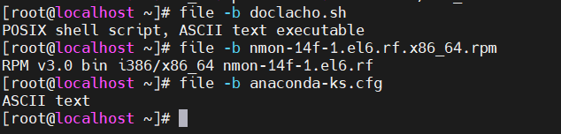

## 7.2. file *
Hiển thị tất cả các loại file trong thư mục đang đứng:

```
[root@localhost ~]# file *
```

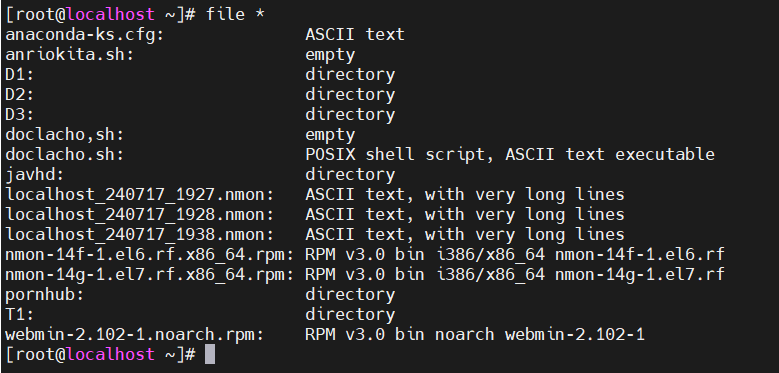

Hiển thị tất cả cái loại file trong thư mục nào đó

```
file <đường_dẫn_thư_mục>/*
```
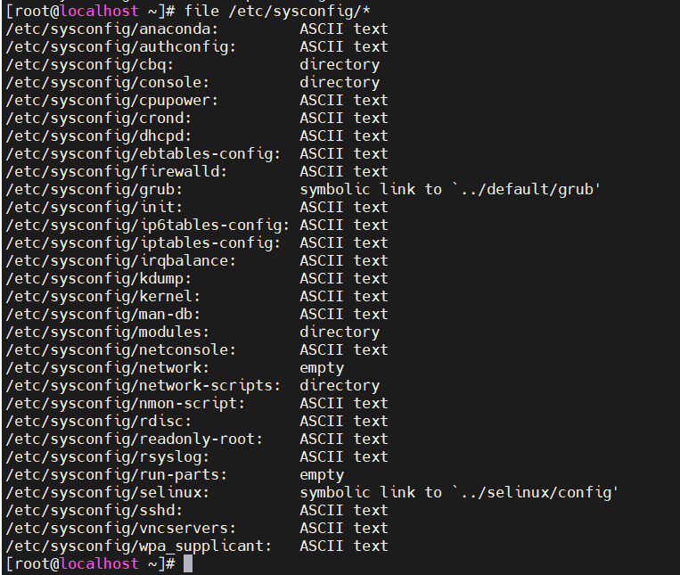


## 7.3. file [range]*
Hiển thị kiểu file của các file trong khoảng nào đó.

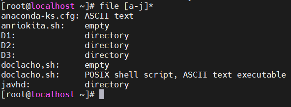

## 7.4. file -s
Hiển thị các loại tệp của tệp đặc biệt như các tệp trong `/dev/` và `/proc/`

## 7.5. file -f -
Kiểm tra kiểu file của nhiều file. Mỗi file gõ trên 1 dòng.

## 7.6. file <filename1> <filename2> ...
Hiển thị loại tệp của nhiều tệp.

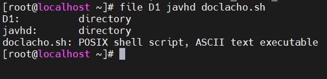

## 7.7. file -z <file_nén>
Lệnh này sẽ cố gắng nhìn vào bên trong file nén.

# 8. Lệnh touch
Là 1 cách đơn giản để tạo 1 file trống hoặc thay đổi dấu thời gian (timestamps) của file.  
Dấu thời gian của file có loại:
- accesstime
- modifytime
- changetime


## 8.1. Tạo file trống
Tạo 1 file:

```
[root@localhost ~]# touch <filename>
```

Tạo nhiều file:

```
[root@localhost ~]# touch <filename1> <filename2> ...
```
## 8.2. Thay đổi dấu thời gian
`touch -a <filename> `:Thay đổi thời gian truy cập (acesstime) của file.

Xem ví dụ sau để hiểu thêm

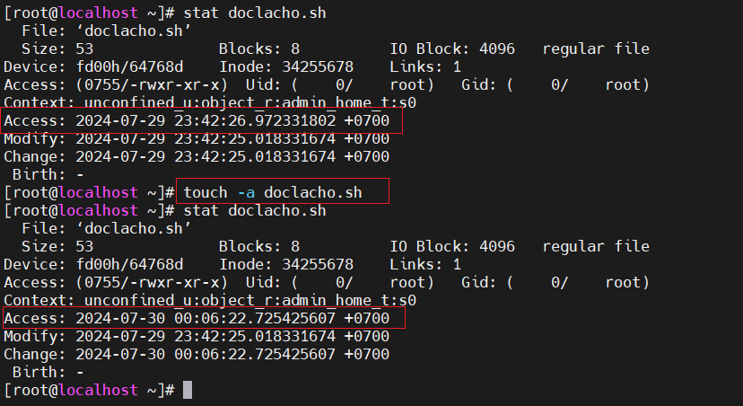

`touch -m <filename>`: Thay đổi thời gian sửa đổi (modifytime)

## 8.3. touch -c <filename>
Option này dùng để tránh tạo tệp khi gõ nhầm. Tức là ta chỉ muốn thay đổi dấu thời gian của tệp mà không muốn tạo ra 1 tệp.


## 8.4. touch -t YYYYMMDDHHMM <filename>
Tạo 1 tệp tin với dấu thời gian nhất định hoặc thay đổi dấu thời gian của 1 tệp đã có.