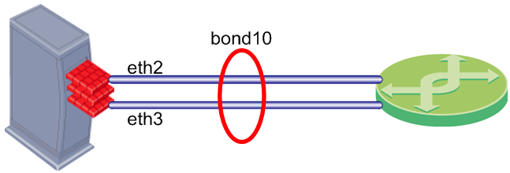

# Tìm Hiểu Về Network Bonding Linux
# 1.Bonding là gì 
Bonding là 1 thuật ngữ mà ở đó user Linux có thể cấu hình để nhóm từ 2 đến nhiều interface vật lý kết hợp thành 1 interface ảo gọi là “Bonding Interface” bằng cách sử dụng module kernel “bonding”. Tính năng của Bonding sẽ dựa trên các Mode sử dụng.

# 2.Mục đích sử dụng của Network Bonding
- **Tăng băng thông**: Khi kết hợp nhiều card mạng, băng thông tổng thể của giao diện ảo sẽ cao hơn tổng băng thông của từng card mạng riêng lẻ. Điều này giúp cải thiện hiệu suất mạng cho các ứng dụng đòi hỏi băng thông cao như truyền tải video, chia sẻ tệp lớn và truy cập cơ sở dữ liệu.  
- **Dự phòng**: Nếu một card mạng trong nhóm bonding bị lỗi, các card mạng còn lại sẽ tự động tiếp tục truyền tải dữ liệu, đảm bảo tính sẵn sàng cao cho mạng.  
- **Chịu lỗi**: IP Bonding giúp giảm thiểu tác động của sự cố card mạng, ngăn chặn việc gián đoạn dịch vụ và mất dữ liệu.

# 3.Thành phần cấu thành 
Các thành phần chính
1. Giao diện liên kết (bond0, bond1, v.v.) :
- Giao diện logic kết hợp nhiều giao diện mạng vật lý.
- Được đặt tên là bond0, bond1, v.v.
2. Giao diện Slave (eth0, eth1, v.v.) :
- Các giao diện mạng vật lý là một phần của giao diện liên kết.
- Mỗi giao diện phụ được cấu hình để hoạt động theo giao diện liên kết.
3. Trình điều khiển liên kết :
- Mô-đun hạt nhân cung cấp chức năng liên kết.
- Đã tải bằng modprobe bonding.

# 3.Các chế độ của bonding 

1. **mode=0 (Balance Round Robin)**
- Lưu lượng truy cập được phân chia đều giữa các card mạng trong nhóm bonding 
- Các gói tin sẽ được gửi tuần tự lần lượt đến các card mạng 
2. **mode=1 (Active backup)**
- Chỉ một card mạng hoạt động tại một thời điểm, các card mạng còn lại ở chế độ dự phòng.
- Khi card mạng chính bị lỗi, card mạng dự phòng sẽ tự động kích hoạt để tiếp tục truyền tải dữ liệu.
3. **mode=2 (Balance XOR)**
- Sử dụng hàm XOR của địa chỉ MAC nguồn để xác định card mạng sẽ truyền tải gói tin.
- Giúp phân chia lưu lượng truy cập đều giữa các card mạng mà không cần theo dõi trạng thái card mạng.
4. **mode=3 (Broadcast)**
- Gửi tất cả các gói tin đến tất cả các card mạng trong nhóm bonding.
- Ít được sử dụng do hiệu quả thấp và có thể gây ra nhiễu mạng.
5. **mode=4 (802.3ad)**
- Tự động đàm phán băng thông và chế độ hoạt động tối ưu giữa các card mạng hỗ trợ 802.3ad.
- Cung cấp hiệu suất và khả năng sử dụng băng thông tối ưu.
- Yêu cầu tất cả các card mạng trong nhóm bonding đều hỗ trợ 802.3ad.
6. **mode=5 (Balance TLB)**
- Phân phối lưu lượng đi ra trên các giao diện khả dụng, có khả năng cải thiện hiệu suất mạng tổng thể.
- Nếu giao diện phụ bị lỗi, nó sẽ tự động bị loại khỏi phân phối lưu lượng, đảm bảo một mức độ dự phòng nhất định.

7. **mode=6 (Balance ALB)**
- Luồng lưu lượng được tối ưu hóa: Bằng cách xem xét tốc độ và tải giao diện, Balance ALB phân phối lưu lượng một cách hiệu quả, có khả năng cải thiện hiệu suất mạng tổng thể.
- Giảm tình trạng tắc nghẽn: Lưu lượng truy cập đến cũng được cân bằng tải, loại bỏ tình trạng tắc nghẽn giao diện đơn của chế độ 5.
- Khả năng chịu lỗi mạnh mẽ: Sao lưu chủ động đảm bảo lưu lượng vẫn tiếp tục lưu thông ngay cả khi giao diện phụ bị lỗi.