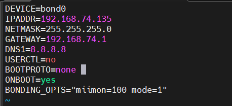
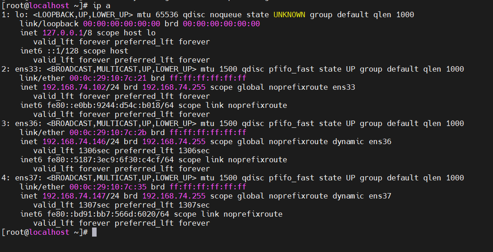
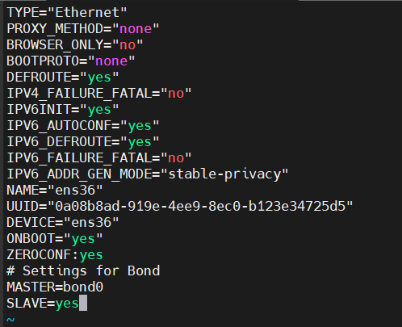
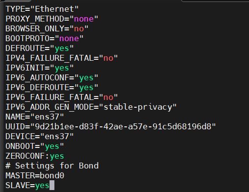
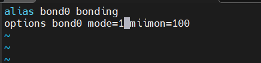
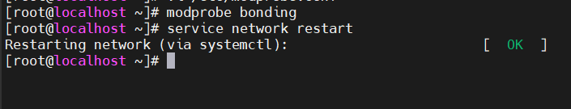
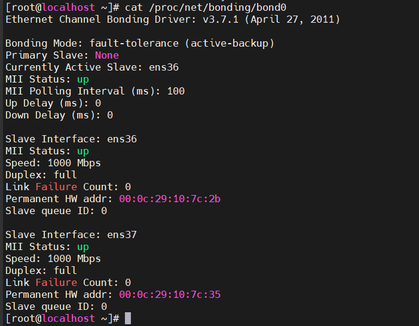

# Cấu Hình Bonding Trên RHEL/CentOS 7

# Mô hình triển khai
- Sử dụng 2 card mạng `ens36` và `ens37` tương ứng server phải có 2 card mạng vật lý, nhóm lại thành 1 card mạng ảo `bonding` là `bond0`.
- Sử dụng cơ chế mode ‘active-backup‘ để chạy cơ chế dự phòng card mạng.


# Các bước triển khai 
**Bước 1: Tạo file ifcfg-bond0**  
File ifcfg-bond0 với địa chỉ IP, netmask và gateway. Đây là địa chỉ IP mà các card mạng sẽ dùng chung.

```
vi /etc/sysconfig/network-scripts/ifcfg-bond0
```


```
DEVICE=bond0
IPADDR=192.168.74.135
NETMASK=255.255.255.0
GATEWAY=192.168.74.1
DNS1=8.8.8.8
USERCTL=no
BOOTPROTO=none
ONBOOT=yes
BONDING_OPTS="miimon=100 mode=1"
```

**Bước 2: Chỉnh sửa các card mạng**  
Cần chú ý đến tham số cấu hình Bond MASTER và SLAVE

Ta sẽ cấu hình bonding cho 2 card mạng ens36 và ens37 

```
vi /etc/sysconfig/network-scripts/ifcfg-ens36
```

```
TYPE="Ethernet"
PROXY_METHOD="none"
BROWSER_ONLY="no"
BOOTPROTO="none"
DEFROUTE="yes"
IPV4_FAILURE_FATAL="no"
IPV6INIT="yes"
IPV6_AUTOCONF="yes"
IPV6_DEFROUTE="yes"
IPV6_FAILURE_FATAL="no"
IPV6_ADDR_GEN_MODE="stable-privacy"
NAME="ens36"
UUID="0a08b8ad-919e-4ee9-8ec0-b123e34725d5"
DEVICE="ens36"
ONBOOT="yes"
ZEROCONF:yes
# Settings for Bond
MASTER=bond0
SLAVE=yes
```

```
vi /etc/sysconfig/network-scripts/ifcfg-ens37
```

```
TYPE="Ethernet"
PROXY_METHOD="none"
BROWSER_ONLY="no"
BOOTPROTO="none"
DEFROUTE="yes"
IPV4_FAILURE_FATAL="no"
IPV6INIT="yes"
IPV6_AUTOCONF="yes"
IPV6_DEFROUTE="yes"
IPV6_FAILURE_FATAL="no"
IPV6_ADDR_GEN_MODE="stable-privacy"
NAME="ens37"
UUID="9d21b1ee-d83f-42ae-a57e-91c5d68196d8"
DEVICE="ens37"
ONBOOT="yes"
ZEROCONF:yes
# Settings for Bond
MASTER=bond0
SLAVE=yes
```
**Bước 3. Cấu hình các thông số cho Bond, chọn chế độ chạy cho Bond**

```
vi /etc/modprobe.conf
```


`bond0`: Tên của bond được tạo ra.  
`miimon`: Xác định mức độ thường xuyên, tính bằng milli giây, bond được kiểm tra nếu nó vẫn đang hoạt động.  
`mode`: chế độ bond đang chạy. (mode 1: active-backup)

**Bước 4 : Load module và Restart lại card mạng** 

```
modprobe bonding
service network restart
```



**Bước 5: Kiểm tra bonding đã cài đặt bằng lệnh**

```
cat /proc/net/bonding/bond0
```

