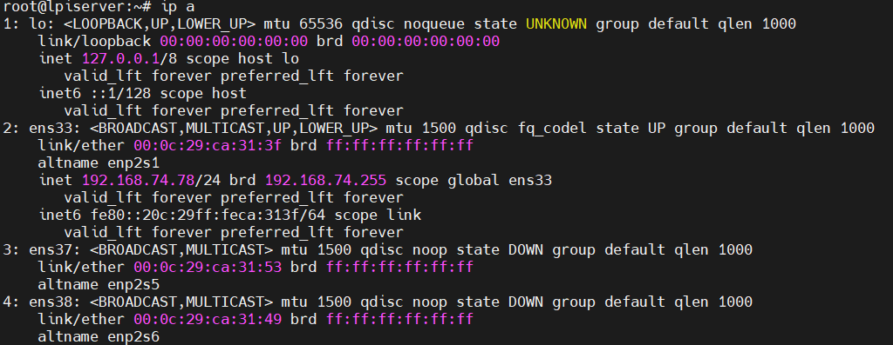
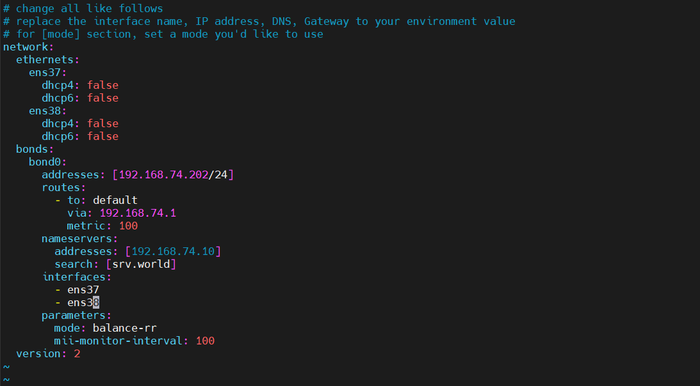
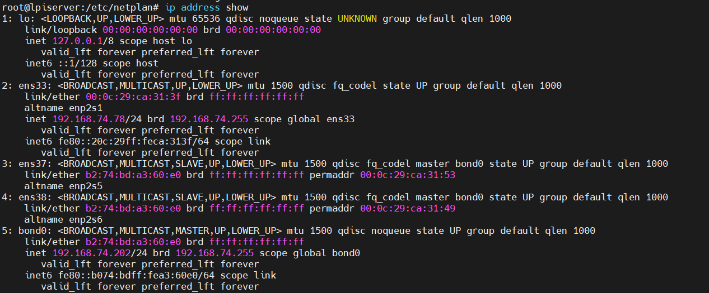

# Cấu Hình Bonding Trên Ubuntu

# Mô hình triển khai
- Sử dụng 2 card mạng `ens38` và `ens37` tương ứng server phải có 2 card mạng vật lý, nhóm lại thành 1 card mạng ảo `bonding` là `bond0`.
- Sử dụng cơ chế mode ‘active-backup‘ để chạy cơ chế dự phòng card mạng.

# Các bước triển khai 

Giao diện mạng hiện tại đang có 



Đảm bảo bạn đã cài đặt và kích hoạt mô-đun liên kết trong nhân của mình. Sử dụng lệnh lsmod như sau:
```
sudo lsmod | grep bonding
```

Nếu mô-đun không khả dụng, hãy sử dụng lệnh bên dưới để cài đặt.

```
sudo apt-get install ifenslave
```

Bắt đầu tiến hành cấu hình Ethernet Interface

```
sudo vi /etc/netplan/01-netcfg.yaml
```

```
# change all like follows
# replace the interface name, IP address, DNS, Gateway to your environment value
# for [mode] section, set a mode you'd like to use
network:
  ethernets:
    ens37:
      dhcp4: false
      dhcp6: false
    ens38:
      dhcp4: false
      dhcp6: false
  bonds:
    bond0:
      addresses: [192.168.74.202/24]
      routes:
        - to: default
          via: 192.168.74.1
          metric: 100
      nameservers:
        addresses: [192.168.74.10]
        search: [srv.world]
      interfaces:
        - ens37
        - ens38
      parameters:
        mode: balance-rr
        mii-monitor-interval: 100
  version: 2
```



Sau khi đã cấu hình hoàn tất, tiến hành apply cấu hình bằng lệnh
```
sudo netplan apply
```

Tiến hành kiểm tra cấu hình network sau khi hoàn tất.



```
cat /proc/net/bonding/bond0
ethtool bond0
```