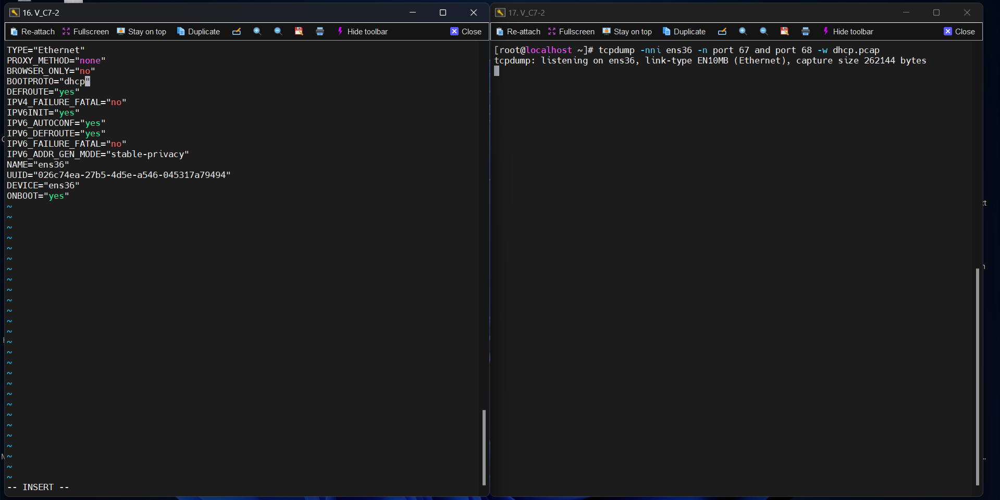
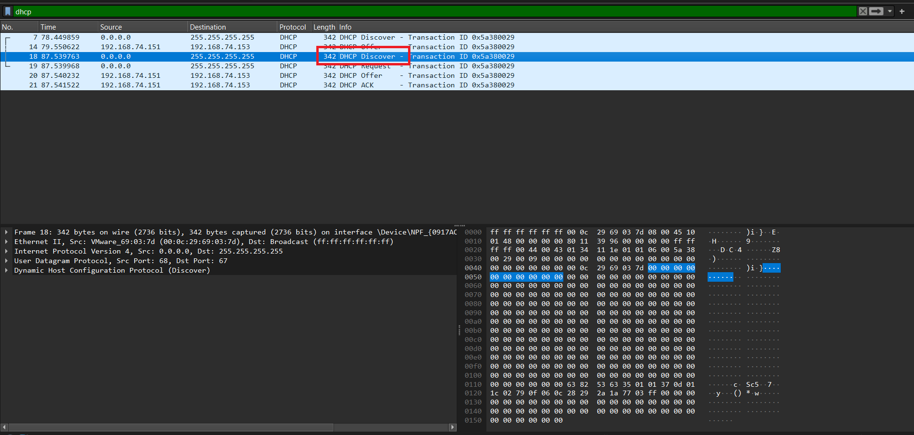
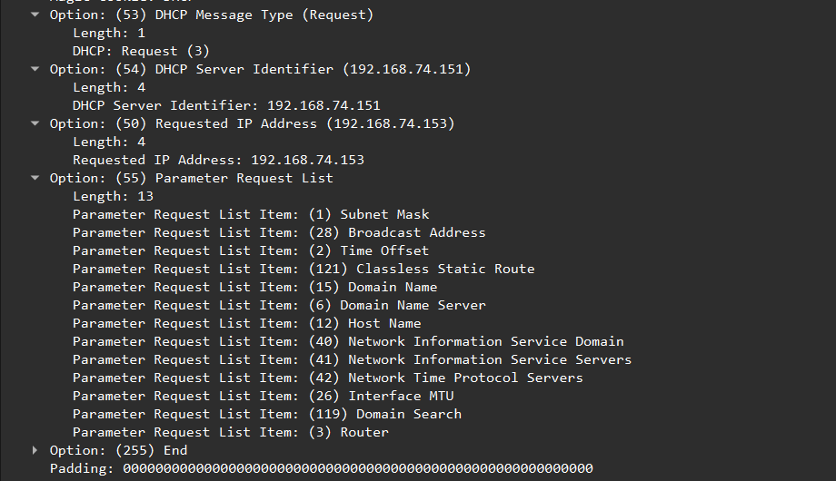
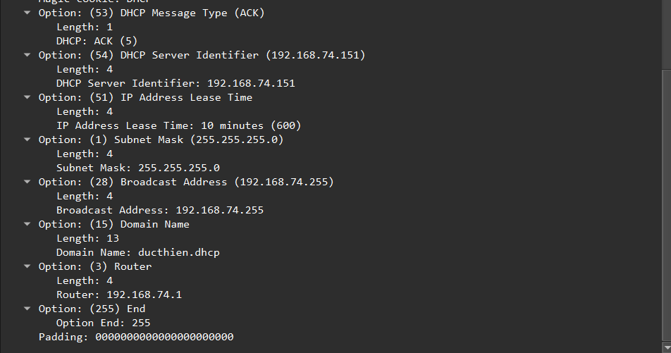

# Phân tích gói tin khi Client nhận ip của DHCP Server
# 1.Phân tích gói tin sử dụng TCPdump(trên centos7)

## 1.1.Lệnh tcpdump

`tcpdump` là 1 câu lệnh dùng để bắt và phân tích gói của 1 giao thức trong máy tính.
Kiểm tra và cài đặt `tcpdump`:
```
[root@ns1 ~]# tcpdump -D
-bash: tcpdump: command not found
[root@ns1 ~]# yum install tcpdump
```


Các option lệnh `tcpdump`

- Hiển thị các giao diện mạng: `# tcpdump -D`
- Bắt gói tin ở các giao diện mạng: `# tcpdump -i <giao_diện_mạng(ens33, ens37,...)>`
- Bắt gói tin với n gói tin: `# tcpdump -i <giao_diện_mạng> -c <n>`
- Hiển thị gói tin dưới dạng HEX và ASCII: `# tcpdump -xx -i <giao_diện_mạng> -c 2`
- Bắt gói tin với địa chỉ IP: `# tcpdump -i <giao_diện_mạng> -n`
- Thêm trường ngày khi bắt gói tin: `# tcpdump -i <giao_diện_mạng> -tttt`
- Bắt gói tin với 1 kiểu giao thức cụ thể: `# tcpdump -i <giao_diện_mạng> tcp`
- Bắt gói tin với 1 port cụ thể: `# tcpdump -i <giao_diện_mạng> port <số_hiệu_port>`
- Bắt gói tin lưu vào 1 file: `# tcpdump -i <giao_diện_mạng> -c 5 -w tcpdump_test.pcap`


Để bắt được gói DHCP cấp độ đầu tiên, chúng ta phải thiết lập lại Máy khách không nhận IP từ Máy chủ DHCP. Chỉnh sửa tập tin sau:`/etc/sysconfig/network-scripts/ifcfg-ens36`


Sau đó khởi động lại. Kiểm tra lại giao diện `ens36`:


Hiện tại, giao diện `ens36` chưa được đặt địa chỉ IP. Ta sẽ mở 2 terminal. 1 bên chỉnh sửa giao diện cấu hình tệp ens36 - ta set BOOTPROTO = "dhcp", 1 bên sử dụng tcpdump để bắt gói khi DHCP cung cấp IP

```
[root@localhost ~]# tcpdump -nni ens36 -n port 67 and port 68 -w dhcp.pcap
```



Ta sẽ giải phóng IP đã gán cho card ens37 khi khởi động:

```
dhclient -r
```

Sau đó Yêu cầu cấp lại địa chỉ IP:

```
dhclient -v
```


Khi xong ta có thể thấy 5 gói tin ta đã bắt được:


# 2.Phân tích gói tin sử dụng WireShark(trên window)

Sử dụng wireshark để đọc file `dhcp2.pcap`


**Phân tích gói 4 bản tin**

1. DHCP DISCOVERY

Client gửi bản tin DHCP Discover

- Client gửi thông điệp theo hình thức Broadcast. 
- Nguồn gửi `VMware_69:03:7d` có địa chỉ MAC `(00:0c:29:69:03:7d)` gửi tới Đích `Broadcast` có địa chỉ MAC `(ff:ff:ff:ff:ff:ff)` 
- IP nguồn: `0.0.0.0` (Do lúc này Client chưa có địa chỉ IP) - port 68 - IP đích: `255.255.255.255` - port 67




1: là địa chỉ đầu và địa chỉ cuối của gói tin ghi bằng MAC

2: là địa chỉ đầu và cuối nhưng được ghi bằng IPv4

3: là port mà gói tin đó sử dụng

4: địa chỉ IP của client

5: MAC của client


2. DHCP OFFER

HCP Server cung cấp bản tin DHCP Offer

Server nhận được bản tin Discover sẽ gửi lại bản tin DHCP Offer theo hình thức Unicast có chứa IP `192.168.74.153` cho Client. 
- Ethernet II, Src: Vmware_0a:de:99 (00:0c:29:0a:de:99), Dst: Vmware_a2:90:c8 (00:0c:29:a2:90:c8) 
- Nguồn gửi `VMware_82:73:6b` có địa chỉ MAC `(00:0c:29:82:73:6b)` gửi lại Client `VMware_69:03:7d (00:0c:29:69:03:7d)` 
- IP nguồn của Server: `192.168.74.151` - port 67 - IP đích - Unicast: địa chỉ IP Server sẽ cấp cho Client: `192.168.74.153` - port 68


- Option 54: chỉ đính danh DHCP server
- Option 51: thời gian cho thuê địa chỉ IP
- Option 1: địa chỉ subnet Mask
- Option 28 : địa chỉ broadcast
- Option 3 : địa chỉ default gateway
- Option 6 : địa chỉ DNS

3. DHCP Request

Client gửi lại bản tin DHCP Request để chấp nhận IP được Server cấp cho.



- Option 53: Kiểu tin nhắn
- Option 50: Địa chỉ IP yêu cầu

4. DHCP ACK

Server gửi bản tin DHCP ACK để xác nhận Client sử dụng địa chỉ IP cũng như thông tin cấu hình khác.



Nhiệm vụ của gói tin này là để xác nhận lại thông tin đã cấp cho client


*Tài liệu tham khảo*

[1] [https://github.com/duckmak14/blogcloud365vn.github.io/blob/master/_posts/2019-04-09-dhcp-tong-quan.md?fbclid=IwZXh0bgNhZW0CMTAAAR2uOo0jz_o25O6LHu-7pD5Iebgdim7IKzZIjbOfTGIiZiahVfwE8gSxLj0_aem_ASHo4j75Mfeft1F96Y0HPViWa2UiDVJe7n_mUbPfOfTyuHqWswtuAA5UZ7FSprZhYxclxG94BYjhfghCiV7FetJt](https://github.com/duckmak14/blogcloud365vn.github.io/blob/master/_posts/2019-04-09-dhcp-tong-quan.md?fbclid=IwZXh0bgNhZW0CMTAAAR2uOo0jz_o25O6LHu-7pD5Iebgdim7IKzZIjbOfTGIiZiahVfwE8gSxLj0_aem_ASHo4j75Mfeft1F96Y0HPViWa2UiDVJe7n_mUbPfOfTyuHqWswtuAA5UZ7FSprZhYxclxG94BYjhfghCiV7FetJt)

[2] [https://github.com/danghai1996/thuctapsinh/blob/master/HaiDD/DHCP/5-PhanTichGoiTinDHCP.md](https://github.com/danghai1996/thuctapsinh/blob/master/HaiDD/DHCP/5-PhanTichGoiTinDHCP.md)