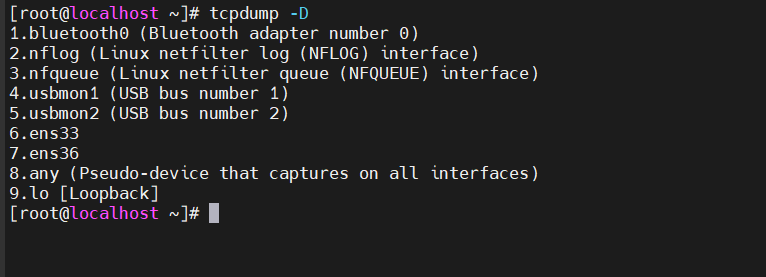

TÌM HIỂU VỀ TCPDUMP
# 1.Tổng quan về tcpdump
## 1.1.Khái niệm
Tcpdump là một công cụ hỗ trợ phân tích các gói dữ liệu mạng theo dòng lệnh,cho phép khách hàng chặn và lọc các gói tin TCP/IP được truyền đi hoặc được nhận trên một mạng ,tcpdump sẽ lưu lại các gói tin sau đó dùng để phân tích 

## 1.2.Tính năng và ưu điểm 

- Giám sát và phân tích lưu lượng mạng: Tcpdump cho phép bạn theo dõi và phân tích lưu lượng mạng trong thời gian thực, giúp bạn tìm ra các vấn đề và cung cấp các giải pháp để giải quyết chúng.
- Tùy chỉnh (các options): Tcpdump cung cấp rất nhiều tùy chọn cho phép bạn lọc và ghi lại các gói tin theo nhu cầu của bạn.
- Phổ biến: Tcpdump là một trong những công cụ giám sát mạng phổ biến nhất và được sử dụng rộng rãi trong các môi trường mạng lớn.

# 2.Sử dụng tcpdump trên Linux

Để cài đặt `tcpdump` trên Linux ta dùng lệnh 

*Với Centos 7*

```
yum install tcmpdump
```


## 2.1. Định dạng chung của tcpdump

`time-stamp src > dst:  flags  data-seqno  ack  window urgent options`

- Time-stamp: hiển thị thời gian gói tin được capture.
- Src và dst: hiển thị địa IP của người gởi và người nhận.
**Cờ Flag thì bao gồm các giá trị sau:**
- S(SYN):  Được sử dụng trong quá trình bắt tay của giao thức TCP.
- .(ACK):  Được sử dụng để thông báo cho bên gửi biết là gói tin đã nhận được dữ liệu thành công.
- F(FIN): Được sử dụng để đóng kết nối TCP.
- P(PUSH): Thường được đặt ở cuối để đánh dấu việc truyền dữ liệu.
- R(RST): Được sử dụng khi muốn thiết lập lại đường truyền.
- Data-sqeno: Số sequence number của gói dữ liệu hiện tại.
- ACK: Mô tả số sequence number tiếp theo của gói tin do bên gởi truyền (số sequence number mong muốn nhận được).
- Window: Vùng nhớ đệm có sẵn theo hướng khác trên kết nối này.
- Urgent: Cho biết có dữ liệu khẩn cấp trong gói tin.

## 2.2. Sử dụng tcpdump 

**Bắt gói tin trên 1 interface**

`tcpdump -i ens33`


**Bắt số gói tin nhất định trên 1 interface**

Khi bạn sử dụng option -c thì bạn có thể yêu cầu nó bắt số gói tin nhất định. Ví dụ bên dưới chúng ta sẽ chỉ bắt 5 gói tin.

`tcpdump -c 5 -i ens33`


**In các gói tin bắt được dưới định dạng ASCII**

`tcpdump -A -i ens33`


**Hiển thị các interface có sẵn**

`tcpdump -D`



**Hiển thị gói tin được bắt dưới dạng hệ HEX và ASCII**

`tcpdump -XX -i ens33`


**Bắt và lưu gói tin**

`tcpdump -w admin.pcap -i ens33`


**Bắt gói tin từ một cổng cụ thể**

`tcpdump -i ens33 port 22`


**Đọc nội dung file đã bắt được**

`tcpdump -r admin.pcap`


**Bắt địa chỉ IP của gói tin**

`tcpdump -n -i ens33`


**Chỉ bắt gói tin TCP**

`tcpdump -i ens33 tcp`


**Bắt gói tin từ địa chỉ IP nguồn**

` tcpdump -i ens33 src 192.168.74.140`


**Bắt gói tin từ địa chỉ IP đích**

`tcpdump -i ens33 dst 192.116.166.135`


*Tài liệu tham khảo*

[1] [https://kdata.vn/tin-tuc/huong-dan-cach-su-dung-lenh-tcpdump-trong-linux](https://kdata.vn/tin-tuc/huong-dan-cach-su-dung-lenh-tcpdump-trong-linux)
[2] [https://staff.vinahost.vn/ac/index.php?rp=/knowledgebase/248/TCPDUMP-v%C3%A0-c%C3%A1c-th%E1%BB%A7-thu%E1%BA%ADt-s%E1%BB%AD-d%E1%BB%A5ng.html](https://staff.vinahost.vn/ac/index.php?rp=/knowledgebase/248/TCPDUMP-v%C3%A0-c%C3%A1c-th%E1%BB%A7-thu%E1%BA%ADt-s%E1%BB%AD-d%E1%BB%A5ng.html)


