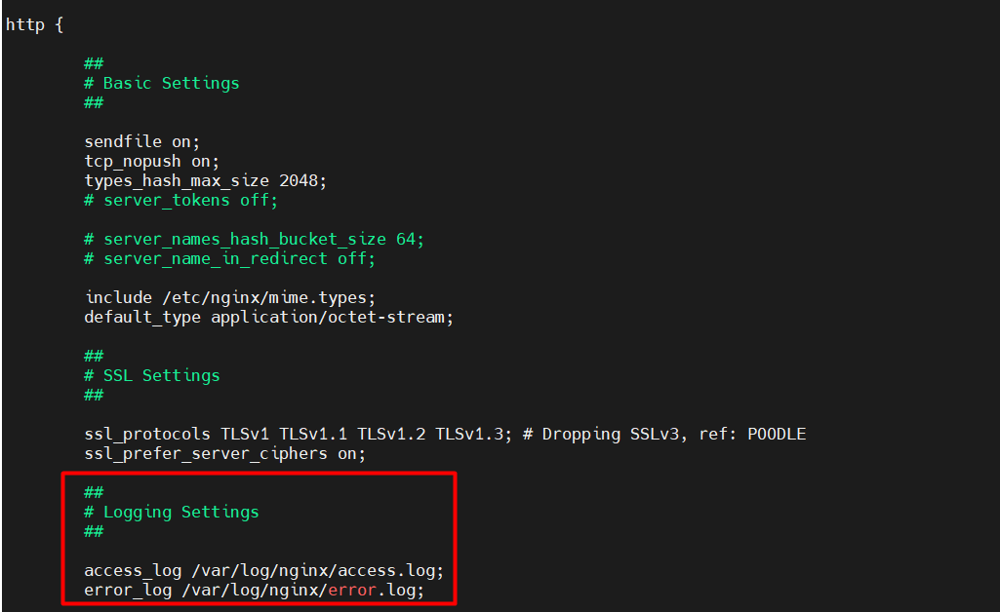
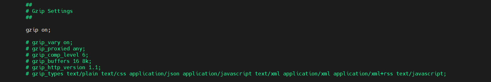

# CÀI ĐẶT VÀ CẤU HÌNH NGĨN CHO UBUNTU 

# 1. Cài đặt 
- Trên Ubuntu ta sử dụng câu lệnh sau
```
sudo apt-get update -y
sudo apt-get install nginx -y
```

- Kiểm tra version Nginx đã cài đặt 
```
nginx -v
```
- Để Nginx có thể khởi động cùng lúc với boot hệ điều hành
```
sudo systemctl start nginx.service
```
- Khởi động cùng hệ điều hành (mặc định)
```
sudo systemctl enable nginx.service
```
- Không khởi động cùng hệ điều hành
```
sudo systemctl disable nginx
```

- Mặc định tường lửa trên HDH sẽ chặn các cổng của Nginx, đổi với dịch vụ web các bạn chỉ cần mở port 80 cho giao thức HTTP và port 443 cho giao thức HTTPS:
```
sudo ufw allow http
sudo ufw allow https
```
- Mở tất cả các port 
```
sudo ufw allow 'Nginx Full'
```
- Kiểm tra trạng thái dịch vụ
```
service nginx status
```
# 2. Danh sách file và thư mục quan trọng 
Các file và thư mục nằm trong `/ect/nginx/`
Trong các tệp ở trên ta chỉ cần đặc biệt chú ý đến :

- `nginx.conf`: File config chính, chịu trách nhiệm tải nhiều tệp khác trong thư mục cấu hình
- `sites-available`: chứa các file config VirtualHost, cho phép chúng ta cấu hình riêng biệt cho từng website
- `conf.d`: chứa các file config của riêng bạn, lưu trữ Server Block của mỗi trang web


# 3. Cấu hình 

- Show nội dung file nginx.conf bằng lệnh 
```
cat nginx.conf
```

```
user www-data;
worker_processes auto;
pid /run/nginx.pid;
include /etc/nginx/modules-enabled/*.conf;

events {
        worker_connections 768;
        # multi_accept on;
}

http {

        ##
        # Basic Settings
        ##

        sendfile on;
        tcp_nopush on;
        types_hash_max_size 2048;
        # server_tokens off;

        # server_names_hash_bucket_size 64;
        # server_name_in_redirect off;

        include /etc/nginx/mime.types;
        default_type application/octet-stream;

        ##
        # SSL Settings
        ##

        ssl_protocols TLSv1 TLSv1.1 TLSv1.2 TLSv1.3; # Dropping SSLv3, ref: POODLE
        ssl_prefer_server_ciphers on;

        ##
        # Logging Settings
        ##

        access_log /var/log/nginx/access.log;
        error_log /var/log/nginx/error.log;

        ##
        # Gzip Settings
        ##

        gzip on;

        # gzip_vary on;
        # gzip_proxied any;
        # gzip_comp_level 6;
        # gzip_buffers 16 8k;
        # gzip_http_version 1.1;
        # gzip_types text/plain text/css application/json application/javascript text/xml application/xml application/xml+rss text/javascript;

        ##
        # Virtual Host Configs
        ##

        include /etc/nginx/conf.d/*.conf;
        include /etc/nginx/sites-enabled/*;
}


#mail {
#       # See sample authentication script at:
#       # http://wiki.nginx.org/ImapAuthenticateWithApachePhpScript
#
#       # auth_http localhost/auth.php;
#       # pop3_capabilities "TOP" "USER";
#       # imap_capabilities "IMAP4rev1" "UIDPLUS";
#
#       server {
#               listen     localhost:110;
#               protocol   pop3;
#               proxy      on;
#       }
#
#       server {
#               listen     localhost:143;
#               protocol   imap;
#               proxy      on;
#       }
#}

```

Tệp xây dựng theo cấu trúc lồng nhau nên các cấu hình lớp trong có thể kế thừa từ cha mẹ của chúng và nó cũng có khả năng ghi đè theo nhu cầu của bạn. Hãy chú ý đến

- **worker_processes**: Xác định số lượng worker process mà Nginx sẽ sử dụng. Do Nginx là single thread cho nên con số này thường bằng với số core của CPU
- **worker_connections**: Đây là số lượng kết nối tối đa tại một thời điểm cho mỗi worker process và cho biết worker process có bao nhiêu người dùng có thể được phục vụ đồng thời bởi Nginx. Con số này càng lớn thì số lượng người dùng được Nginx phục vụ sẽ càng cao.

# 4. Cấu hình Log
Thông thường, log của Nginx được lưu ở trong thư mục `/var/log/nginx` gồm có 2 file là:

- access.log: Lưu lại thông tin truy cập tới Web Server
- error.log: Lưu lại thông tin lỗi 

Để thay đổi đường dẫn 2 file này chúng ta sửa 2 tham số là error_log và access_log trong file `/etc/nginx/nginx.conf`:



# 5. Cấu hình gzip
Gzip là phương pháp nén dữ liệu trả về của server, giúp giảm tải thời gian tải tài nguyền từ server về client , giúp hiệu suất được nâng cao.

Để bật gzip trên Nginx chúng ta sửa file config `/etc/nginx/nginx.conf`:

