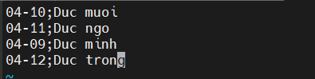

# Viết script thông báo sinh nhật 

# 1.Tạo file ngày sinh và tên của mọi người 



# 2.Tạo file bash shell chúc mừng sinh nhật

Ta tạo file birthday.sh với nội dung phía dưới 

```
#!/bin/bash

# Chat ID Information (Replace with your Telegram user ID)
USERID="-1001905581046"

# Bot Token (Replace with your Telegram bot token)
BOTTOKEN="7003171125:AAGErRwQ31uMrLlaICRQfpqQwGNuni5uVjo"

# Birthday Data File
FILE="dateofbirth.txt"

# Get Today's Date
TODAY="$(date +"%m-%d")"

# Input Field Separator
IFS=';'

while read -r bday name; do
  # Check Birthday Match
  if [[ "$bday" == "$TODAY" ]]; then
    # Construct Birthday Message
    MESSAGE="Happy Birthday, $name!"  # Consider adding more personalization
/usr/bin/curl --silent --output /dev/null \
    --data-urlencode "chat_id=${USERID}" \
    --data-urlencode "text=${MESSAGE}" \
    --data-urlencode "parse_mode=HTML" \
    --data-urlencode "disable_web_page_preview=true" \
    "https://api.telegram.org/bot${BOTTOKEN}/sendMessage?"
    echo "Successfully sent birthday message to $name."
  fi
done < "$FILE"
```

Cấp quyền thực thi và nhập kết quả bên phía telegram
