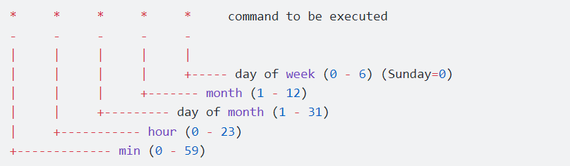
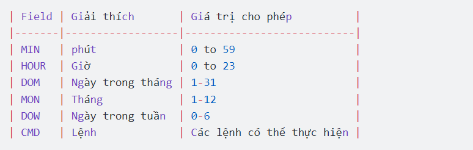

# 1.Tổng quan về Crontab
## 1.1.Crontab là gì?

Crontab là một cách để tạo và chạy các lệnh theo một chu kỳ xác định. Đây là tiện ích giúp lập lịch trình để chạy những dòng lệnh bên phía server, nhằm thực thi một hoặc nhiều công việc nào đó theo thời gian được lập sẵn.

## 1.2.Cách hoạt  động 
Một cron schedule đơn giản là một text file. Mỗi người dùng có một cron schedule riêng, file này thường nằm ở /var/spool/cron . Crontab files không cho phép bạn tạo hoặc chỉnh sửa trực tiếp với bất kỳ trình text editor nào, trừ phi bạn dùng lệnh crontab.

**Một số lệnh phổ biến**
```
crontab -e: tạo,  chỉnh sửa các crontab
crontab -l: Xem các Crontab đã tạo
crontab -r: xóa file crontab
```
## 1.3.Cài đặt Crontab

Câu lênh cài đặt
`yum install cronie`

Start crontab và tự động chạy mỗi khi reboot
```
service crond start
chkconfig crond on
```
# 2.Cách sử dụng 
Cron hoạt động dựa trên các lệnh được chỉ định trong cron table (crontab). Mỗi người dùng, kể cả root, đều có thể có một file cron. Các file này theo mặc định sẽ không tồn tại. Nhưng ta có thể tạo nó trong thư mục /var/spool/cron bằng cách dùng lệnh crontab -e. Ngoài ra, lệnh này cũng có thể được dùng để chỉnh sửa một file cron.

## 2.1.Cấu trúc file Crontab
Một crontab file có 5 trường xác định thời gian, cuối cùng là lệnh sẽ được chạy định kỳ, cấu trúc như sau:

Nếu một cột được gán ký tự *, nó có nghĩa là tác vụ sau đó sẽ được chạy ở mọi giá trị cho cột đó.


*Ví dụ*

**Chạy script 30 phút 1 lần** 

`30 * * * * command`

**Chạy script vào 3 giờ sáng mỗi ngày**

`0 3 * * * command`

**Tạo một tác vụ hoạt động vào một giờ cụ thể**

`11 08 10 07 * /home/framgia.vn/backup`

**Tạo 1 tác vụ thực hiện 2 lần trong một ngày**

`00 07,21  * * * /home/framgia.vn/backup`

Backup dữ liệu website: 2 lần trong một ngày lúc 7:00 và 21:00 hàng ngày.

**Tạo một tác vụ chỉ thực hiện vào các giờ cụ thể**

Chạy từ thứ 2 đến thứ 6

` 00 09-18 * * 1-5 /home/hostingaz.info/full-backup`

**Một số giá trị thời gian cho Crontab**

| Keyword | Giá trị             |
|---------|---------------------|
| @yearly | 0 0 1 1 *           |
| @daily  | 0 0 * * *           |
| @hourly | 0 * * * *           |
| @reboot | chạy lúc khởi động. |


**Tạo một tác vụ chạy vào phút đầu tiên của năm**

`@yearly /home/framgia.vn/backup`

**Tạo một tác vụ chạy vào phút đầu tiên của tháng**

`@monthly /home/framgia.vn/backup`


# 3.Giới hạn truy cập Cron trong Crontab Linux

Việc thường xuyên sử dụng cron có thể dẫn đến một số lỗi, chẳng hạn như tài nguyên hệ thống (bộ nhớ, CPU…) bị sử dụng quá mức. Do đó, sysadmin có thể giới hạn quyền truy cập của người dùng để hạn chế lỗi xảy ra. Cụ thể, hãy tạo một file /ect/cron.allow, chứa danh sách người dùng có quyền tạo cron job. Tuy nhiên, người dùng root không thể bị chặn sử dụng cron


# 3.1.Crond

Thư mục `/etc/cron.d` là nơi chứa các ứng dụng, như SpamAssassin, sysstat, file cài đặt cron…Vì không có người dùng spamassassin hay sysstat, các chương trình này cần một nơi để định vị các file cron. Vì vậy chúng sẽ được đặt ở trong `/etc/cron.d`

File `/etc/cron.d/sysstat` chứa các cron job liên quan đến báo cáo hoạt động hệ thống (SAR). Các file cron này có cùng định dạng với file cron của người dùng.

```
# Run system activity accounting tool every 10 minutes
*/10 * * * * root /usr/lib64/sa/sa1 1 1
# Generate a daily summary of process accounting at 23:53
53 23 * * * root /usr/lib64/sa/sa2 -A
```
Cron file sysstat sẽ gồm hai dòng lệnh để thực hiện các task. Dòng thứ nhất chạy lệnh sa1 mỗi 10 phút để thu thập dữ liệu trong các file nhị phân đặc biệt, được đặt ở thư mục /var/log/sa. Sau đó, mỗi tối vào 23:53, chương trình sa2 sẽ chạy để tạo một bản tóm tắt hàng ngày.


# 3.2.Anacron

Chương trình anacron thực hiện các chức năng tương tự như crond .Nhưng nó có thể chạy các job đã bị bỏ qua, ví dụ như máy tính đã tắt hoặc không thể chạy job trong một thời gian. Ngay sau khi máy tính được khởi động lại, anacron sẽ kiểm tra các job đã được cấu hình có bỏ lỡ lịch chạy nào không . Nếu có các job này sẽ được chạy ngay lập tức .Nhưng các job sẽ chỉ chạy 1 lần bất kể bao nhiêu lần nó đã bỏ lỡ lịch 

Cách vận hành của anacron
1. Dịch vụ crond chạy các cron job được chỉ định trong `/etc/cron.d/0hourly`

```
# Run the hourly jobs
SHELL=/bin/bash
PATH=/sbin:/bin:/usr/sbin:/usr/bin
MAILTO=root
01 * * * * root run-parts /etc/cron.hourly
```
2. Cron job được chỉ định trong /etc/cron.d/0hourly chạy chương trình run-parts mỗi giờ một lần 
3. Chương trình run-parts sẽ chạy tất cả script có trong thư mục /etc/cron.hourly
4. Thư mục /etc/cron.hourly chứa script 0anacron, script này sẽ chạy chương trình anacron bằng config file /etdc/anacrontab  ở dưới đây:

```
# /etc/anacrontab: configuration file for anacron

# See anacron(8) and anacrontab(5) for details.
```


5. Cuối cùng, chương tình anacron chạy các chương trình có trong /etc/cron.daily hàng ngày; chạy job trong /etc/cron.weekly hàng tuần, và job trong cron.monthly mỗi tháng. Lưu ý rằng thời gian delat trong mỗi dòng giúp ngăn các job này bị trùng nhau.


*Tài liệu tham khảo*

[1] [https://viblo.asia/p/tim-hieu-crontab-tren-linux-WApGx3DbM06y](https://viblo.asia/p/tim-hieu-crontab-tren-linux-WApGx3DbM06y)

[2] [https://vietnix.vn/crontab/](https://vietnix.vn/crontab/)