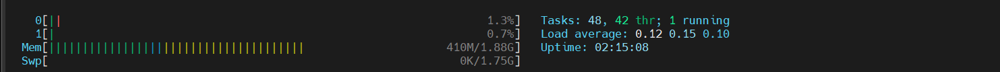
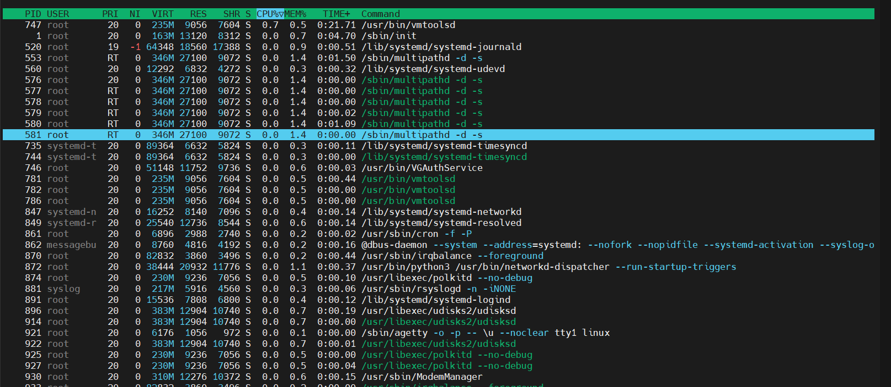
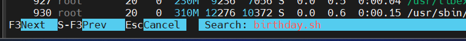
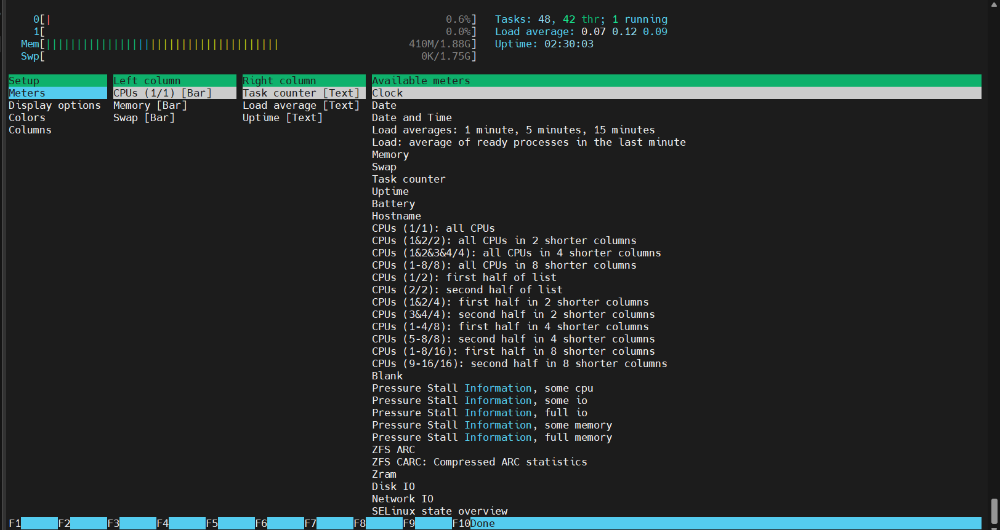
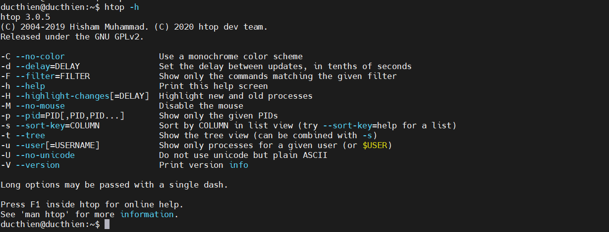

# Htop – Linux Process Monitoring

# 1.Mục đích sử dụng 
Htop là một công cụ giám sát quy trình Linux tương tác và thời gian thực. Lệnh này giống với lệnh top nhưng có một số tính năng phong phú như giao diện thân thiện với người dùng để quản lý quy trình, phím tắt, chế độ xem dọc và ngang của các quy trình và hơn thế . Htop là một công cụ bên thứ 3 và không có trong các hệ thống trong Linux

# 2.Cài đặt
```
apt-get install htop
```

# 3.Thông tin hiển thị 


*Phần đầu*

Phần trên cùng chia hai bên trái phải hiển thị mức sử dụng CPU/bộ nhớ , bộ nhớ SWAP(swap space), thời gian họat động của máy , các tác vụ và mức độ tải trung bình( load average)



Bạn cũng có thể xem mã màu do htop cung cấp để xác định loại quy trình nào đang sử dụng CPU

**Mức sử dụng CPU**
- Màu xanh dương: Tiến trình với mức ưu tiên thấp
- Màu xanh lá cây: Tiến trình người dùng
- Màu đỏ: Tiến trình kernel
- Màu vàng: Thời gian IRQ
- Màu đỏ tươi: Thời gian Soft IRQ
- Màu Xám: Thời gian chờ IO

**Mức dùng bộ nhớ ram**
- Màu đỏ : phần trăm bị chiếm bởi nội dung bộ nhớ cache
- Màu xanh lam: phần trăm bị chiếm bởi nội dung buffer (vùng lưu trữ dự liệu tạm thời )
- Màu xanh lá cây : phần trăm bị chiếm bởi bộ nhớ đã sử dụng

*Phần giữa*



Bảng trung tâm hiển thị tất cả các quy trình đang chạy với các dũ liệu hệ thống dựa trên lượng sử dụng CPU .Nó hiển thị các thông tin sau cho mỗi quá trình

- `PID`: Số ID của tiến trình.
- `USER`: Chủ sở hữu tiến trình.
- `PR`: Mức độ ưu tiên của tiến trình. Con số càng thấp, mức độ ưu tiên càng cao.
- `NI`: Giá trị nice value của tiến trình, ảnh hưởng đến mức độ ưu tiên của nó.
- `VIRT`: Tiến trình sử dụng bao nhiêu bộ nhớ ảo.
- `RES`: Tiến trình sử dụng bao nhiêu RAM vật lý, được đo bằng kilobyte.
- `SHR`: Bộ nhớ chia sẻ mà tiến trình đang sử dụng.
- `S`: Tình trạng hiện tại của tiến trình (zombied, sleeping, running, uninterruptedly sleeping, traced).
- `%CPU`: Tỷ lệ phần trăm CPU được sử dụng bởi tiến trình.
- `%MEM`: Tỷ lệ phần trăm RAM vật lý được sử dụng bởi tiến trình.
- `TIME+`: Tiến trình xử lý đã sử dụng bao nhiêu thời gian.
- `COMMAND`: Tên của lệnh bắt đầu tiến trình.

*Phần chân*


Phần chân trình bày một vài tính năng tương tác của htop .Nó chứa tất cả các tùy chọn cần thiết để hoạt động xung quanh giao diện đồ họa htop

- Nhấn `F3` (hoặc ấn `/`) để tìm kiếm tên chương trình 



- Nhấn `F2` để vào menu cài đặt để đặt meter, thay đổi tùy chọn hiển thị, màu sắc và thêm/bớt các cột khỏi bảng điều khiển giữa



**Bảng tổng hợp phím tắt trên htop**

|Mô tả	|Phím chức năng |Phím tắt|
|-----|-----|-----|
|Help	|F1|	h|
|Setup	|F2|	s|
|Seach Process	|F3|	/|
|Inver Sort Order	|F4|	i|
|Tree	|F5|	t|
|Sort by	|F6|	>|
|Nice – (Change Priority)	|F7|	[|
|Nice + (Change Priority)	|F8|	]|
|Kill	|F9|	k|
|Quit	|F10|	q|


# 4.Các option lệnh htop

- –d – delay (hiển thị độ trễ giữa các bản cập nhật, tính bằng 1/10 giây).
- –C – no-color (chế độ đơn sắc)


- –h – help (hiển thị thông báo trợ giúp và thoát)



- –u – user=USERNAME (chỉ hiển thị các tiến trình của một người dùng nhất định)


- –h – pid=PID (chỉ hiển thị các PID đã cho)
- –s – sort-key COLUMN (Sắp xếp theo cột này)

`htop -s USER`


- –v – version (thông tin phiên bản đầu ra và thoát)


*Tài liệu tham khảo*

[1] [https://tel4vn.edu.vn/blog/6-cau-lenh-monitor-can-thiet-nhat/](https://tel4vn.edu.vn/blog/6-cau-lenh-monitor-can-thiet-nhat/)

[2] [https://longvan.net/cong-dong/mot-so-cong-cu-de-monitor-server-linux/](https://longvan.net/cong-dong/mot-so-cong-cu-de-monitor-server-linux/)

[3] [https://tailieu.tgs.com.vn/huong-dan-su-dung-htop-theo-doi-system-processes-tren-linux/](https://tailieu.tgs.com.vn/huong-dan-su-dung-htop-theo-doi-system-processes-tren-linux/)