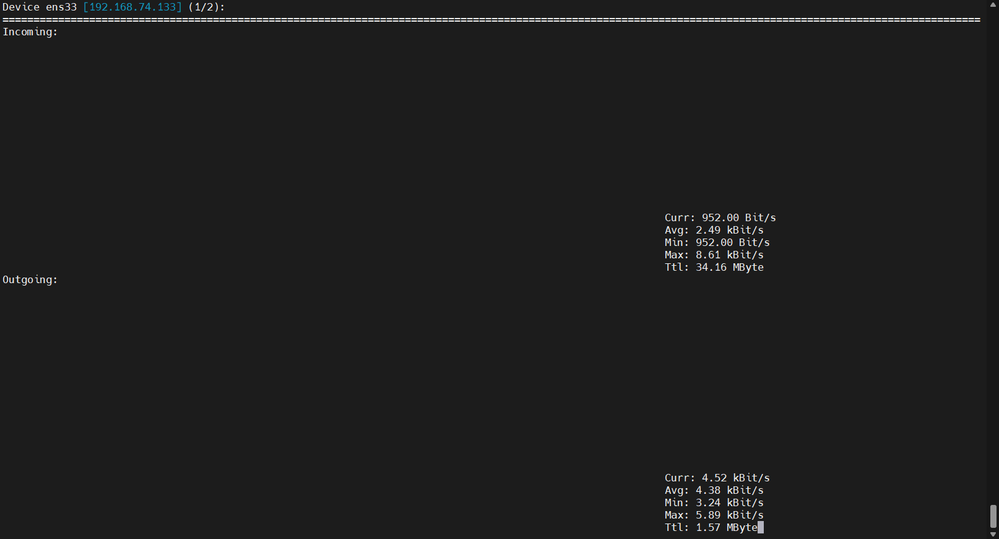

# Nload – Linux Process Monitoring 
# 1.Mục đích sử dụng 
Nload là một công cụ dòng lệnh để theo dõi lưu lượng mạng và việc sử dụng băng thông theo thời gian thực. Nload giúp giám sát lưu lượng đến (Incoming) và đi (Outgoing) bằng biểu đồ và cung cấp các thông tin như tổng lượng dữ liệu được truyền và mức sử dụng mạng tối thiểu và tối đa.

# 2.Cài đặt nload

```
sudo apt install nload
```

# 3.Thông tin hiển thị 



- Curr: Tốc độ tải xuống hiện tại
- Avg: Tốc độ trung bình trong một khoảng thời gian nhất định
- Min: Tốc độ chậm nhất đo được trong một khoảng thời gian 
- Max: Tốc độ nhanh nhất đo được trong một khoảng thời gian 
- Tlt: Tổng lượng dữ liệu tải xuống cho đến thời điểm hiện tại

# 4.Các phím tắt

Sau khi khởi chạy nload, bạn có thể sử dụng các phím tắt sau:

- Sử dụng các phím mũi tên trái và phải hoặc phím Enter / Tab để chuyển màn hình sang card mạng tiếp theo hoặc sử dụng nload -m để xem nhiều card cùng một lúc.
- Sử dụng F2 để hiển thị cửa sổ tùy chọn.
- Sử dụng F5 để lưu cài đặt hiện tại vào tệp cấu hình của người dùng.
- Sử dụng F6 để tải lại cài đặt từ các tệp cấu hình.
- Sử dụng q hoặc Ctrl + C để thoát nload


**Các option lệnh nload**

`nload -m` : Hiển thị nhiều card mạng cùng lúc 


Sử dụng -a và khoảng thời gian để đặt độ dài tính bằng giây của kết quả tính trung bình (mặc định là 300)

`nload -a 400`

Tùy chọn -t và khoảng thời gian refresh của màn hình được tính bằng mili giây (giá trị mặc định là 500)

`nload -ma 400 -t 600`


*Tài liệu tham khảo*

[1] [https://azdigi.com/blog/linux-server/tools/nload-monitor-linux-network-bandwidth-usage/](https://azdigi.com/blog/linux-server/tools/nload-monitor-linux-network-bandwidth-usage/)