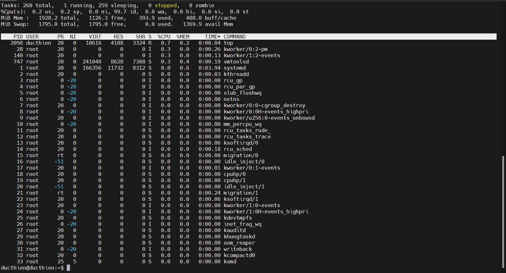
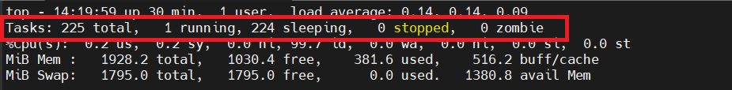
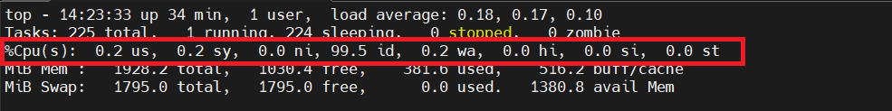
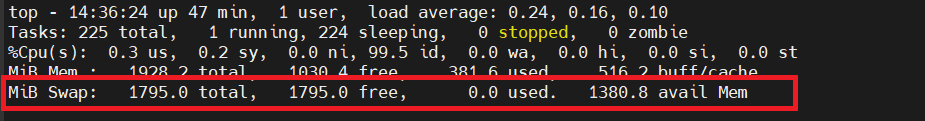
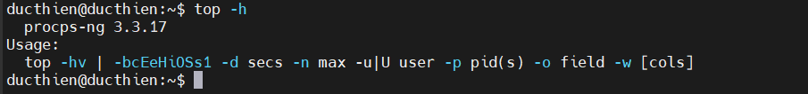
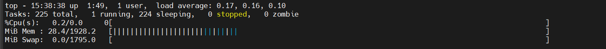

# Top – Linux Process Monitoring 

# 1.Mục đích sử dụng 
Lệnh Linux Top là một chương trình theo dõi hiệu suất. Lệnh Top được sử dụng để hiển thị tât cả các quy trình thời gian thực đang chạy và đang hoạt động trong danh sách được sắp xếp và cập nhật nó thường xuyên .

# 2.Thông tin hiển thị 
Nó hiển thị sử dụng CPU usage, Memory usage, Swap Memory, Cache Size, Buffer Size, Process PID, User, Commands .....

Để hiển thị các thông tin của hệ thống, chỉ cần gõ lệnh sau vào cửa sổ dòng lệnh:

`top`

**Các thông cụ thể sẽ hiển thị khi sử dụng lệnh top**

*Dòng 1*

- Thời gian hiện tại của hệ thống.
- Thời gian uptime.
- Số lượng người dùng.
- Load average hiển thị thời gian load hệ thống trong 1 phút, 5 phút và 15 phút cuối

Lưu ý: Load average sẽ khác nhau tùy theo server và thời điểm. Nếu Server/VPS của bạn có 2 CPU(s) thì trung bình tải chỉ nên là dưới 2. Nếu con số này cao hơn số CPU của bạn thì hệ thống đang quá tải, số lượng công việc xử lý vượt qua mức CPU có thể xử lý hiện tại.

*Dòng 2*

- `Tasks`: Tổng số tác vụ có trên máy chủ
- `running`: Số lượng tác vụ đang chạy
- `sleeping`: Số lượng tác vụ trong trạng thái “sleep”, bạn có thể hiểu tác vụ đang tạm dừng
- `stopped`: Số lượng tác vụ đã dừng
- Số lượng tác vụ `zombie` (tiến trình không tồn tại hoặc bị hỏng)

*Dòng 3*

- `%us` (user cpu time): Mức sử dụng CPU bởi người dùng theo tỷ lệ phần trăm
- `%sy` (system cpu time): Mức sử dụng CPU bởi hệ thống theo tỷ lệ phần trăm
- `%ni` (user nice cpu time): Mức sử dụng CPU bởi các tiến trình có mức ưu tiên thấp theo tỷ lệ phần trăm
- `%id` (idle cpu time): Mức sử dụng CPU bởi idle process (tiến trình cho biết bộ xử lý đang rảnh rỗi) theo tỷ lệ phần trăm
- `%wa` (io wait cpu time): Mức sử dụng CPU bởi io wait (thời gian CPU không hoạt động để chờ I/O disk hoàn thành) theo tỷ lệ phần trăm
- `%hi` (hardware irq): Mức sử dụng CPU bởi việc ngắt phần cứng theo tỷ lệ phần trăm
- `%si` (software irq): Mức sử dụng CPU bởi việc ngắt phần mềm theo tỷ lệ phần trăm
- `%st` (steal time): Mức sử dụng CPU bởi steal time (thời gian CPU ảo “chờ” CPU thực, trong khi bộ ảo hóa đang phục vụ bộ xử lý ảo khác) theo tỷ lệ phần trăm

*Dòng 4*

- Tổng bộ nhớ hệ thống(đơn vị Kib).
- Bộ nhớ trống.
- Bộ nhớ đã sử dụng.
- Bộ nhớ đệm buffer cache.

*Dòng 5*

- Tổng swap có sẵn(đơn vị Kib).
- Tổng swap còn trống.
- Tổng swap đã sử dụng.
- Bộ nhớ khả dụng.
Swap là RAM ảo, được sử dụng khi bộ nhớ vật lý (RAM) bị đầy. Luôn luôn bật Swap để khi hệ thống đầy ram vật lý sẽ không bị treo.

*Bảng thông tin chính*

- `PID`:ID tiến trình.
- `USER`:Người dùng(Mình có ẩn bớt một số user chứ mặc định không có trống).
- `PR`:Mức độ ưu tiên.
- `NI`:Mức độ nice (gọi một tập lệnh shell với mức độ ưu tiên cụ thể).
- `VIRT`:Bộ nhớ ảo được sử dụng bởi tiến trình.
- `RES`:Bộ nhớ “thường trú” mà một tiến trình sử dụng (tức là tiến trình luôn ở trong bộ nhớ và không thể chuyển ra thiết bị lưu trữ khác)
- `SHR`:Bộ nhớ có thể chia sẻ
- `%CPU`:CPU được sử dụng bởi tiến trình theo tỷ lệ phần trăm của 1 cpu.
- `MEM`:Bộ nhớ được sử dụng bởi tiến trình theo tỷ lệ phần trăm
- `TIME`:Thời gian tiến trình đã được chạy

# 3.Các option lệnh top:
- `-h` : Hiển thị phiên bản hiện tại.

- `-c` : Hiển thị tên đầy đủ của các tiến trình thay vì chỉ hiển thị tên ngắn gọn
- `-d` : Chỉ định thời gian trễ khi refresh màn hình.
- `-o` : Sắp xếp theo trường được đặt tên
- `-p` : Chỉ hiển thị các tiến trình với ID được chỉ định.
- `-u` : Chỉ hiển thị những tiến trình của người dùng được chỉ định.
- `-i` : Không hiển thị các idle task.

# 4.Sắp xếp tiến trình 

- Nhấn `M` và `T` để sắp xếp tiến trình theo ID

- Nhấn `M` và `P` để sắp xếp tiến trình theo mức độ sử dụng bộ nhớ 
- Nhấn `M` và `T` để sắp xếp tiến trình theo thời gian chạy

- Nhấn `z` để thay đổi màu sắc dang chạy

*Tài liệu tham khảo*

[1] [https://tel4vn.edu.vn/blog/6-cau-lenh-monitor-can-thiet-nhat/](https://tel4vn.edu.vn/blog/6-cau-lenh-monitor-can-thiet-nhat/)

[2] [https://longvan.net/cong-dong/mot-so-cong-cu-de-monitor-server-linux/](https://longvan.net/cong-dong/mot-so-cong-cu-de-monitor-server-linux/)

[3] [https://www.tecmint.com/12-top-command-examples-in-linux/](https://www.tecmint.com/12-top-command-examples-in-linux/)