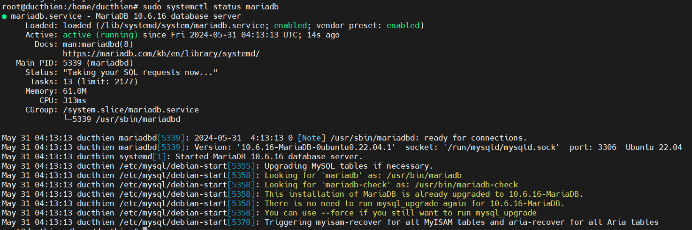
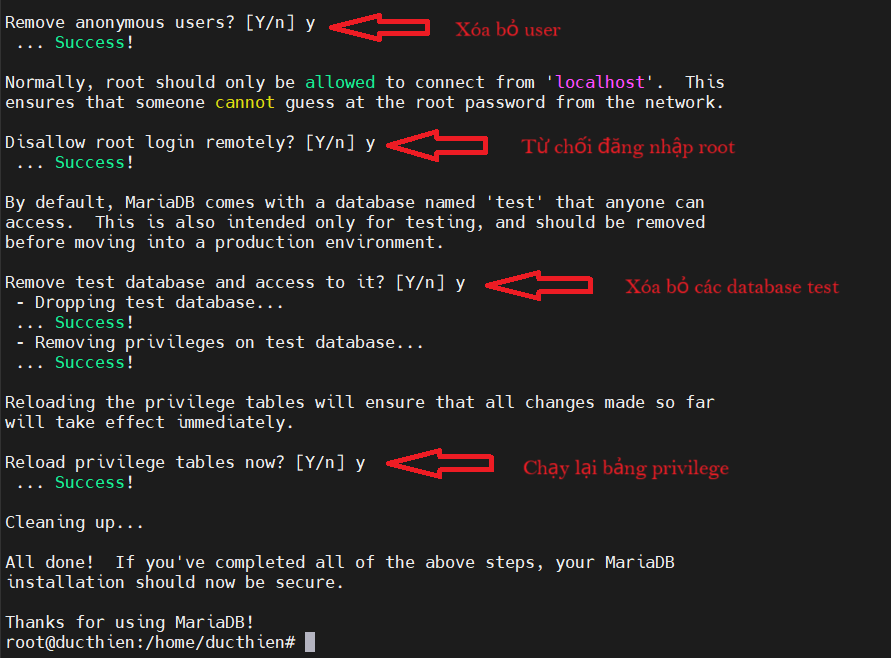
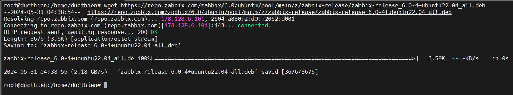
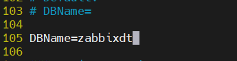
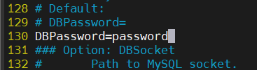
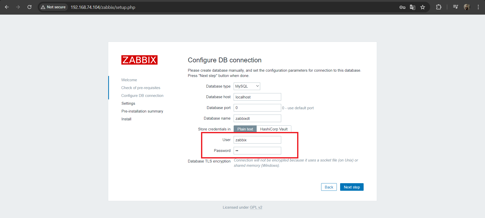
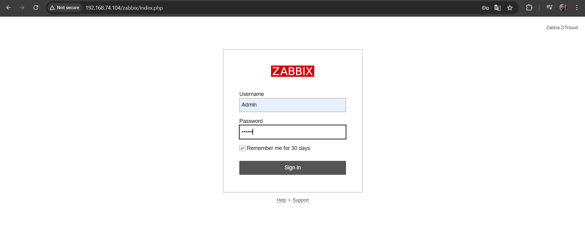
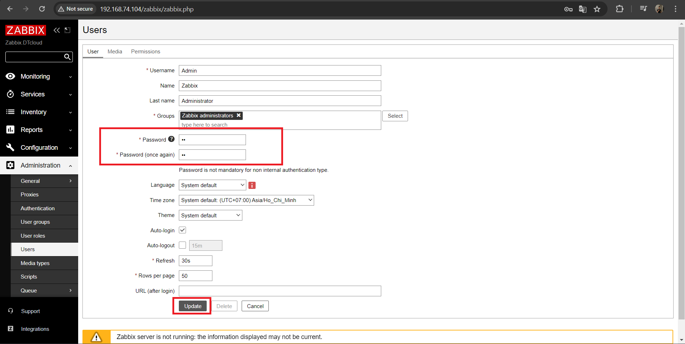

# Cài đặt Zabbix Server trên Ubuntu 22.04

# 1.Mô hình 


**Máy Zabbix Server**   
Ubuntu Server 22.04   
IP 192.168.74.104

**Máy Web Server**  
Ubuntu Server 22.04  
IP 192.168.74.105

**Máy Windows Server**  
Windows server 2019  
IP 192.168.74.106  

**1.Giám sát Web Server sử dụng Zabbix Agent**  
**2.Giám sát Windows Server sử dụng Zabbix Agent/SMNP**

# 2.Cài đặt Zabbix server

## 2.1. Thiết lập IP tĩnh cho Zabbix server

Ta cấu hình trong file netpaln với IP:192.168.74.104


## 2.2.Cài đặt Aapache HTTP Server

- Cập nhật lại hệ thống 
```
sudo apt update
```
- Cài đặt apache2 
```
sudo apt -y install apache2
```
- Kiểm tra các gói apache đã cài đặt
```
sudo apt list --installed | grep apache2
```
- Restart và bật apache chạy ngay khi khởi động 
```
sudo systemctl restart apache2
sudo systemctl enable apache2
```
- Kiểm tra trạng thái apache
```
sudo systemctl status apache2
```

Truy cập link `http://192.168.74.104` đã thấy hoạt động


## 2.3.Cài đặt MariaDB

- Cài đặt mariadb server  
```
sudo apt -y install mariadb-server
```
- Restart lại và bật hoạt động mariadb server   
```
sudo systemctl restart mariadb
sudo systemctl enable mariadb
```  
- Kiểm tra trạng thái mariadb server  
```
sudo systemctl status mariadb
```


- Thiết lập lại secure mariadb server 
```
sudo mysql_secure_installation
```





## 2.4.Cài đặt PHP-FPM

- Cài đặt php
```
sudo apt -y install php-fpm
```

- Bật các module tùy chọn 
```
sudo a2enmod proxy_fcgi setenvif
sudo a2enconf php8.1-fpm
```
   

- Restart lại php
```
sudo systemctl restart php8.1-fpm apache2
```
- Kiểm tra trạng thái hoạt động của php
```
sudo systemctl status php8.1-fpm
```
- Kiểm tra version php đã cài đặt 
```
php -v
```

## 2.5.Cài đặt zabbix 

**Cài đặt Zabbix**
- Thêm repo Zabbix vào hệ thống Ubuntu 22.04
 
```
wget https://repo.zabbix.com/zabbix/6.0/ubuntu/pool/main/z/zabbix-release/zabbix-release_6.0-4+ubuntu22.04_all.deb

```



- Cài đặt zabbix 
```
sudo dpkg -i zabbix-release_6.0-4+ubuntu22.04_all.deb
```
- Cập nhật lại hệ thống 
```
sudo apt update -y
```

Cài đặt Zabbix Server , Fronted và Agent
```
sudo apt -y install zabbix-server-mysql zabbix-frontend-php zabbix-apache-conf zabbix-sql-scripts zabbix-agent php-mysql php-gd php-bcmath php-net-socket
```

**Thiết lập mariadb, tạo cở sở dữ liệu Zabbix**

```
mysql -uroot -p
```
- Tạo Database  
```
create database zabbixdt character set utf8mb4 collate utf8mb4_bin;
```
- Tạo user và password 
```
create user zabbix@localhost identified by 'A1';
```
- Phân quyền 
```
grant all privileges on zabbixdt.* to zabbix@localhost;
set global log_bin_trust_function_creators = 1;
flush privileges;
quit;
```


**Import database mặc định của zabbix**

```
sudo zcat /usr/share/zabbix-sql-scripts//mysql/server.sql.gz | mysql --default-character-set=utf8mb4 -uzabbix -p zabbixdt
```

**Chỉnh sửa tệp cấu hình máy chủ và đặt thông tin đăng nhập cơ sở dữ liệu**

Ta chỉnh sửa file config sau : 

```
sudo vi /etc/zabbix/zabbix_server.conf
```

*Kiểm tra DB name dòng 105*

`DBName=zabbix`



*Kiểm tra DB user dòng 121*

`DBUser=zabbix`


*Tại dòng 130 thêm password user zabbix đã tạo ở bước trên*

`DBPassword=password`



**Lưu lại và khởi động lại dịch vụ**

```
sudo systemctl restart zabbix-server

sudo systemctl enable zabbix-server
```
Allow port 80 

```
sudo ufw allow from any to any port 80 proto tcp
```

## 2.6.Thiết lập Web Interface 

**Truy cập giao diện người dùng Zabbix mới cài đặt**

`http://192.168.74.104/zabbix`


Các thông số trên web chưa thỏa mãn yêu cầu cài đặt 


**Cấu hình giá trị PHP cho Zabbix**

*Chỉnh sửa file config PHP*

```
sudo vi /etc/php/8.1/fpm/pool.d/www.conf
```

*Thêm tất cả các thông số sau phía cuối file config*

```
php_value[max_execution_time] = 300
php_value[memory_limit] = 128M
php_value[post_max_size] = 16M
php_value[upload_max_filesize] = 2M
php_value[max_input_time] = 300
php_value[max_input_vars] = 10000
php_value[always_populate_raw_post_data] = -1
php_value[date.timezone] = Asia/Ho_Chi_Minh
```
*Khởi động lại dịch vụ*
```
sudo systemctl restart php8.1-fpm
```


## 2.7.Cấu hình giao diện web 

Mở giao diện người dùng Zabbix mới cài đặt bằng URL: `http://192.168.74.104/zabbix`

*Chọn Next step để bắt đầu cài đặt Zabbix*


*Kiểm tra điều kiện: Đảm bảo tất cả các item đều [OK], Chọn Next step để sang bước tiếp theo*


*Cấu hình kết nối với DB: **Nhập Database**, **user** và **password database zabbix** bạn đã tạo. Chọn **Next step** để sang bước tiếp theo.*



*Đặt tên Zabbix server, múi giờ và chủ đề cho giao diện người dùng.*


*Xác nhận các cài đặt trước đó. Chọn `Next` step để sang màn hình tiếp theo.*


*Chọn Finish để kết thúc quá trình cài đặt*


## 2.8.Đăng nhập Zabbix 

*Sử dụng tên người dùng quản trị mặc định của zabbix: Admin/zabbix để đăng nhập vào giao diện người dùng
*


*Sau khi cài đặt zabbix thành công, để đảm bảo tính bảo mật chúng ta nên thay đổi mật khẩu tài khoản quản trị.*

- Chọn `Administrator` > `User`. Sau đó chọn dòng `Username Admin`


*Chọn `Change password`để tiến hành thay đổi mật khẩu*


*Nhập mật khẩu bạn muốn thay đổi và chọn Update để xác nhận thay đổi mật khẩu*




***Như vậy là ta đã cài đặt xong Zabbix***


*Tài liệu tham khảo*

[1] [https://www.zabbix.com/download?zabbix=6.4&os_distribution=alma_linux&os_version=9&components=server_frontend_agent&db=mysql&ws=apache](https://www.zabbix.com/download?zabbix=6.4&os_distribution=alma_linux&os_version=9&components=server_frontend_agent&db=mysql&ws=apache)   
[2] [https://suncloud.vn/huong-dan-cai-dat-zabbix-60-lts-tren-ubuntu-2204](https://suncloud.vn/huong-dan-cai-dat-zabbix-60-lts-tren-ubuntu-2204)  
[3] [https://www.zabbix.com/download?zabbix=6.4&os_distribution=alma_linux&os_version=9&components=server_frontend_agent&db=mysql&ws=apache](https://www.zabbix.com/download?zabbix=6.4&os_distribution=alma_linux&os_version=9&components=server_frontend_agent&db=mysql&ws=apache)