# Cấu hình cảnh báo trên Zabbix
Để cấu hình cảnh báo khi CPU hoặc RAM vượt mức 80% trên Zabbix, bạn cần thực hiện các bước sau
# 1. Tạo mẫu cảnh báo 

## 1.1.Tạo một Item trên Zabbix để giám sát CPU:

**Bước 1:** Đăng nhập vào giao diện quản trị của Zabbix.

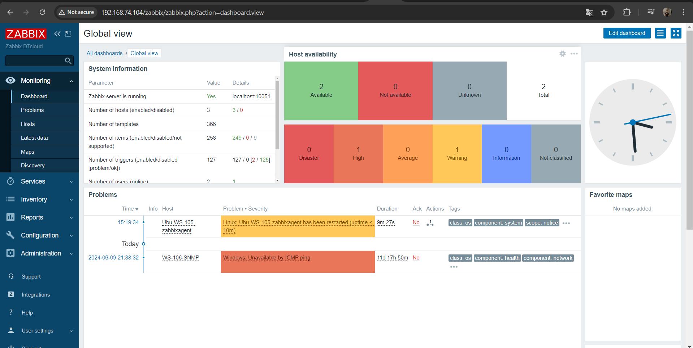

**Bước 2:** Di chuyển đến mục "Configuration" và chọn "Hosts"

**Bước 3:**Chọn host bạn muốn giám sát (nơi bạn muốn giám sát CPU).

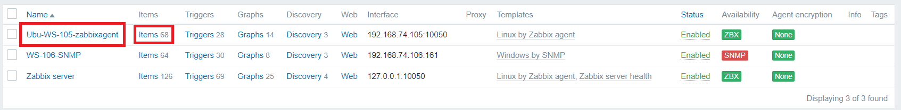

Ở đây ta sẽ chọn host `Ubu-WS-105-zabbixagent` để giám sát 

**Bước 4:** Thêm một `Item` mới , Nhấp vào *Item* sau đó là *Create Item*

Điền các thông tin sau:
- Name: Tên của Item (ví dụ: CPU sử dụng).
- Type: Loại Item là "Zabbix agent" (nếu bạn đang sử dụng Zabbix agent để giám sát).
- Key: system.cpu.util[,idle] (hoặc sử dụng key phù hợp để lấy thông tin về tình trạng sử dụng CPU).
- Type of information: Numeric (float).
- Lưu Item.

## 1.2.Tạo một Trigger cho cảnh báo:

Sau khi có Item để giám sát CPU, bạn cần tạo một `Trigger` để cảnh báo khi CPU vượt mức 80%.

Trong cùng giao diện cấu hình Hosts, di chuyển đến mục "Triggers". Thêm một Trigger mới: Nhấp vào `Create Trigger`

Điền các thông tin sau:
- Name: Tên của Trigger (ví dụ: CPU sử dụng mức cao).
- Severity: Mức độ nghiêm trọng của cảnh báo (ví dụ: High).
- Expression: Sử dụng biểu thức để kiểm tra giá trị của Item CPU usage. Bấm add để hiện bảng thêm giá trị 

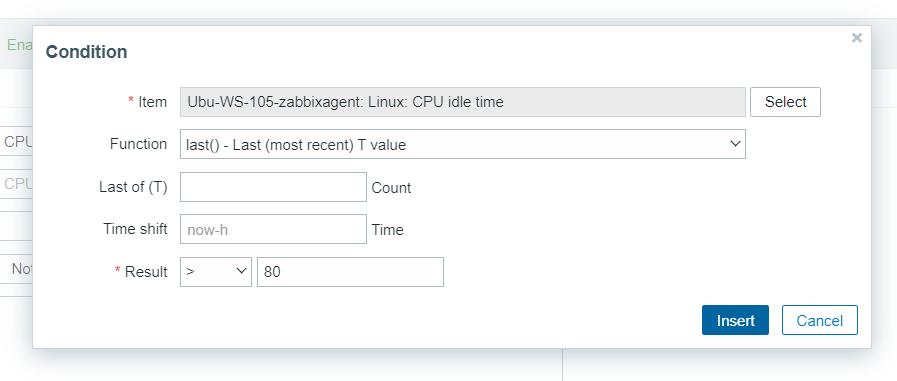

# 2.Cấu hình Zabbix gửi cảnh báo đến Telegram

## 2.1.Tạo một bot trên Telegram
- Nhập Botfather tại thanh tìm kiếm trên telegram, chọn Botfather có tích xanh.

- Nhấn start

- Hệ thống sẽ hiển thị ra đoạn chat, sau đó bạn nhấn vào mục /newbot - create a new bot.

- Và bạn nhập tên cho Bot bạn mong muốn và ấn gửi

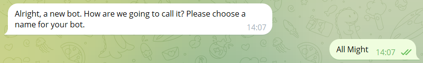

- Nhập tên người dùng cho Bot.  

*Lưu ý: Tên bạn muốn tạo phải có đuôi kết thúc bằng chữ "bot", chẳng hạn như HthnBot hoặc hthn_bot.*

- Lúc này hệ thống sẽ gửi thông tin xác nhận bạn tạo Bot thành công.

## 2.2. Cấu hình Media Types trong Zabbix để gửi cảnh báo đến Telegram

Đăng nhập vào giao diện quản trị Zabbix, chọn **Administration > Media types > Telegram**

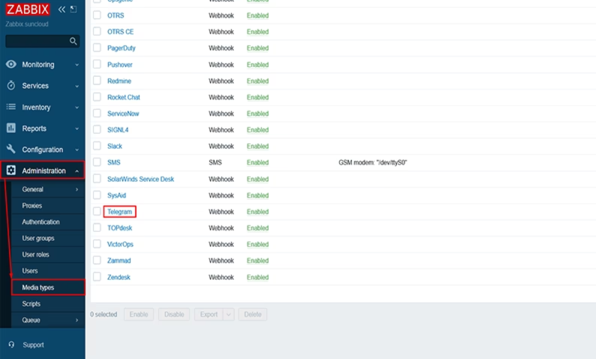

Nhập API Token của bot vào trường `Token`

Nhấp vào nút `Update` để lưu lại nội dung Mediatype.

## 2.3.Cấu hình Users

Chọn mục **Users** và chọn người dùng bạn muốn gửi cảnh báo qua Telegram.

Chọn tab **Media > Add** để thêm Media mới.
- Trong phần "Type", chọn mediatype bạn đã tạo trước đó là **Telegram**.
- Điền chat ID của người dùng hoặc ID của group ở bước bước 1 tại **Send to**.
- Tại When active nhập giới hạn khung thời gian có thể gửi cảnh báo
- Nhấp vào nút "Update” để lưu lại thay đổ

Chọn `Update` để lưu thông tin thay đổi của **Users**

## 2.4.Cấu hình Action để nhận cảnh báo

Chọn **Configuration > Actions > Create action**

Trong bảng tạo Action ta điền các thông tin như phía dưới 

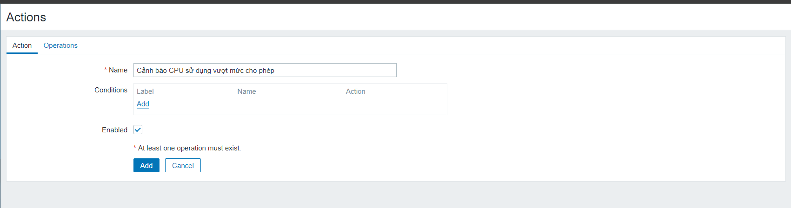

**Conditions**: Cấu hình điều kiện để `Trigger` kích hoạt Action. 

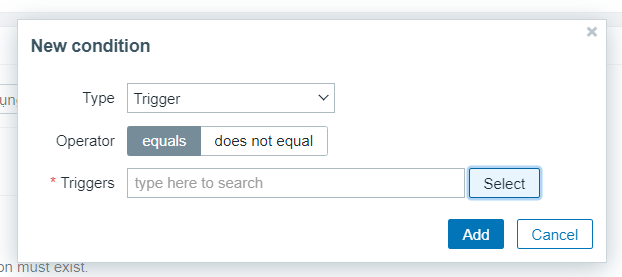

Ta bấm `Select` và chọn `Trigger` đã tạo trước đó , hoặc các `Trigger` khác tùy thuộc vào nhu cầu sử dụng 

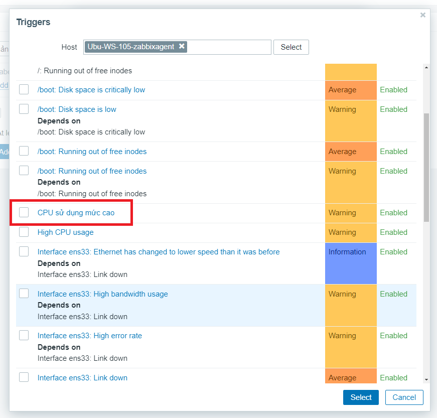

Chọn tab **Operations > Operations > Add**

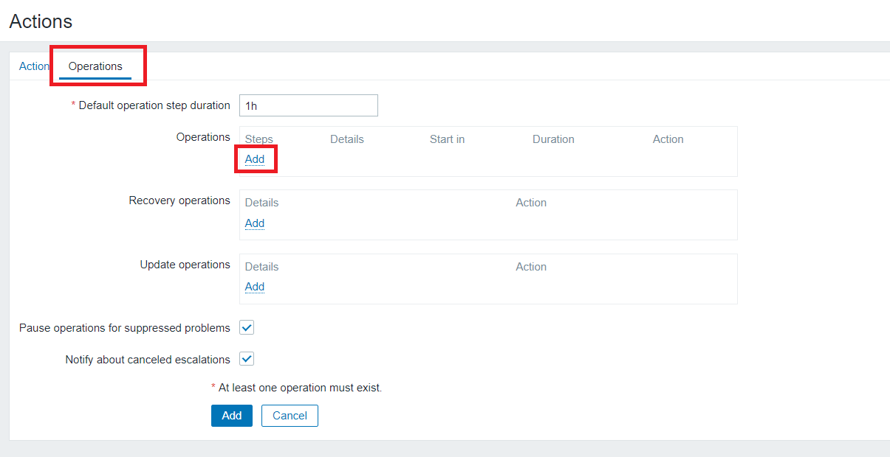

Tại Operation details:
- **Send to users** chọn User cần gửi cảnh báo đã chọn ở trên.
- **Send only to** chọn `Telegram`
- Chọn **Custom message** để thiết lập form cho message, có thể tham khảo mẫu bên dưới:

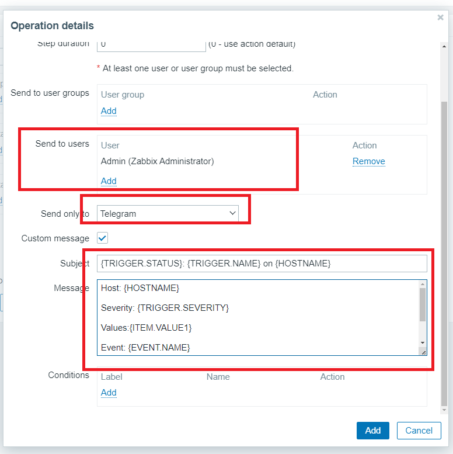

Chọn **Add** tại **Recovery operations**

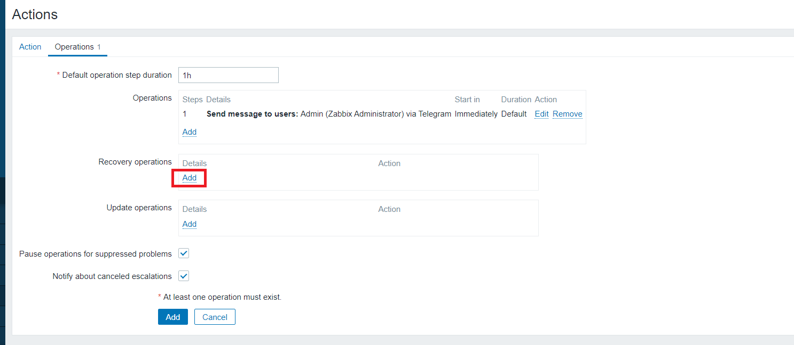

Tại Operation details:
- **Send to users** chọn User cần gửi cảnh báo đã chọn ở trên.
- **Send only to** chọn `Telegram`
- Chọn **Custom message** để thiết lập form cho message, có thể tham khảo mẫu bên dưới:

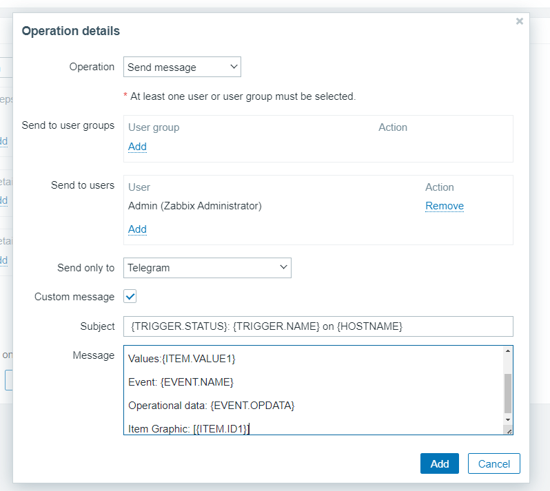