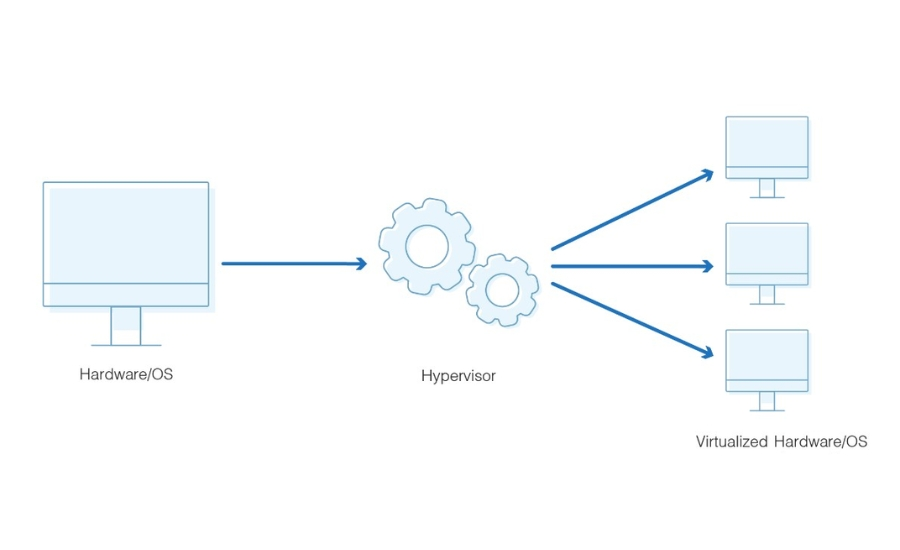
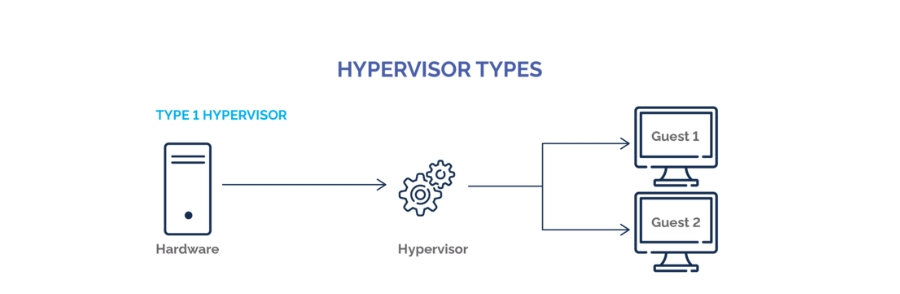

# Ảo hóa - Virtualization

## 1. Ảo hóa là gì (Virtualization)

## 1.1.Tổng quan về máy ảo 

- Virtualization hay ảo hóa là công nghệ được phát triển để tận dụng toàn bộ khả năng hoạt động của máy chủ vật lý . Công nghệ này cho cho phép máy chủ ảo chạy trên cùng một máy chủ vật lý , chia sẻ tài nguyên như RAM, CPU, ổ cứng ...
- Đối với các ứng dụng chạy trên máy ảo, nó có thể xuất hiện như thể trên một máy chuyên dụng, nơi hệ điều hành, thư viện, và các chương trình khác là duy nhất cho máy ảo và không kết nối với hệ thống máy chủ dưới nó

## 1.2. Thành phần ảo hóa 

1. **Hypervisor**   
Hypervisor còn được gọi là trình quản lý máy ảo (Virtual Machine Monitor -VMM), là phần mềm hoặc phần cứng chịu trách nhiệm tạo và quản lý các máy ảo (VMs). Có 2 loại hypervisor chính 
- Type 1 (Bare-Metal) Hypervisor: Chạy trực tiếp trên phần cứng máy chủ mà không cần hệ điều hành 
- Type 2 (Hosted)Hypervisor: Chạy trên hệ điều hành máy chủ và cung cấp khả năng tạo máy ảo 

2. **Virtual Machine(VMs)**  
Máy ảo là các phiên bản ảo của một hệ điều hành, chạy dưới sự kiểm soát của hypervisor. Mỗi máy ảo hoạt động như một hệ thống độc lập với tài nguyên riêng biệt (CPU,RAM,ổ đĩa,mạng)

3. **Guest Operating System**  
Hệ điều hành khách (Guest OS) là hệ điều hành chạy bên trong một máy ảo. Mỗi VM có thể có một Guest OS khác nhau và hoạt động độc lập

4. **Host Operating System**   
Hệ điều hành máy chủ (Host OS) là hệ điều hành chạy trên máy chủ vật lý và quản lý các tài nguyên phần cứng

5. **Virtualization Layer**  
Lớp ảo hóa là phần của hypervisor chịu trách nhiệm trừu tượng hóa phần cứng vật lý cung cấp các tài nguyên ảo cho các máy ảo 

6. **Virtual Hardware**  
Phần cứng ảo là các tài nguyên ảo được cung cấp cho máy ảo, bao gồm CPU, bộ nhớ, đĩa lưu trữ, và mạng. Hypervisor tạo ra các tài nguyên ảo này từ phần cứng vật lý của máy chủ 

7. **Virtual network**  
Mạng ảo cho phép cac máy ảo giao tiếp với nhau và với các mạng bên ngoài thông qua các thiết bị mạng ảo như switch ảo và card mạng ảo 

8. **Storage Virtualization**  
Ảo hóa lưu trữ trừu tượng hóa các tài nguyên lưu trữ vật lý và cung cấp không gian lưu trữ ảo cho các máy ảo. Điều này có thể bao gồm các ổ đĩa (virtual disks) được tạo ra từ ổ đĩa vật lý hoặc hệ thống lưu trữ mạng 

9. **Management Tools**  
Công cụ quản lý giúp quản trị viên tạo, cấu hình, và quản lý các máy ảo và tài nguyên ảo hóa.Các công cụ này có thể là giao diện dòng lệnh hoặc giao diện đồ họa

10. **Virtualization APIs**  
APIs ảo hóa cho phép các công cụ và phần mềm quản lý tương tác với hypervisor và các máy ảo, tự động hóa các tác vụ quản lý và giám sát

## 1.3.Mục đích của ảo hóa 

- Để có thể chạy 1 hệ điều hành khác ngay trên hệ thống hiện tại mà không cần phải đổi máy hay đổi hệ thống 
- Cung cấp một cách để phân đoạn một hệ thống lớn thành các phần nhỏ hơn 
- Đảm bảo độ an toàn cho các chương trình và dữ liệu đối với các máy ảo khác nhau 

# 2. Hypervisor

## 2.1.Khái niệm 
Hypervisor là một phần cứng, hoặc phần mềm, firmware có thể tạo các máy ảo và quản lý cũng như phân bổ tài nguyên cho chúng 

## 2.2.Phân loại 

**Bare metal hypervisor - Native**  
Native hypervisor hoạt động trực tiếp trên phần cứng máy chủ vật lý, thay vì hoạt động trên hệ điều hành nào đó như các hypervisor khác     
Native hypervisor cho phép người dùng chia sẻ tài nguyên giữa các máy ảo hiệu quả, tăng hiệu suất và giảm độ trễ tốt. Giải pháp này cũng mang lại môi trường ảo hóa độc lập, không phụ thuộc vào các hệ điều hành chủ      
Native hypervisor được sử dụng chính trong các trung tâm dữ liệu (Data center) và môi trường ảo hóa của doanh nghiệp, nhằm mục đích tăng hiệu quả và tính linh hoạt cho hệ thống 

**Embedded hypervisors - Hosted**  
Hosted hypervisors hoạt động trên một hệ điều hành chủ như một ứng dụng , các hệ điều hành khách có thể chạy cùng lúc trên cùng một máy tính vật lý 

# 3.Phân loại ảo hóa 

1. **Ảo hóa máy chủ (Server Virtualization)**  
Ảo hóa máy chủ cho phép một máy chủ vật lý chạy nhiều hệ điều hành và ứng dụng như các máy chủ ảo độc lập. Các máy chủ ảo này được gọi là máy ảo (Virtual Machines - VMs).  
Hypervisor Type 1 (Bare-Metal): Chạy trực tiếp trên phần cứng máy chủ mà không cần hệ điều hành. Ví dụ: VMware ESXi, Microsoft Hyper-V, Xen.
Hypervisor Type 2 (Hosted): Chạy trên hệ điều hành máy chủ và cung cấp khả năng tạo máy ảo. Ví dụ: VMware Workstation, Oracle VirtualBox.

2. **Ảo hóa mạng (Network Virtualization)**  
Ảo hóa mạng trừu tượng hóa tài nguyên mạng vật lý để tạo ra các mạng ảo. Điều này cho phép nhiều mạng ảo chia sẻ cùng một cơ sở hạ tầng mạng vật lý.   
SDN (Software-Defined Networking): Quản lý mạng thông qua phần mềm thay vì phần cứng truyền thống.
NFV (Network Functions Virtualization): Chạy các chức năng mạng như firewall, load balancer trên phần mềm thay vì phần cứng chuyên dụng.

3. **Ảo hóa lưu trữ (Storage Virtualization)**  
Ảo hóa lưu trữ trừu tượng hóa tài nguyên lưu trữ vật lý để tạo ra một không gian lưu trữ ảo, giúp quản lý và phân bổ tài nguyên lưu trữ dễ dàng hơn.  
Block Storage Virtualization: Trừu tượng hóa các khối lưu trữ (block storage), ví dụ: LVM (Logical Volume Manager).
File Storage Virtualization: Trừu tượng hóa các hệ thống file, ví dụ: NFS (Network File System).

4. **Ảo hóa hệ điều hành (Operating System Virtualization)**  
Cho phép chạy nhiều hệ điều hành trên cùng một nhân (kernel) duy nhất. Các hệ điều hành này được gọi là containers.  
Containerization: Docker, LXC (Linux Containers).

5. **Ảo hóa ứng dụng (Application Virtualization)**  
Cho phép ứng dụng chạy trên nhiều hệ điều hành mà không cần cài đặt trên mỗi hệ điều hành.  
Application Streaming: Microsoft App-V, VMware ThinApp.

6. **Ảo hóa máy tính để bàn (Desktop Virtualization)**  
Cho phép chạy môi trường desktop của người dùng trên máy chủ và truy cập từ xa.  
VDI (Virtual Desktop Infrastructure): VMware Horizon, Citrix XenDesktop.  
Remote Desktop Services: Microsoft Remote Desktop Services.

7. **Ảo hóa dữ liệu (Data Virtualization)**  
Cho phép người dùng truy cập và quản lý dữ liệu mà không cần biết chi tiết về nơi lưu trữ và cấu trúc vật lý của dữ liệu.  
Data Virtualization Platforms: Denodo, IBM Data Virtualization.

8. **Ảo hóa I/O (Input/Output Virtualization)**  
Trừu tượng hóa tài nguyên I/O để cải thiện hiệu suất và quản lý tài nguyên I/O hiệu quả hơn.  
SR-IOV (Single Root I/O Virtualization): Cho phép chia sẻ một thiết bị I/O duy nhất giữa nhiều máy ảo.

# 4.Các mức độ ảo hóa

1. **Ảo hóa toàn phần (full virtualization)**  
Ảo hóa toàn phần là một loại ảo hóa phổ biến hiện nay, về cơ bản là ảo hóa toàn phần là phương pháp tách biệt hoàn toàn với phần cứng vật lý, hệ điều hành (OS), dịch vụ của máy ảo với máy chủ. Trong ảo hóa toàn phần máy ảo sẽ không khác nhiều so với một máy thật.  
Một số công nghệ ảo hóa toàn phần phổ biến như: KVM, VirtualBox, Vmware Vsphere (ESXi), MS Hyper-V

2. **Ảo hóa một phần (Partial Virtualization)**  
Ảo hóa một phần là ảo hóa một số phần cứng nhất định cho máy ảo, nó sẽ được chia sẽ một phần tài nguyên từ máy chủ vật lý.

3. **Ảo hóa song song (Paravirtualization)**  
Là một phương pháp ảo hóa máy chủ trong đó thay vì mô phỏng một môi trường phần cứng hoàn chỉnh, phần mềm ảo hóa này là một lớp mỏng dồn các truy cập các hệ điều hành máy chủ vào tài nguyên máy vật lý cơ sở, sử dụng môt kernel đơn để quản lý các Server ảo và cho phép chúng chạy cùng một lúc (có thể ngầm hiểu, một Server chính là giao diện người dùng được sử dụng để tương tác với hệ điều hành).  
Một số công nghệ phổ biến như: Xen serverBM LPAR, Oracle VM for SPARC (LDOM), Oracle VM for X86 (OVM),…

4. **Ảo hóa hệ điều hành (Operating System Virtualization)**  
Ảo hóa hệ điều hành là công nghệ ảo hóa mà máy ảo sử dụng một phần của hệ điều hành máy chủ để có thể sử dụng tất cả các tính năng như ảo hóa toàn phần. Tuy nhiên ở mức độ ảo hóa này, máy ảo phải chạy cùng hệ điều hành với máy chủ. Mọi máy chủ ảo vẫn độc lập với các máy chủ ảo khác trong hệ thống.