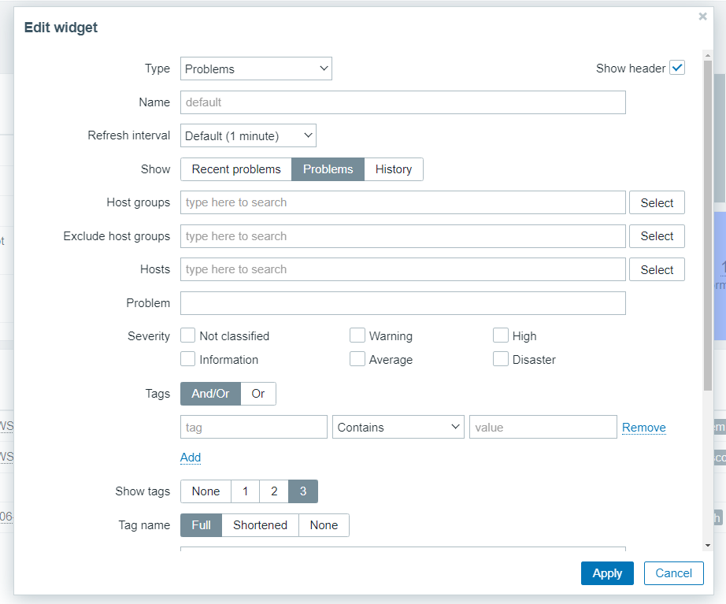
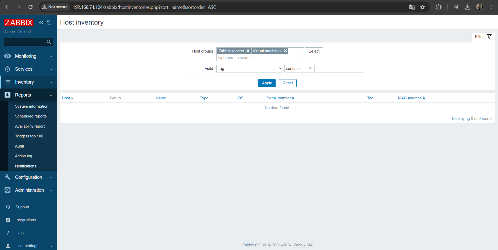
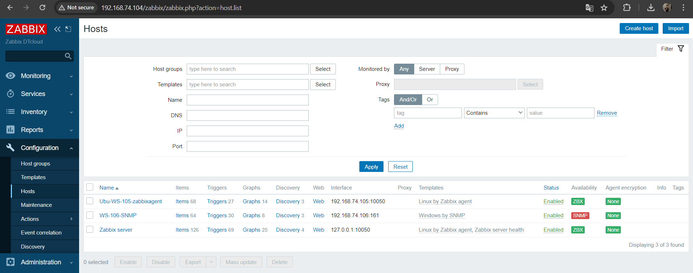
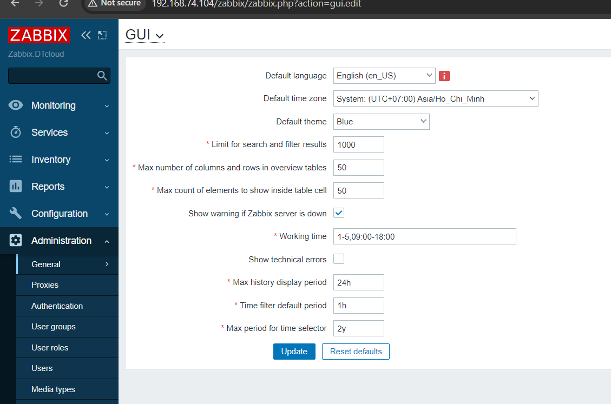

# ĐỌC HIỂU DỮ LIỆU GIÁM SÁT TRÊN ZABBIX

Dưới đây là giao diện tổng quan khi đã cài đặt thành công Zabbix . Thanh tác vụ gồm nhiều mục lớn như Monitoring, Inventory, Reports, Configuration, Administrator ,trong các tab lớn sẽ bao gồm nhiều task thành phần nhỏ hơn.

# 1.Monitoring 

## 1.1.Dashboard
Dashboard: Là giao diện hiển thị các dashboard trực quan để người quản trị nhìn trực tiếp, người quản trị có thể tạo ra rất nhiều các dashboard khác nhau, nhưng tại một tab screen chỉ có thể xem được 1 dashboard bất kỳ nào đó.

Gồm nhiều thành phần nhỏ hơn 

- **System information**

Bảng này hiển thị trạng thái của zabbix server, số lượng các host, trigger, item, số người đang đăng nhập và trạng thái của các thông số trên ở 2 cột `Value` và `Details`

- **Problems**
Tất cả các vấn đề xảy ra với các host trong các group thống kê theo thời gian.

- **Problems by severity**

Bảng đánh giá vấn đề theo mức độ nghiêm trọng 

- **Host availability**

Bảng trạng thái các host hiện có 

- Có thể tùy chỉnh add thêm những gì muốn hiển thị theo ý muốn tương ứng với từng mục.

- Đối với mỗi bảng có thể tùy chỉnh thờ gian interval để update lại data  
Click vào bánh răng nhỏ để cấu hình như ở dưới

Bảng cài đặt sẽ cho bạn thay đổi như phía dưới đây 

## 1.2. Problems

**Problems**: Hiển thị các vấn đề đối với từng device mà zabbix server thu thập dữ liệu về. Hỗ trợ cơ chế lọc theo ý người quản trị.

Có thể lọc theo các tiêu chí sau và có thể export ra file csv để lưu trữ lại.

**Show**: `Recent problems` (Hiển thị vấn đề hiện tại đang gặp phải), `Problems` (Hiển thị các vấn đề đã gặp phải), `History` (Lịch sử các vấn đề đã gặp phải).

`Host group`, `Host`, `Trigger`, `Problem`, `Host inventory`, `Tags`... là các lựa chọn để lọc thông tin, có thể lọc theo một tiêu chí hoặc kết hợp nhiều tiêu chí.

## 1.3.Host
Hiển thị danh sách đầy đủ các máy chủ được giám sát với thông tin chi tiết về giao diện máy chủ, tính khả dụng, thẻ, sự cố hiện tại, trạng thái (đã bật/tắt) và các liên kết để dễ dàng điều hướng đến dữ liệu mới nhất của máy chủ, lịch sử sự cố, biểu đồ, bảng điều khiển và các kịch bản web.

- Name : Tên máy chủ 
- Interface : Địa chỉ IP máy chủ / Port kết nối
- Availability : Tính khả dụng của máy chủ
- Tags : Các tag được gắn vào máy chủ
- Status : Tình trạng bật tắt máy chủ 
- Latest data :	Dữ liệu mới nhất
- Problems : Các sự cố gặp phải
- Graphs : Biểu đồ được cấu hình cho máy chủ
- Dashboards :	Bảng điều khiển được định cấu hình cho máy chủ
- Web : Các kịch bản web được cấu hình cho máy chủ   

**Create host** : cho phép tạo một máy chủ mới

**Using filter** : sử dụng bộ lọc để chỉ hiển thị các máy chủ mà bạn quan tâm

- Name : Tên máy chủ
- Host groups : Tên nhóm máy chủ 
- IP : Lọc theo địa chỉ IP
- DNS : Lọc theo tên DNS
- Port : Lọc theo port kết nối
- Severity : Lọc theo vấn đề nghiêm trọng đang gặp phải 
- Status : Lọc theo trạng thái máy chủ
- Tags :Lọc theo các tag của máy chủ 
- Show hosts in maintenance : Hiển thị máy chủ đang bảo trì
- Show suppressed problems : Hiển thị các vấn đề bị ngăn chặn

Bạn có thể lưu lại bộ lọc ở 1 tab mới để tiện cho công việc theo dõi 

### 1.3.1.Graphs

Bạn có thể xem biểu đồ của từng host bằng cách truy cập Monitoring → Hosts , nhấp chuột vào Host bất kỳ và chọn Graphs

**Chọn khoảng thời gian**: Hãy lưu ý bộ chọn khoảng thời gian phía trên biểu đồ. Nó cho phép chọn các khoảng thời gian thường được yêu cầu chỉ bằng một cú click chuột.

**Sử dụng bộ lọc để xem biểu đồ**:
Để xem một biểu đồ cụ thể, hãy chọn biểu đồ đó trong bộ lọc. Bộ lọc cho phép chỉ định máy chủ, tên biểu đồ và tùy chọn Hiển thị (tất cả/đồ thị máy chủ/đồ thị đơn giản).

### 1.3.2.Web scenarios

## 1.4.Latest data

Bạn có thể xem dữ liệu thu thập mới nhất theo từng danh mục 

## 1.5.Map

Là thành phân cung cấp khả năng giám sát hệ thống dưới hình thức mô hình mạng. Giúp người quản trị có cái nhìn tổng quan về hệ thống sống mạng dưới dạng sơ đồ, trong trường hợp có sự cố sẽ giúp người quản trị đánh giá tầm ảnh hưởng của thiết bị gặp sự cố và đưa ra giải pháp phù hợp..

## 1.6.Discovery
Nếu một thiết bị đã được giám sát, tên máy chủ sẽ được liệt kê trong cột Máy chủ được giám sát và khoảng thời gian thiết bị được phát hiện hoặc bị mất sau lần phát hiện trước đó sẽ được hiển thị trong cột Thời gian hoạt động/Thời gian ngừng hoạt động .

# 2.Services
Menu Dịch vụ dành cho các chức năng giám sát dịch vụ của Zabbix.

## 2.1.Services

Trong phần này, bạn có thể thấy trạng thái cấp cao của toàn bộ dịch vụ đã được định cấu hình trong Zabbix, dựa trên cơ sở hạ tầng của bạn.

## 2.2.Service actions

Các hành động đã định cấu hình sẽ được hiển thị trong danh sách liên quan đến quyền của vai trò người dùng . Người dùng sẽ chỉ thấy các hành động đối với các dịch vụ mà vai trò người dùng của họ cấp quyền truy cập.

## 2.3.SLA

Phần này cho phép xem và định cấu hình SLA.

## 2.4.SLA report

Phần này cho phép xem báo cáo SLA , dựa trên tiêu chí đã chọn trong bộ lọc. Báo cáo SLA cũng có thể được hiển thị dưới dạng tiện ích bảng điều khiển 

# 3.Inventory

## 3.1. Overview
Là sự tổng hợp thông tin về data zabbix zerver thu thập được, có thể lọc theo Host group -> Kiểu data.

## 3.2.Host
Bạn có thể lọc máy chủ theo (các) nhóm máy chủ và theo bất kỳ trường kiểm kê nào để chỉ hiển thị các máy chủ mà bạn quan tâm.

# 4.Report

Menu Báo cáo có một số phần chứa nhiều loại báo cáo được xác định trước và người dùng có thể tùy chỉnh, tập trung vào việc hiển thị tổng quan về các tham số như thông tin hệ thống, trình kích hoạt và dữ liệu được thu thập.

## 4.1.System information

|  Tham số |	Giá trị	|Chi tiết |
|---|---|---|
|Zabbix server is running|Có:máy chủ đang chạy- Không :máy chủ không chạy|Vị trí và cổng của máy chủ Zabbix.|
|Number of hosts (enabled/disabled)|Tổng số máy chủ được cấu hình được hiển thị|	Số lượng máy chủ được giám sát/máy chủ không được giám sát.|
|Number of templates	|Tổng số mẫu được hiển thị.	|  |
|Number of items |Tổng số mục được hiển thị |Số lượng mục cấp máy chủ được giám sát/vô hiệu hóa/không được hỗ trợ.Các mục trên máy chủ bị vô hiệu hóa được tính là bị vô hiệu hóa.|
|Number of triggers|Tổng số kích hoạt được hiển thị|Số lượng trình kích hoạt cấp máy chủ đã bật/tắt; phân chia các trình kích hoạt được bật theo trạng thái "Sự cố"/"OK".|
|Number of users|Tổng số người dùng được cấu hình được hiển thị|Số lượng người dùng trực tuyến.|
|Required server performance, new values per second|Số lượng giá trị mới dự kiến ​​​​được máy chủ Zabbix xử lý mỗi giây được hiển thị.|   |

## 4.2.Scheduled reports

người dùng có đủ quyền có thể định cấu hình việc tạo phiên bản PDF theo lịch của trang tổng quan, phiên bản này sẽ được gửi qua email đến những người nhận được chỉ định.

## 4.3.Availability report

bạn có thể xem tỷ lệ thời gian mỗi trình kích hoạt ở trạng thái có vấn đề/ok. Tỷ lệ phần trăm thời gian cho mỗi trạng thái được hiển thị.

## 4.4.100 busiest triggers

Bạn có thể thấy các trình kích hoạt đã thay đổi trạng thái thường xuyên nhất trong khoảng thời gian đánh giá, được sắp xếp theo số lần thay đổi trạng thái.

## 4.5.Audit log

Audit log có thể xem hồ sơ về hoạt động của người dùng và hệ thống.

## 4.6.Action log

Người dùng có thể xem chi tiết các hoạt động (thông báo, lệnh từ xa) được thực hiện trong một hành động.

## 4.7.Notifications

Một báo cáo về số lượng thông báo được gửi đến mỗi người dùng sẽ được hiển thị.

# 5.Configuration

## 5.1.Host groups
Người dùng có thể định cấu hình và duy trì các nhóm máy chủ. Một nhóm máy chủ có thể chứa cả mẫu và máy chủ.

|Cột|	Miêu tả|
|---|---|
|Name|	Tên của nhóm chủ nhà. Nhấp vào tên nhóm sẽ mở ra biểu mẫu cấu hình nhóm máy chủ .|
|Hosts|	Số lượng máy chủ trong nhóm (hiển thị màu xám). Nhấp vào "Máy chủ", trong toàn bộ danh sách máy chủ, sẽ lọc ra những máy chủ thuộc nhóm.|
|Templates|	Số mẫu trong nhóm (hiển thị màu xám). Nhấp vào "Mẫu", trong toàn bộ danh sách mẫu, sẽ lọc ra những mẫu thuộc nhóm.|
|Members|	Tên của các thành viên trong nhóm. Tên mẫu được hiển thị bằng màu xám, tên máy chủ được giám sát có màu xanh lam và tên máy chủ không được giám sát có màu đỏ. Nhấp vào tên sẽ mở biểu mẫu cấu hình mẫu/máy chủ.|
|Info|	Thông tin lỗi (nếu có) liên quan đến nhóm máy chủ được hiển thị.

## 5.2.Template

Templates: Đây là tập hợp các thực thể có thể áp dụng cho các Host, một Template sẽ chứa trong nó các tập lệnh để truy vấn lấy dữ liệu, hiển thị thông tin dữ liệu lấy được, thông tin tình trạng thiết bị, hiển thị và thông báo lỗi…   
Trong mỗi Template, các tệp lệnh được chia thành: items, triggers, graphs, applications, web .... Tùy theo giám sát thiết bị, dịch vụ, ứng dụng… nào thì các thành phần này được thiết lập khác nhau.

Có thể import template tự viết vào.

##  5.3.Host

Host: Là một máy tính, server, vps, chạy các hệ điều hành khác nhau hoặc một thực thể trong hệ thống mạng như là máy in, máy chấm công, máy photo, máy camera có hỗ trợ các giao thức mà monitor zabbix cung cấp.

## 5.4.Maintance

Maintance có thể xác định thời gian bảo trì cho máy chủ và group trong Zabbix. Có hai loại Maintance - với thu thập dữ liệu và không thu thập dữ liệu.  
Ví dụ server của bạn off trong khoảng thời gian này để nâng cấp sửa chữa, thì maintance sẽ được lựa chọn cấu hình để không thu thập data trong khoảng thời gian đó.

## 5.5. Action
Các hành động được hiển thị là các hành động được chỉ định cho nguồn sự kiện đã chọn (trigger, service, discovery, autoregistration, internal actions).

Các hành động được nhóm thành các tiểu mục theo nguồn sự kiện (trigger, service, discovery, autoregistration, internal actions). Danh sách các tiểu mục có sẵn sẽ xuất hiện khi nhấn vào Hành động trong phần menu Cấu hình . Cũng có thể chuyển đổi giữa các phần phụ bằng cách sử dụng danh sách thả xuống tiêu đề ở góc trên cùng bên trái.

## 5.6. Event correlation

Cho phép cấu hình tương quan giữa các sự kiến với độ chính xác vào và tùy biến linh hoạt.

## 5.7. Discovery

Thiết lập range IP, nếu trong range có có thiết bị nào mà cài đặt các giao thức mà Zabbix server hỗ trợ thì sẽ tự động thu thập data về

# 6.Administrator

Chức năng của của tab Administrator là để cấu hình chung cho zabbix đối với user có quyền Admin

## 6.1.General

- GUI  
Phần này cung cấp khả năng tùy chỉnh một số giá trị mặc định liên quan đến giao diện người dùng.

- Autoregistration

Trong phần này, bạn có thể định cấu hình mức mã hóa cho tính năng tự động đăng ký tác nhân đang hoạt động.

- Housekeeper

Housekeeperlà một quy trình định kỳ, được thực thi bởi máy chủ Zabbix. Quá trình loại bỏ thông tin lỗi thời và thông tin bị người dùng xóa.

-  Audit log

Phần này cho phép định cấu hình cài đặt nhật ký kiểm tra.

- Images

Phần Images hiển thị toàn bộ những hình ảnh có sẵn trong Zabbix. Hình ảnh được lưu trữ trong cơ sở dữ liệu.

- Icon mapping

Phần này cho phép tạo ánh xạ của một số máy chủ nhất định với các biểu tượng nhất định. Thông tin trường kiểm kê máy chủ được sử dụng để tạo ánh xạ.

Sau đó, ánh xạ có thể được sử dụng trong cấu hình bản đồ mạng để tự động gán các biểu tượng thích hợp cho các máy chủ phù hợp.

- Regular expressions

Phần này cho phép tạo các biểu thức chính quy tùy chỉnh có thể được sử dụng ở một số vị trí trong giao diện người dùng

- Macros

Phần này cho phép xác định macro người dùng trên toàn hệ thống dưới dạng cặp tên-giá trị. Lưu ý rằng các giá trị macro có thể được giữ dưới dạng văn bản thuần túy, văn bản bí mật hoặc bí mật Vault. Thêm mô tả cũng được hỗ trợ.

- Trigger displaying options

Phần này cho phép tùy chỉnh cách hiển thị trạng thái kích hoạt trong giao diện người dùng cũng như tên và màu sắc mức độ nghiêm trọng của kích hoạt 

- Geographical maps

Phần này cho phép chọn nhà cung cấp dịch vụ lát bản đồ địa lý và định cấu hình cài đặt nhà cung cấp dịch vụ cho tiện ích bảng điều khiển Geomap . Để cung cấp khả năng trực quan hóa bằng bản đồ địa lý, Zabbix sử dụng Tờ rơi thư viện bản đồ tương tác JavaScript nguồn mở. Xin lưu ý rằng Zabbix không kiểm soát chất lượng hình ảnh do nhà cung cấp ô bên thứ ba cung cấp, bao gồm cả các nhà cung cấp ô được xác định trước.

- Modules

Phần này cho phép quản lý các mô-đun giao diện người dùng tùy chỉnh .

- API tokens

Bạn có thể lọc mã thông báo API theo tên, người dùng được chỉ định mã thông báo, ngày hết hạn, người dùng đã tạo mã thông báo hoặc trạng thái (đã bật/tắt). Nhấp vào trạng thái mã thông báo trong danh sách để bật/tắt nhanh mã thông báo. Bạn cũng có thể bật/tắt hàng loạt mã thông báo bằng cách chọn chúng trong danh sách rồi nhấp vào nút Bật/Tắt bên dưới danh sách.

## 6.2 Proxies

Proxy để giám sát phân tán có thể được định cấu hình trong giao diện Zabbix.

## 6.3.Authentication
Cho phép chỉ định phương thức xác thực người dùng toàn cầu cho Zabbix và các yêu cầu mật khẩu nội bộ. Các phương thức khả dụng là xác thực nội bộ, HTTP, LDAP và SAML.

## 6.4.User groups
Các nhóm người dùng của hệ thống được duy trì.

## 6.5.User roles
Các vai trò có thể được chỉ định cho người dùng hệ thống và các quyền cụ thể cho từng vai trò vẫn được duy trì.

**Vai trò người dùng mặc định**
Theo mặc định, Zabbix được định cấu hình với bốn vai trò người dùng, có một bộ quyền được xác định trước:

- Vai trò quản trị viên
- Vai trò khách mời
- Vai trò quản trị viên cấp cao
- Vai trò người dùng

## 6.6.Users

Danh sách người dùng hiện tại cùng với thông tin chi tiết của họ được hiển thị.

## 6.7.Media types

Thông tin về loại phương tiện chứa các hướng dẫn chung về cách sử dụng phương tiện làm kênh phân phối thông báo. Các chi tiết cụ thể, chẳng hạn như địa chỉ email riêng lẻ để gửi thông báo sẽ được lưu giữ với từng người dùng.

## 6.8.Scripts
Các tập lệnh chung, tùy thuộc vào phạm vi được định cấu hình và quyền của người dùng, có sẵn để thực thi

## 6.9.Queue
Hàng đợi các mục đang chờ cập nhật sẽ được hiển thị.

*Tài liệu tham khảo*

[1] [https://www.zabbix.com/documentation/6.0/en/manual/web_interface/frontend_sections/administration/authentication](https://www.zabbix.com/documentation/6.0/en/manual/web_interface/frontend_sections/administration/authentication)

