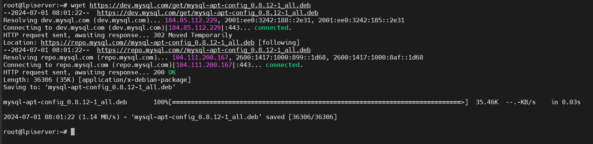
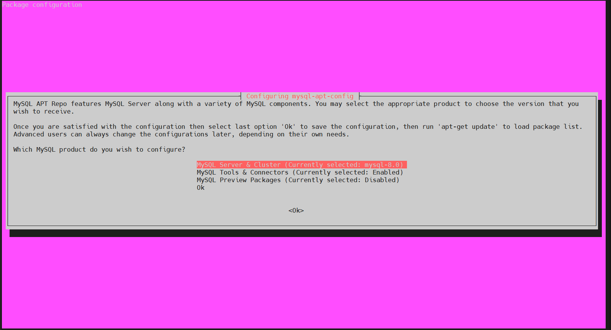
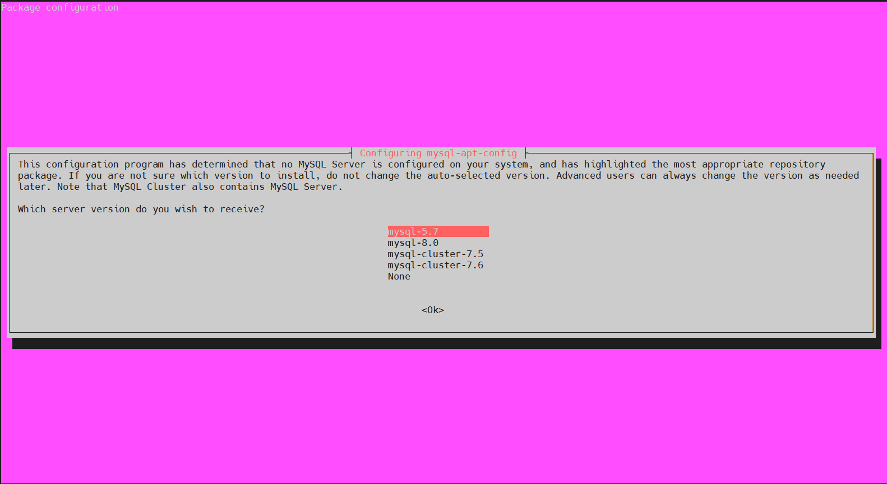

# Cài đặt MySQL trên Linux bằng APT

# 1.Thêm Kho lưu trữ APT của MySQL

Cập nhật gói hệ thống:

```
sudo apt update
```

Chúng ta cần cài đặt wget bằng lệnh dưới đây:
```
sudo apt install wget -y
```

Tải về kho lưu trữ bằng lệnh dưới đây:
```
wget https://dev.mysql.com/get/mysql-apt-config_0.8.12-1_all.deb
```



Sau khi tải về, cài đặt kho lưu trữ bằng lệnh dưới đây:
```
sudo dpkg -i mysql-apt-config_0.8.12-1_all.deb
```

Trong cửa sổ thoại, chọn Ubuntu Bionic và nhấp vào OK.


Hộp thoại tiếp theo sẽ hiển thị MySQL 8.0 được chọn mặc định. Chọn tùy chọn đầu tiên và nhấp vào OK.



Trong hộp thoại tiếp theo, chọn máy chủ MySQL 5.7 và nhấp vào OK.



Hộp thoại tiếp theo đã mặc định chọn MySQL 5.7. Tiếp đến, chọn mục cuối cùng "Ok" và nhấp vào OK.

# 2.Cập nhật kho lưu trữ MySQL
Cập nhật gói hệ thống của bạn:
```
sudo apt-get update
```
Hãy tìm kiếm MySQL 5.7 bằng lệnh dưới đây:
```
sudo apt-cache policy mysql-server
```
# 3.Install MySQL 5.7 Ubuntu 22.04 LTS

Trước khi cài đặt MySQL 5.7, bạn cần chạy lệnh sau để cập nhật GPG KEY:
```
sudo apt-key adv --keyserver keyserver.ubuntu.com --recv-keys 467B942D3A79BD29
```

Chúng ta sẽ cài đặt MySQL 5.7 client và MySQL 5.7 server bằng lệnh dưới đây:

```
sudo apt install -f mysql-client=5.7* mysql-community-server=5.7* mysql-server=5.7*
```