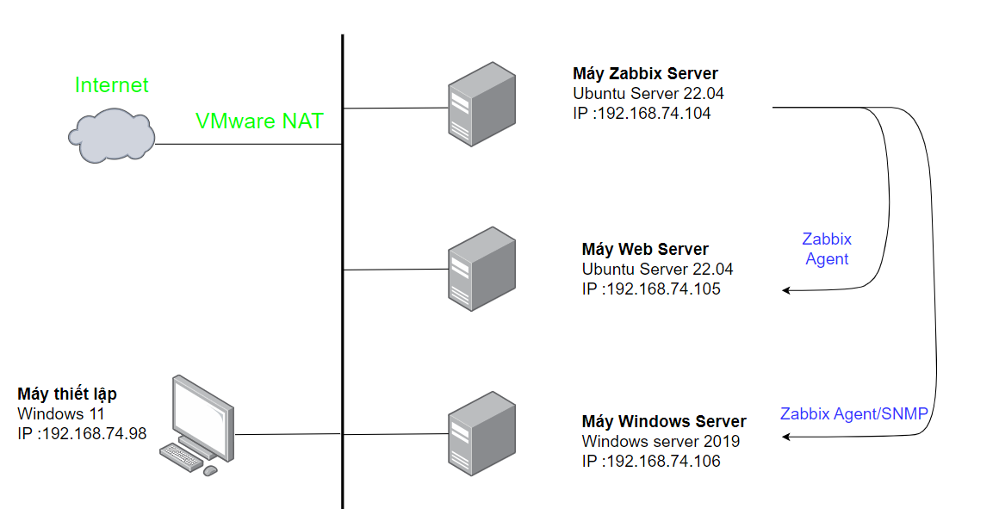
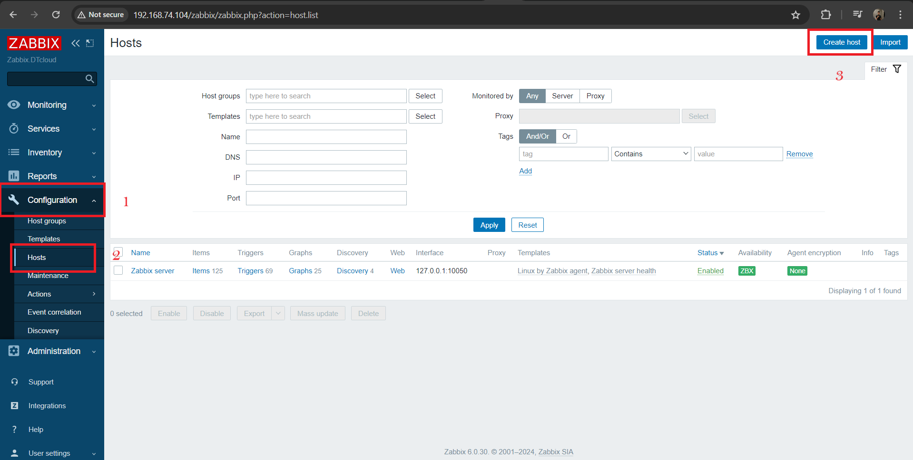

# THIẾT LẬP GIÁM SÁT THÔNG QUA ZABBIX AGENT

# 1.Mô hình 


**Máy Zabbix Server**   
Ubuntu Server 22.04   
IP 192.168.74.104

**Máy Web Server**  
Ubuntu Server 22.04  
IP 192.168.74.105


# 2.Cài đặt zabbix-agent trên Ubuntu server

**1.Tải về gói cài đặt**

```
wget https://repo.zabbix.com/zabbix/6.4/ubuntu/pool/main/z/zabbix-release/zabbix-release_6.4-1+ubuntu22.04_all.deb

```

**2.Giải nén và cài đặt**

```
dpkg -i zabbix-release_6.4-1+ubuntu22.04_all.deb
```

**3.Update các gói phần mềm và cài zabbix-agent**

```
sudo apt-get update
sudo apt-get install zabbix-agent -y
```

**4.Sửa file cấu hình zabbix-agent**

Sửa lại file `/etc/zabbix/zabbix_agentd.conf` với các tham số như sau:

```
Server=<IP_ZABBIX_SERVER>
ServerActive=<IP_ZABBIX_SERVER>
Hostname=<ZABBIX_SERVER_HOSTNAME>

```

**5.Khởi động dịch vụ zabbix-agent**

```
systemctl start zabbix-agent
systemctl enable zabbix-agent
```

# 3.Thêm host lên Zabbix Server

**1.Đăng nhập vào giao diện Web của Zabbix-Server**


**2.Thực hiện thêm host để giám sát**

Configuration -> Host -> Create Host




**3.Thiết lập thông số host**

Tối thiểu cần 3 thông số:

- Hostname: Là tên hiển thị trên zabbix web
- Groups: Chỉ định các group của host muốn thêm
- Agent interface: Địa chỉ IP của agent muốn thêm vào

Trong tab Template, ta chọn template để gán cho host cần giám sát. Ở đây Ubuntu do vậy ta sẽ chọn Linux by Zabbix Agent.

Sau khi điền đầy đủ thông tin ta bấm add


Host thêm thành công sẽ hiển thị màu xanh


# 4.Thực hiện giám sát các thông số của Web server trên Zabbix server

**1.Cài đặt web server trên thiết bị muốn giám sát**

```
sudo apt -y install apache2
sudo systemctl restart apache2
sudo systemctl enable apache2

```

**2.Thêm template để giám sát dịch vụ apache**

Ta thêm tamplate Apache by Zabbix agent để có thể giám sát web server


**Xem số liệu thu được khi giám sát webserver**

Tất cả thông tin giám sát được ta có thể xem được trong bảng điều khiển 

