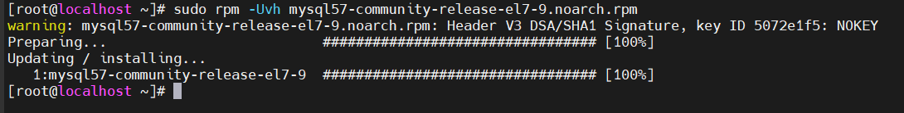

# Cài đặt MySQL trên Linux bằng Yum

# 1.Tải và chuẩn bị MySQL repository

Cập nhật lại hệ thống 
```
sudo yum update
```

Cài MySQL  repositories. Các phiên bản khác có thể tìm thấy [tại đây](https://dev.mysql.com/downloads/repo/yum/):

```
wget http://dev.mysql.com/get/mysql57-community-release-el7-9.noarch.rpm
```


Nhập khóa GPG từ MySQL để xác thực các gói phần mềm từ kho lưu trữ của MySQL

```
rpm --import https://repo.mysql.com/RPM-GPG-KEY-mysql-2022
```

Giờ bạn đã có thể prepare repository rồi cài đặt MySQL packages từ nó

```
sudo rpm -Uvh mysql57-community-release-el7-9.noarch.rpm
```


Bạn có thể kiểm tra kho lưu trữ MySQL Yum đã được thêm và kích hoạt thành công hay chưa bằng lệnh sau

```
yum repolist enabled | grep mysql.*-community
```

# 2. Install MySQL

Cài đặt MySQL

```
sudo yum install mysql-server -y
```


Danh sách file cài sẽ được đưa ra và thông tin kho cài đặt như ta đã cấu hình ở bước trên 

Khi đã hoàn tất tải file, bạn sẽ nhận được thông báo xác nhận cài đặt. Bạn cũng cần nhấn y vài lần là hoàn tất. Nếu bạn thấy chữ Complete! ở cuối trang có nghĩa là MySQL đã được cài đặt thành công trên server


# 3. Khởi động MySQL và kiểm tra xem nó có hoạt động không

Khởi động và enable dịch vụ với lệnh sau 
```
sudo systemctl start mysqld
sudo systemctl enable mysqld
```

Kiểm tra trạng thái dịch vụ 
```
sudo systemctl status mysqld
```


Mở firewall cho phép kết nối MySQL từ xa

```
firewall-cmd --add-service=mysql --permanent
firewall-cmd --reload
```