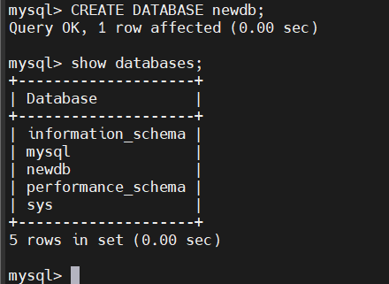

# Làm thế nào để cấu hình MySQL?

Giờ bạn đã hiểu rõ cách install MySQL thông qua hướng dẫn cách cài MySQL. Giờ, chúng tôi sẽ chỉ bạn dùng một số lệnh hữu dụng và tùy chỉnh bạn cần biết khi làm việc với MySQL.

# 1.Thiết lập bảo mật lần đầu cho MySQL

Sau khi cài đặt ta cần thiết lập bảo mật cho MySQL nhằm giúp MySQL an toàn hơn, Để thiệt lập bảo mật cho MySQL ta chạy lệnh `mysql_secure_installation`, một lệnh được tích hợp sẵn để thực hiện các cài đặt bảo mật:

```
[root@localhost ~]# mysql_secure_installation
Securing the MySQL server deployment.

Enter password for user root: 

The existing password for the user account root has expired. Please set a new password.

New password: 

Re-enter new password: 
The 'validate_password' component is installed on the server.
The subsequent steps will run with the existing configuration
of the component.
Using existing password for root.

Estimated strength of the password: 100 
Change the password for root ? ((Press y|Y for Yes, any other key for No) : Y

New password: 

Re-enter new password: 

Estimated strength of the password: 100 
Do you wish to continue with the password provided?(Press y|Y for Yes, any other key for No) : Y
By default, a MySQL installation has an anonymous user,
allowing anyone to log into MySQL without having to have
a user account created for them. This is intended only for
testing, and to make the installation go a bit smoother.
You should remove them before moving into a production
environment.

Remove anonymous users? (Press y|Y for Yes, any other key for No) : Y
Success.


Normally, root should only be allowed to connect from
'localhost'. This ensures that someone cannot guess at
the root password from the network.

Disallow root login remotely? (Press y|Y for Yes, any other key for No) : Y
Success.

By default, MySQL comes with a database named 'test' that
anyone can access. This is also intended only for testing,
and should be removed before moving into a production
environment.


Remove test database and access to it? (Press y|Y for Yes, any other key for No) : Y
 - Dropping test database...
Success.

 - Removing privileges on test database...
Success.

Reloading the privilege tables will ensure that all changes
made so far will take effect immediately.

Reload privilege tables now? (Press y|Y for Yes, any other key for No) : Y
Success.

All done! 
```


Trong đó:

- Tại dòng `Enter password for user root`: , lần đầu tiên đăng nhập MySQL sẽ yêu cầu ta nhập mật khẩu của tài khoản `root` (Tài khoản `root` trong quản trị cơ sở dữ liệu, không phải tài khoản `root` hệ thống)  
- `The existing password for the user account root has expired. Please set a new password`: dòng thông báo cho ta biết mật khẩu mặc định đã hết hạn và yêu cầu ta đặt mật khẩu mới, ta lần lượt nhập mật khẩu mới vào `New password:` và `Re-enter new password:`.

- `The 'validate_password' component is installed on the server. The subsequent steps will run with the existing configuration of the component. Using existing password for root. Estimated strength of the password: 100  Change the password for root ? ((Press y|Y for Yes, any other key for No) :` Sau khi ta đặt mật khẩu cho tài khoản root một thông báo hiện ra cho ta biết một chức năng kiểm tra độ an toàn của mật khẩu (được tích hợp trong các phiên bản mới) đang hoạt động và cho ta biết mức độ an toàn của mật khẩu ta vừa đặt và cho phép ta tiếp tục thay đổi mật khẩu. Để thay đổi mật khẩu ta ấn Y và phím bất kỳ để bỏ qua. nếu ta ấn Y thì ta sẽ lần lượt nhập mật khẩu vào các dòng `New password:` và `Re-enter new password`: và sau đó tại dòng `Do you wish to continue with the password provided?(Press y|Y for Yes, any other key for No) : `yêu cầu ta xác nhận thay đổi mật khẩu, ta ấn Y để xác nhận và phím bất kỳ để bỏ qua.

- Tại dòng `Remove anonymous users? (Press y|Y for Yes, any other key for No) `: cho phép ta xóa tài khoản anonymous, anonymous là tài khoản mặc định ngay từ khi cài đặt MySQL. Để xóa anonymous user ta ấn Y và bất cứ phím gì để bỏ qua.

- Tại dòng `Disallow root login remotely? (Press y|Y for Yes, any other key for No) `: cho phép ta vô hiệu hóa tính năng đăng nhập từ xa đối với tài khoản root. Để vô hiệu hóa ta ấn Y và bất cứ phím gì để bỏ qua.

- Tại dòng `Remove test database and access to it? (Press y|Y for Yes, any other key for No)` : cho phép ta xóa cơ sở dữ liệu test, một cơ sở dữ liệu được tạo mặc định ngay từ khi cài đặt MySQL. Để xóa ta ấn Y và bất cứ phím gì để bỏ qua.

- Tại dòng `Reload privilege tables now? (Press y|Y for Yes, any other key for No) `: ta ấn Y để Reload privilege nhằm áp dụng các cấu hình ta vừa đặt ở trên.

# 2. Đăng nhập tài khoản root và thực hiện truy vấn SQL đơn giản

Đăng nhập tài khoản vào MySQL

```
mysql -u root -p
```


**Tạo mới MySQL User, Database**

Là user root trong MySQL, bạn có toàn quyền truy cập vào mọi database.   
Tuy nhiên, nếu bạn làm việc trong một nhóm, có nhiều trường hợp bạn cần áp dụng hạn chế. Bạn sẽ cần tạo database mới hoặc user mới với phân quyền đặc biệt.

1. Sử dụng lệnh sau để tạo mới database:

```
CREATE DATABASE newdb
```


2. Tạo user mới bằng cách gõ vào dòng sau

```
CREATE USER 'thienbd'@'localhost' IDENTIFIED BY 'Ducthien@1998';
```

3. Nếu bạnm muốn xóa một user nhất định, dùng lệnh sau

```
DROP USER thienbd@‘localhost’;
```

4. Gán quyền truy cập vào database cho user mới bằng lệnh sau:

```
GRANT ALL PRIVILEGES ON newdb.* TO 'thienbd'@'localhost'
```

Bạn cũng có thể gán từng quyền riêng biệt, bao gồm:

- `SELECT` – user có quyền đọc (read) database bằng lệnh select
- `CREATE` – họ có thể tạo bảng mới
- `DROP` – cho phép người dùng xóa bảng
- `DELETE` – users có thể xóa dòng khỏi bảng
- `INSERT` – giúp user thêm dòng vào bảng
- `UPDATE` – giúp cập nhật dòng
- `GRANT OPTION` – có thể gán hoặc xóa quyền của user khác