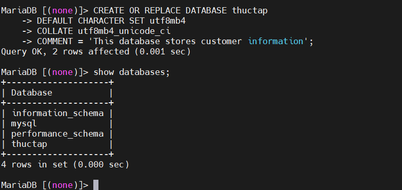
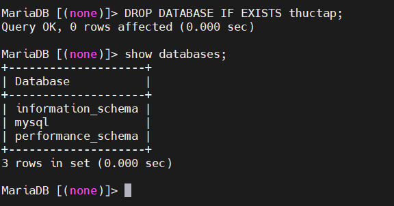

# DATABASES TRONG MARIADB


# 1.SHOW DATABASES
**Cú Pháp**  
```
SHOW DATABASES;
```
# 2.CREATE DATABASE
`CREATE DATABASE` được dùng để tạo dữ liệu mới   

**Cú Pháp**  
```
CREATE [OR REPLACE] {DATABASE | SCHEMA} [IF NOT EXISTS] db_name
    [create_specification] ...

create_specification:
  | [DEFAULT] CHARACTER SET [=] charset_name
  | [DEFAULT] COLLATE [=] collation_name
  | COMMENT [=] 'comment'
```

Trong đó 
- **CREATE [OR REPLACE]**: Điều này chỉ định liệu có nên tạo cơ sở dữ liệu/sơ đồ mới (`CREATE`) hay thay thế cơ sở dữ liệu/sơ đồ hiện có (`REPLACE`) nếu cơ sở dữ liệu/sơ đồ đó đã tồn tại.
- **{DATABASE | SCHEMA}**: Điều này xác định loại đối tượng bạn đang tạo. Chọn `DATABASE` cho cơ sở dữ liệu hoặc `SCHEMA` cho lược đồ trong cơ sở dữ liệu.
- **[IF NOT EXISTS]**: Mệnh đề tùy chọn này đảm bảo thao tác chỉ diễn ra nếu cơ sở dữ liệu/sơ đồ chưa tồn tại.
db_name: Đây là tên bạn muốn gán cho cơ sở dữ liệu hoặc lược đồ của mình.
- **[create_specification] ...**: Đây là phần tùy chọn, tại đó bạn có thể xác định các thông số kỹ thuật bổ sung cho cơ sở dữ liệu/sơ đồ.
    - **[DEFAULT] CHARACTER SET [=] charset_name**: Điều này thiết lập bộ ký tự mặc định cho cơ sở dữ liệu/sơ đồ. Bộ ký tự này xác định các ký tự được hỗ trợ để lưu trữ dữ liệu văn bản.
    - **[DEFAULT] COLLATE [=] collation_name**: Điều này xác định đối chiếu mặc định cho cơ sở dữ liệu/sơ đồ. Đối chiếu xác định cách các ký tự được sắp xếp và so sánh trong bộ ký tự.
    - **COMMENT [=] 'comment'**: Điều này cho phép bạn thêm chú thích vào cơ sở dữ liệu/sơ đồ để cung cấp thêm thông tin hoặc tài liệu.


*Ví dụ*
```
CREATE OR REPLACE DATABASE thuctap
DEFAULT CHARACTER SET utf8mb4
COLLATE utf8mb4_unicode_ci
COMMENT = 'This database stores customer information';
```


# 3. DROP DATABASE

**Cú Pháp**

```
DROP {DATABASE | SCHEMA} [IF EXISTS] db_name
```

- **DROP**: Từ khóa này khởi tạo việc xóa cơ sở dữ liệu hoặc lược đồ.
- **{DATABASE | SCHEMA}**: Điều này chỉ định loại đối tượng bạn muốn xóa. Sử dụng DATABASEđể xóa toàn bộ cơ sở dữ liệu và SCHEMAxóa một lược đồ cụ thể trong cơ sở dữ liệu.
- **[IF EXISTS]**: Mệnh đề tùy chọn này ngăn ngừa lỗi nếu cơ sở dữ liệu hoặc lược đồ bạn đang cố gắng xóa không tồn tại.
- **db_name**: Đây là tên cơ sở dữ liệu hoặc lược đồ mà bạn muốn xóa.


*Ví dụ*

```
DROP DATABASE IF EXISTS thuctap;
```



*Tài liệu tham khảo*

[1] [https://mariadb.com/kb/vi/cac-lenh-sql/](https://mariadb.com/kb/vi/cac-lenh-sql/)   
[2] [https://dev.mysql.com/doc/refman/8.4/en/tutorial.html](https://dev.mysql.com/doc/refman/8.4/en/tutorial.html)