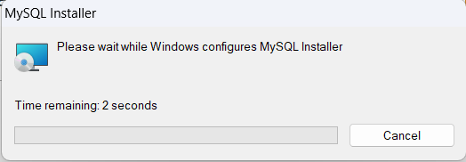
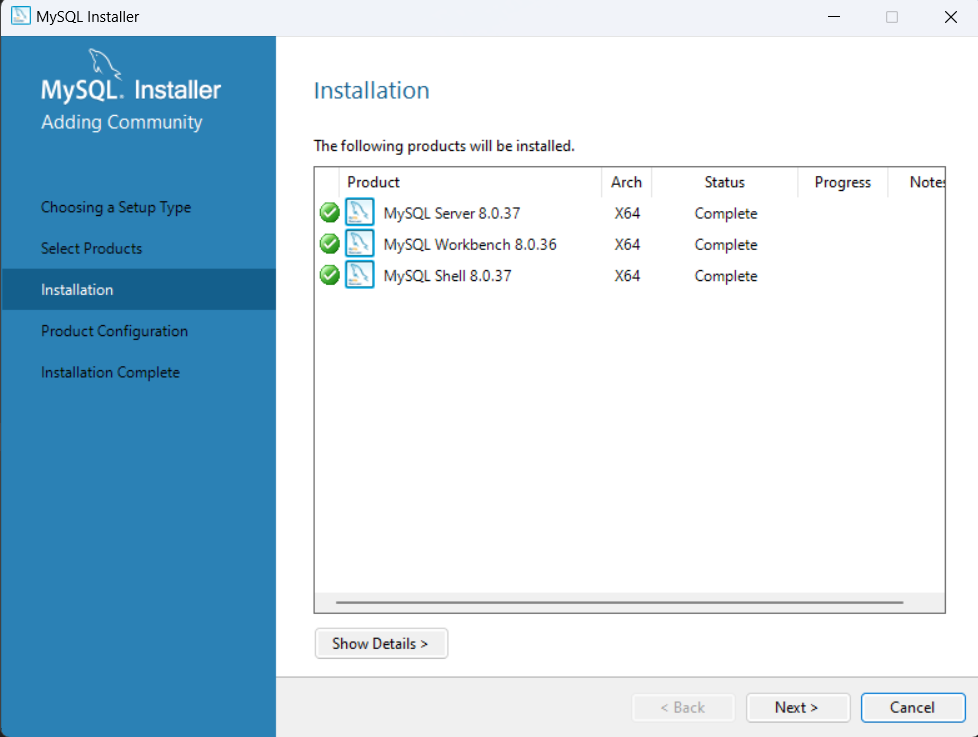
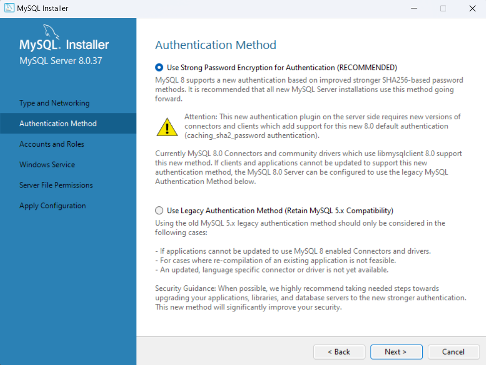
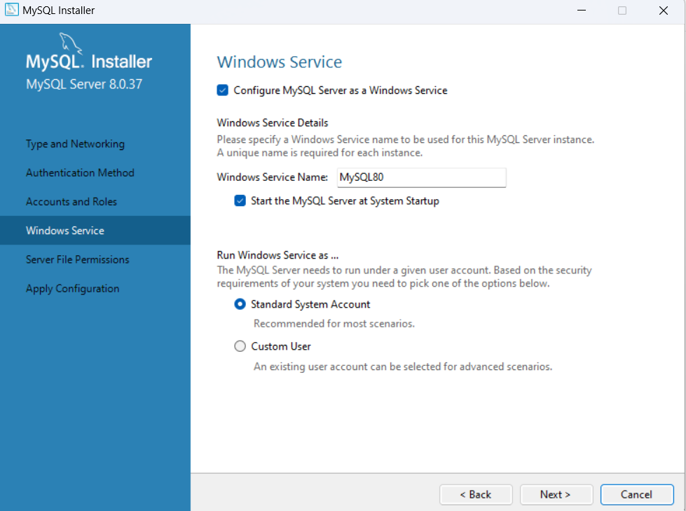
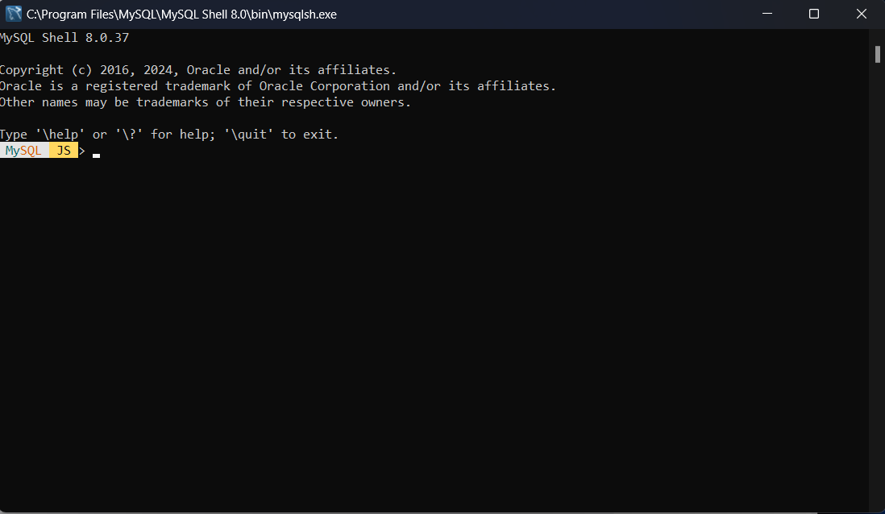
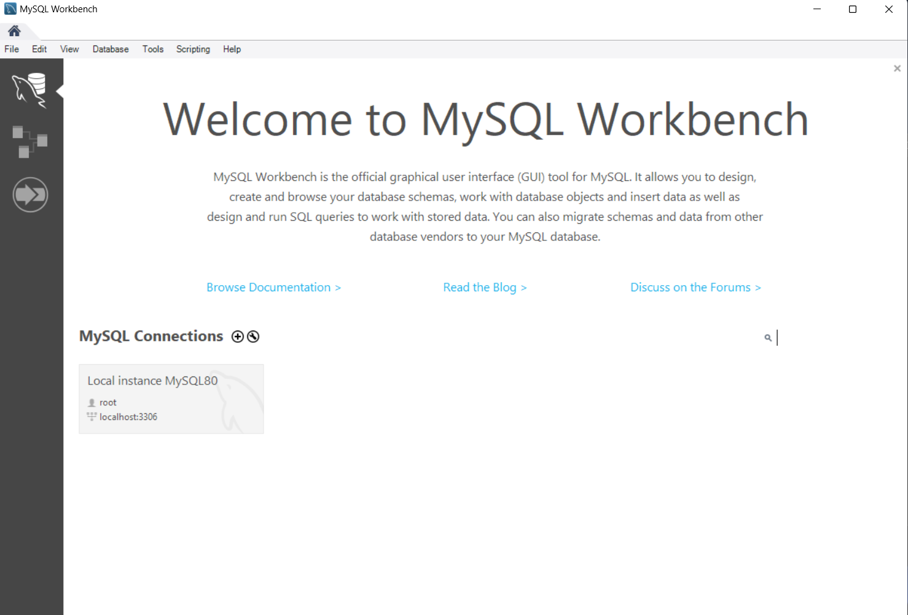

# HƯỚNG DẪN CÀI ĐẶT MYSQL SERVER TRÊN WINDOW

# 1. Download bộ cài đặt

Để tải xuống trình cài đặt MySQL, hãy truy cập liên kết sau : http://dev.mysql.com/downloads/installer/

Chọn version 8.0.37 : `Windows (x86, 32-bit), MSI Installer`

# 2. Hướng dẫn cài đặt 

Sau khi tải bộ cài đặt về , hãy kích đúp vào nó để bắt đầu cài đặt 

**Bước 1: Lựa chọn thiết lập**
Bạn cần chọn kiểu thiết lập phù hợp với trường hợp sử dụng của mình, ở đây ta sẽ chọn mục custom

**Bước 2: Lựa chọn dịch vụ cài đặt**

Chúng tôi sẽ cài đặt các sản phẩm sau:

- Máy chủ MySQL - Đây là Máy chủ cơ sở dữ liệu MySQL.
- MySQL Workbench – Đây là công cụ máy khách để tương tác với Máy chủ cơ sở dữ liệu MySQL thông qua GUI.
- MySQL Shell – Đây là giao diện Javascript, Python hoặc SQL tương tác hỗ trợ phát triển và quản trị cho MySQL Server.

Để chọn các sản phẩm này, bạn nhấp vào biểu tượng + ở khung bên trái, chọn sản phẩm và nhấp vào nút mũi tên phải.

Sau khi chọn xong ta bấm next

**Bước 3: Cài đặt các dịch vụ đã chọn**

Sau khi chọn các dịch vụ ở bước 2 , ta có 1 bảng các dịch vụ như ảnh dưới , bấm `Execute` để cài đặt 

Sau khi cài đặt hoàn tất, hãy nhấp vào nút Next để tiến hành Cấu hình

**Bước 4: Cấu hình dịch vụ**

Chọn `Development Computer` cho loại cấu hình máy chủ, giữ nguyên các tùy chọn khác và nhấp vào nút `Next` .

**Bước 5: Chọn phương pháp xác thực**

Bạn nên sử dụng mã hóa mật khẩu mạnh để xác thực, đây là tùy chọn đầu tiên.

**Bước 6: Nhập mật khẩu cho tài khoản root**

Nhập mật khẩu an toàn cho tài khoản root, có đầy đủ quyền quản trị

**Bước 7:Cấu hình MySQL Server như một dịch vụ Windows**

Trong bước này, bạn có thể định cấu hình Máy chủ MySQL làm dịch vụ Windows, chỉ định tên dịch vụ và chọn có khởi động Máy chủ MySQL trong quá trình khởi động hệ điều hành hay không.

**Bước 8:Cấp quyền cho tệp**

Ở bước này, bạn cấp quyền cho MySQL truy cập vào thư mục dữ liệu.

**Bước 9: Hiển thị cấu hình đã chọn**
Trình cài đặt MySQL hiển thị một cửa sổ với các bước cấu hình. Nhấp vào nút `Execute` để áp dụng cấu hình.

Sau khi hoàn tất cấu hình ta bấm `Finish`

**Bước 10:Hoàn tất cài đặt**

Sau khi bấm `Finish` ta quay lại cửa sổ lựa chọn trước đó , bấm Next để sang bước hoàn tất cài đặt

Bấm `Finish` để kết thúc cài đặt 
Hai cửa sổ phía dưới là sẽ hiện ra sau khi bạn cài đặt xong MySQL Server

