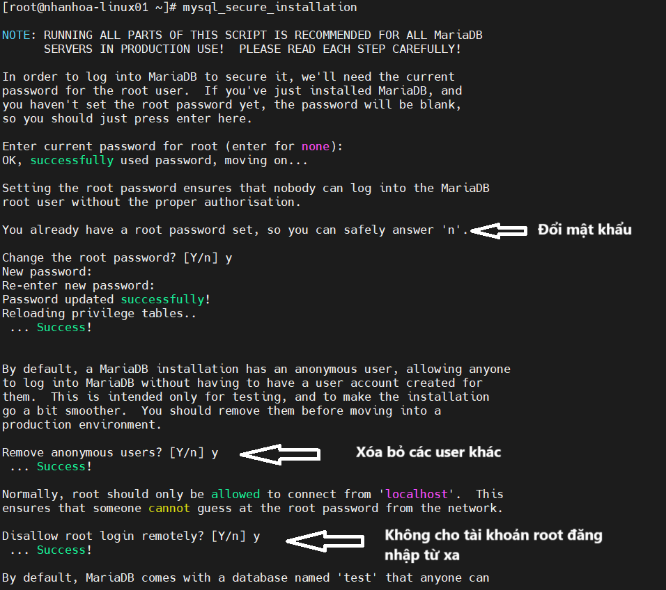
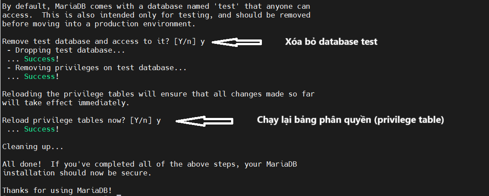
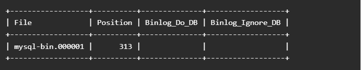
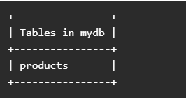
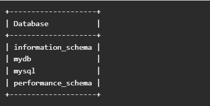

# CÀI ĐẶT MARIADB MASTER SLAVE REPLICATION TRÊN UBUNTU 22.04

MariaDB Master Slave Replication đem lại những lợi ích như 

- Khả năng mở rộng và tính sẵn sàng cao
- Sao lưu backup dữ liệu 
- Cân bằng tải
- Tăng hiệu suất cơ sở dữ liệu
- Giảm thiểu sự cố chuyển đổi
- Bảo mật dữ liệu

Trong bài viết này ta sẽ cài đặt với 1 node Master và 1 node Slave. Để cài đặt ta tiến hành theo các bước sau
# Bước 1. Cài đặt MariaDB trên cả 2 Server

- Đầu tiên, bạn sẽ cần cài đặt MariaDB trên cả hai máy chủ. Bạn có thể cài đặt bằng cách chạy lệnh sau:
```
apt-get install mariadb-server mariadb-client -y
```

- Sau khi cài đặt MariaDB, hãy chạy lệnh sau để bảo mật cài đặt MariaDB:
```
mysql_secure_installation
```



# Bước 2. Cấu hình trên Master Server

Mở file cấu hình của Mariadb và chỉnh sửa những nôi dung sau 
```
nano /etc/mysql/mariadb.conf.d/50-server.cnf
```

- Tìm dòng bind-address và thay đổi giá trị thành 0.0.0.0 để cho phép kết nối đến.

```
bind-address            = 0.0.0.0
```
- Tiếp theo, thêm các dòng sau vào cuối tệp:

```
server-id = 1
log_bin = /var/log/mysql/mysql-bin.log
log_bin_index =/var/log/mysql/mysql-bin.log.index
relay_log = /var/log/mysql/mysql-relay-bin
relay_log_index = /var/log/mysql/mysql-relay-bin.index
```

**server-id = 1**: Xác định ID của server trong hệ thống replication
**mysql-bin.log**: chứa các thay đổi cần được nhân bản đến Slave.
**mysql-bin.log.index**: theo dõi danh sách các tệp binary log.
**mysql-relay-bin**: chứa dữ liệu được nhận từ Master.
**mysql-relay-bin.index:** theo dõi danh sách relay log.

- Lưu và đóng tệp khi bạn hoàn tất. Sau đó, khởi động lại dịch vụ MariaDB để thực hiện các thay đổi:

```
systemctl restart mariadb
```

Tiếp theo, bạn sẽ cần tạo một replication user. Máy chủ Slave sẽ sử dụng user này để đăng nhập vào máy chủ MasterMaster và yêu cầu nhật ký nhị phân.

- Đầu tiên, hãy đăng nhập vào shell MariaDB bằng lệnh sau:
```
mysql -u root -p
```
Cung cấp mật khẩu và tạo user bằng lệnh sau 

```
CREATE USER 'replication'@'%' identified by 'your-password';
```

- Tiếp theo, cấp quyền sao chép cho user này bằng lệnh sau:

```
GRANT REPLICATION SLAVE ON *.* TO 'replication'@'%';
```

- Chạy lệnh sau để xác nhận lại các lệnh vừa rồi 
```
FLUSH PRIVILEGES;
```

- Tiếp theo, hãy kiểm tra trạng thái máy chủ Master bằng lệnh sau:

```
show master status;
```

Bạn sẽ nhận được kết quả sau



*Lưu ý* : Vui lòng ghi nhớ thông tin `File` và `Position` từ đầu ra ở trên. Bạn sẽ cần những giá trị này khi cấu hình máy chủ Slave.

# Bước 3. Cấu hình trên Slave Server

Mở file cấu hình của Mariadb và chỉnh sửa những nôi dung sau 
```
nano /etc/mysql/mariadb.conf.d/50-server.cnf
```

- Tìm dòng bind-address và thay đổi giá trị thành 0.0.0.0 để cho phép kết nối đến.

```
bind-address            = 0.0.0.0
```
- Tiếp theo, thêm các dòng sau vào cuối tệp:

```
server-id = 2 
log_bin = /var/log/mysql/mysql-bin.log 
log_bin_index =/var/log/mysql/mysql-bin.log.index 
relay_log = /var/log/mysql/mysql-relay-bin 
relay_log_index = /var/log/mysql/mysql-relay-bin.index
```

- Lưu và đóng tệp khi bạn hoàn tất. Sau đó, khởi động lại dịch vụ MariaDB để thực hiện các thay đổi:

```
systemctl restart mariadb
```

- Tiếp theo, đăng nhập vào shell MariaDB bằng lệnh sau:
```
mysql -u root -p
```
Điền mật khẩu và chạy lệnh sau 
```
stop slave;
```

- Tiếp theo, chạy lệnh sau để thiết lập máy Slave sao chép máy chủ Master:

```
CHANGE MASTER TO MASTER_HOST = 'your-master-host-ip', MASTER_USER = 'replication', MASTER_PASSWORD = 'your-password', MASTER_LOG_FILE = 'mysql-bin.000001', MASTER_LOG_POS = 313;
```
Khởi tạo Slave và thoát khỏi MariaDB

```
start slave;
exit;
```

# Bước 4. Kiểm tra sao chép và đồng bộ dữ liệu 
**Trên Master Server**
- Đăng nhập Mariadb và chạy lệnh sau tạo cơ sở dữ liệu có tên `mydb` 

```
mysql -u root -p
create database mydb;
```

- Tiếp theo, tạo một bảng có tên “products” bên trong cơ sở dữ liệu mydb:

```
use mydb;
CREATE TABLE products(product_id INT NOT NULL AUTO_INCREMENT,product_name VARCHAR(100) NOT NULL,product_manufacturer VARCHAR(40) NOT NULL,submission_date DATE,PRIMARY KEY ( product_id ));
```

- Chạy lệnh sau kiểm tra bảng vừa tạo 

```
SHOW TABLES;
```


**Trên Slave Server**

Đăng nhập Mariadb và kiểm tra trạng thái Slave bằng lệnh sau 

```
mysql -u root -p
SHOW SLAVE STATUS \G
```
Chạy lệnh sau để kiểm tra cơ dở dữ liệu đã tạo đã có chưa

```
show databases;
```


- Tiếp tục kiểm tra bảng đã tạo từ phía Master Server

```
MariaDB [(none)]> use mydb;
MariaDB [mydb]> show tables;
```

*Tài liệu tham khảo*
[1] [https://www.atlantic.net/vps-hosting/how-to-setup-mariadb-master-slave-replication-on-ubuntu-18-04/](https://www.atlantic.net/vps-hosting/how-to-setup-mariadb-master-slave-replication-on-ubuntu-18-04/)