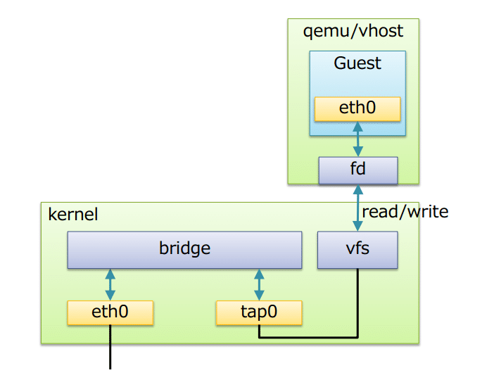

# KVM - Kernel Virtualization Machine

# 1.KVM là gì 
KVM - Kernel Virtualization Machine là giải pháp ảo hóa tích hợp vào kernel cho hệ thống Linux trên nền tảng phần cứng có các module mở rộng hỗ trợ ảo hóa. Nó biến nhân Linux thành một hypervisor, cho phép chạy nhiều hệ điều hành khách (Guests) độc lập trên một máy chủ vật lý 

# 2.KVM dùng để làm gì 
1. **Tạo và Quản lý Máy Ảo**  
KVM cho phép tạo và quản lý nhiều máy ảo (VMs) trên một máy chủ vật lý duy nhất. Mỗi máy ảo có thể chạy một hệ điều hành khác nhau, giúp tối ưu hóa việc sử dụng tài nguyên phần cứng.

2. **Tích Hợp với Hệ Sinh Thái Linux**  
KVM được tích hợp trực tiếp vào nhân Linux, cho phép tận dụng tất cả các tính năng của nhân như quản lý bộ nhớ, quản lý tiến trình và bảo mật. Điều này giúp KVM có hiệu suất cao và ổn định.

3. **Triển khai và Quản lý Hạ Tầng Đám Mây**  
KVM là một thành phần quan trọng trong các giải pháp đám mây như OpenStack. Nó cho phép các nhà cung cấp dịch vụ đám mây triển khai và quản lý hàng ngàn máy ảo trên một cơ sở hạ tầng phần cứng chung.

4. **Tối Ưu Hóa Tài Nguyên**  
KVM giúp tối ưu hóa việc sử dụng tài nguyên phần cứng như CPU, bộ nhớ, và lưu trữ bằng cách phân bổ và quản lý tài nguyên một cách hiệu quả giữa các máy ảo. Điều này giúp giảm chi phí phần cứng và tăng hiệu suất tổng thể.

5. **Quản Lý và Tự Động Hóa**  
KVM có thể được tích hợp với các công cụ quản lý và tự động hóa như libvirt, OpenStack, và Ansible, giúp tự động hóa việc triển khai, quản lý và theo dõi các máy ảo.

# 3.Loại ảo hóa của KVM và khác biệt
KVM thuộc loại ảo hóa phần cứng Hardware assisted virtualization, và thuộc loại Hypervisor type 1: Bare-Metal  
Mặc dù KVM cần hệ điều hành Linux để hoạt động, nó vẫn được xếp vào loại hypervisor Type 1 vì nó chạy trực tiếp trong nhân (kernel) của hệ điều hành và không cần một hệ điều hành host riêng biệt như hypervisor Type 2. Khi mô-đun KVM được tải vào nhân Linux, Linux kernel hoạt động như một hypervisor, quản lý trực tiếp tài nguyên phần cứng để cung cấp cho các máy ảo.

**So Sánh Với Hypervisor Type 2**  
Hypervisor Type 2 (Hosted):

- *Chạy Trên Hệ Điều Hành Host* : Hypervisor Type 2 chạy trên một hệ điều hành host như một ứng dụng. Nó phụ thuộc vào hệ điều hành host để quản lý tài nguyên phần cứng.
- *Hiệu Suất Thấp Hơn* : Do phải thông qua hệ điều hành host, hypervisor Type 2 thường có hiệu suất thấp hơn so với hypervisor Type 1.

**Ưu và nhược điểm của KVM**

- Ưu điểm
    - *Khả năng linh hoạt*: Mặc dù máy chủ gốc được cài đặt Linux, nhưng KVM hỗ trợ tạo máy chủ ảo có thể chạy cả Linux, Windows. Khi được sử dụng kết hợp với QEMU, KVM có thể chạy Mac OS X. Ngoài ra, KVM cũng hỗ trợ cả x86 và x86-64 system.
    - *Có tính độc quyền cao*: Cấu hình từng gói VPS KVM sẽ chỉ được một người sở hữu và toàn quyền sử dụng tài nguyên đó (bao gồm CPU, RAM, DISK SPACE…) mà không hề bị chia sẻ hay ảnh hưởng bởi các VPS khác hoạt động trên cùng hệ thống.
    - *Độ bảo mật chắc chắn*: Nhờ tích hợp các đặc điểm bảo mật của Linux như SELinux với các cơ chế bảo mật nhiều lớp, KVM bảo vệ các máy ảo tối đa và cách ly hoàn toàn, tránh bị xâm hại.
    - *Giúp tiết kiệm chi phí, độ mở rộng cao*: do được phát triển trên nền tảng mã nguồn mở hoàn toàn miễn phí và được hỗ trợ từ cộng đồng và nhà sản xuất thiết bị, KVM ngày càng lớn mạnh và trở thành một lựa chọn hàng đầu cho doanh nghiệp có chi phí thấp nhưng hiệu quả sử dụng đem lại cao.

- Nhược điểm
    - Có yêu cầu cao về server/máy chủ: Do là công nghệ ảo hóa hoàn toàn phần cứng, KVM yêu cầu cấu hình server vật lý khá cao. Thậm chí còn yêu cầu phải sử dụng các server của các thương hiệu lớn thì mới đảm bảo hoạt động tốt được
    - Công nghệ ảo hóa KVM chỉ có sẵn trong các hệ thống Linux
# 4.Cấu trúc của KVM

*Kiến trúc của KVM bao gồm 3 thành phần chính:*

1. **KVM kernel module**:
- Là 1 phần trong dòng chính của Linux Kernel
- Cung cấp giao diện chung cho Intel VMX và AMD SVM (thành phần hỗ trợ ảo hóa phần cứng)
- Chứa những mô phỏng cho các instruction và CPU modes không được hỗ trợ bởi Intel VMX và AMD SVM
2. **Qemu-kvm**: là chương trình dòng lệnh để tạo ra các máy ảo, thường được vận chuyển dưới dạng các package kvm hoặc qemu-kvm. Có 3 chức năng chính:
- Thiết lập VM và các thiết bị vào/ra (Input/Output)
- Thực thi mã khách thông qua KVM kernel module
- Mô phỏng các thiết bị vào/ra và di chuyển các Guest từ Host này sang Host khác
3. **Libvirt management stack**:
- Cung cấp API để các tool như virsh có thể giao tiếp và quản lý các VM
- Cung cấp chế độ quản lý từ xa an toàn

# 5.Cơ chế hoạt động  

- Để các máy ảo giao tiếp được với nhau, KVM sử dụng Linux Bridge và OpenVSwitch, đây là 2 phần mềm cung cấp các giải pháp ảo hóa network  
- Linux Bridge là 1 phần mềm được tích hợp vào trong nhân của Linux để giải quyết các vấn đề ảo hóa phần network trong máy vật lý. Về mặt logic Linux bridge sẽ tạo ra 1 con switch ảo để cho các VM kết nối được vào và có thể nói chuyện được với nhau cũng như sử dụng để kết nối ra bên ngoài  
- Cấu trúc của Linux Bridge khi kết hợp với KVM-QEMU:

- Trong đó:   
    - Bridge: tương đương với switch layer 2
    - Port: tương đương với port của switch thật
    - Tap (tap interface): có thể hiểu là giao diện mạng để các   - VM kết nối với bridge do linux bridge tạo ra
fd (forward data): vận chuyển dữ liệu
- Các tính năng chính:
    - STP: Spanning Tree Protocol – giao thức chống lặp gói tin trong mạng
    - VLAN: chia switch (do Linux Bridge tạo ra) thành các mạng LAN ảo, cô lập traffic giữa các VM trên các VLAN khác nhau của cùng 1 switch
    - FDB (forwarding database): chuyển tiếp các gói tin theo database để nâng cao hiệu năng switch. Database lưu các địa chỉ MAC mà nó học được. Khi gói tin Ethernet đến, bridge sẽ tìm kiếm trong database có chứa MAC address không. Nếu không, nó sẽ gửi gói tin đến tất cả các cổng (broadcast)