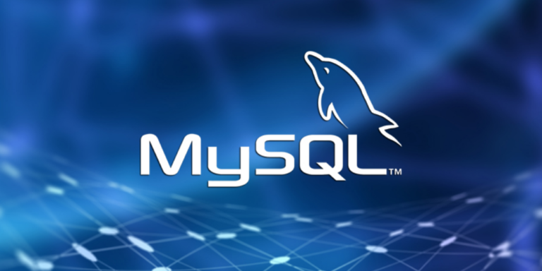
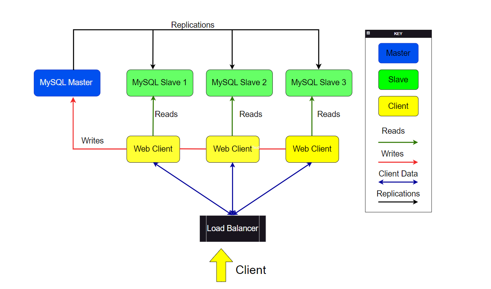

# TÌM HIỂU VỀ MYSQL

# 1. MySQL là gì 
MySQL chính là một hệ thống mã nguồn mở quản lý cơ sở dữ liệu. Cũng như tất cả các cơ sở dữ liệu quan hệ khác, MySQL cũng sẽ lưu trữ dữ liệu ở bên trong các bảng được tạo thành từ các cột và các hàng của nó. MySQL thường được sử dụng để quản lý và lưu trữ dữ liệu trong các ứng dụng web, phần mềm doanh nghiệp và nhiều hệ thống khác.

# 2.Mục đích sử dụng 

Với khối lượng thông tin lớn hiện nay , việc quản lý thông tin trở nên vô cùng khó khăn, vì thế MySQL được sinh ra nhằm quản lý dữ liệu người dùng. Khi muốn nghe những bài hát yêu thích, bạn mở danh sách phát từ điện thoại thông minh của mình. Trong trường hợp này, danh sách phát về cơ bản là một cơ sở dữ liệu. Khi bạn chụp ảnh và tải nó lên tài khoản của mình trên mạng xã hội như Facebook, thư viện ảnh của bạn sẽ trở thành cơ sở dữ liệu.

# 3. Cấu trúc hoạt động của MySQL
MySQL được cấu trúc theo mô hình client-server, bao gồm các thành phần chính sau:

1. **Máy chủ MySQL (MySQL Server)**  
Là bộ não của hệ thống, chịu trách nhiệm xử lý các yêu cầu truy vấn, quản lý dữ liệu và đảm bảo tính toàn vẹn cho cơ sở dữ liệu.
Cung cấp các dịch vụ như: kết nối mạng, xác thực người dùng, tối ưu hóa truy vấn, ghi chép nhật ký, ...
Có thể cài đặt độc lập hoặc cùng với các ứng dụng khác.
2. **Máy khách MySQL (MySQL Client)**  
Là giao diện người dùng cho phép người dùng tương tác với MySQL Server.
Có nhiều loại client khác nhau, phổ biến nhất là:
MySQL Command-Line Client: Dòng lệnh để thực thi các câu lệnh SQL trực tiếp.
MySQL Workbench: Giao diện đồ họa cung cấp nhiều tính năng như quản lý cơ sở dữ liệu, viết truy vấn, ...
API MySQL: Thư viện cho phép các ngôn ngữ lập trình truy cập và thao tác với MySQL.
3. **Cấu trúc lưu trữ**  
Dữ liệu được lưu trữ trong các bảng, mỗi bảng bao gồm các cột và hàng. Các cột định nghĩa các thuộc tính của dữ liệu, ví dụ như tên, kiểu dữ liệu, ...
Các hàng đại diện cho các bản ghi dữ liệu cụ thể.
MySQL hỗ trợ nhiều kiểu dữ liệu khác nhau như số nguyên, chuỗi, ngày tháng, ...

# 4.Ngôn ngữ sử dụng trên MySQL

1. **Ngôn ngữ định nghĩa dữ liệu (DDL)** : bao gồm các câu lệnh để xác định cơ sở dữ liệu và các đối tượng của nó như bảng, dạng xem , trình kích hoạt , thủ tục được lưu trữ , v.v.
2. **Ngôn ngữ thao tác dữ liệu (DML)** : chứa các câu lệnh để cập nhật và truy vấn dữ liệu .
3. **Ngôn ngữ kiểm soát dữ liệu (DCL)** : cho phép bạn cấp quyền cho người dùng truy cập dữ liệu cụ thể trong cơ sở dữ liệu

# 5. Nguyên lý hoạt động 

1. **Kết nối**  
Máy khách MySQL kết nối với máy chủ MySQL thông qua giao thức TCP/IP.
Quá trình kết nối được xác thực bằng tên người dùng và mật khẩu.
2. **Gửi yêu cầu**
Sau khi kết nối thành công, máy khách có thể gửi các yêu cầu đến máy chủ MySQL. Yêu cầu này có thể là câu lệnh SQL để truy vấn, thao tác dữ liệu hoặc cấu hình hệ thống.
3. **Xử lý yêu cầu**  
Máy chủ MySQL nhận yêu cầu từ máy khách và tiến hành xử lý.  
Quá trình xử lý bao gồm:  
- Phân tích cú pháp và ngữ nghĩa của câu lệnh SQL.
- Tìm kiếm dữ liệu trong cơ sở dữ liệu.
- Thực hiện các thao tác cần thiết trên dữ liệu.
- Chuẩn bị kết quả trả về cho máy khách.
4. **Trả về kết quả**  
Máy chủ MySQL trả về kết quả cho máy khách.
Kết quả có thể là dữ liệu được truy vấn, thông báo lỗi hoặc thông tin trạng thái.
5. **Đóng kết nối**  
Khi máy khách không còn yêu cầu gì nữa, kết nối sẽ được đóng lại.

