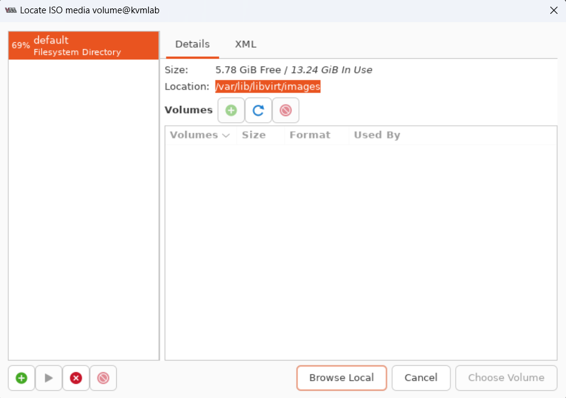
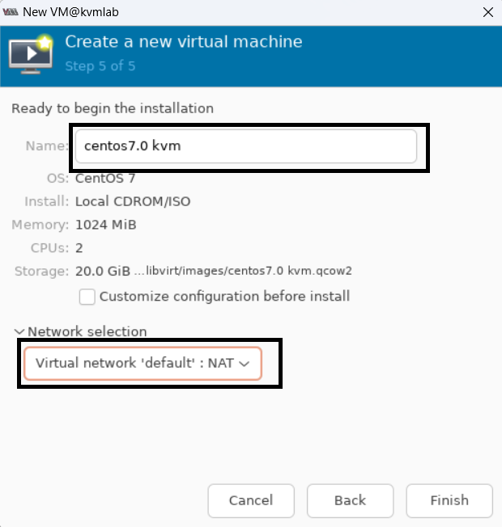

# CÀI ĐẶT KVM TRÊN UBUNTU DESKTOP BẢN 22.04

# 1.Kiểm tra hỗ trợ cài đặt ảo hóa 
Xem lại tại đây : [Kiểm tra hỗ trợ ảo hóa](https://github.com/ducthien1998/system-intership/blob/main/ThienBD/19.KVM/Install_and_Lab/1.Kiem_Tra_Ho_Tro_Ao_Hoa.md)

# 2. Cài đặt KVM

Cài đặt KVM bằng lệnh 
```
apt install -y qemu-kvm libvirt-daemon-system libvirt-daemon virtinst bridge-utils libosinfo-bin
```
Trong đó:

- `qemu-kvm`: Phần phụ trợ cho KVM
- `libvirt-bin`: Cung cấp libvirt mà bạn cần quản lý qemu bằng libvirt
- `bridge-utils`: Chứa tiện ích cần thiết để tạo và quản lý máy ảo.
- `virt-manager`: cung cấp giao diện để quản lý máy ảo
Sau khi cài đặt xong ta khởi động lại dịch vụ và enable bằng lệnh 

```
sudo systemctl restart libvirtd
sudo systemctl enable libvirtd
```

Kiểm tra lại trạng thái dịch vụ 


# 2.Sử dụng công cụ Virt-manager để cài VM
Cài đặt virt-manager (quản lý bằng GUI)
```
apt install -y virt-manager
```
Tạo thư mục chứa file ISO và tải file ISO CentOS 7
```
mkdir file_iso
cd file_iso
wget http://centos-hn.viettelidc.com.vn/7/isos/x86_64/CentOS-7-x86_64-Minimal-1810.iso
```
Khởi chạy chương trình bằng lệnh 
```
virt-manager
```


Trong cửa sổ đầu tiên, hãy nhấp vào biểu tượng máy tính ở góc trên bên trái, trong cửa sổ mở ra , chọn tùy chọn cài đặt VM bằng Local install media(ISO). Sau đó click tiếp vào `Forward`


Ở đây chọn `Browse`



Tiếp tục chọn `Browse Local`

  
Điều hướng đến đường dẫn nơi bạn đã lưu trữ ISO mà bạn muốn cài đặt và chọn iso muốn cài đặt. Sau khi đã chọn được bản cài, tiếp tục chọn Forward để đi tới cài đặt dung lượng ổ đĩa 


Nhập dung lượng RAM, và số lượng CPU bạn muốn phân bổ cho VM và tiến hành bước tiếp theo. Chọn nơi lưu trữ VM


Chọn dung lượng ổ đĩa và tiếp tục 



Đặt tên VM và chọn card mạng, ở đây ta để mặc định card NAT


Chọn `Install CentOS 7` và để chương trình chạy 

Tiếp theo ta cài đặt hệ điều hành có thể tham khảo mục sau : [Cài đặt CentOS7](https://github.com/ducthien1998/system-intership/blob/main/ThienBD/02.VMWares/docs/01.SetupCentOS7.md)