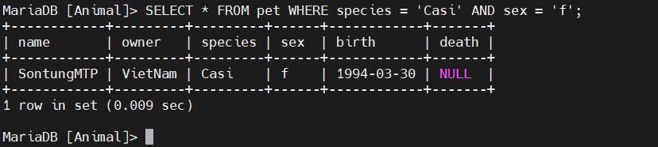
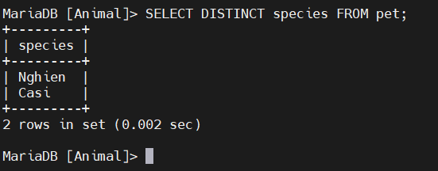

# Lấy thông tin từ một bảng

1. Chọn tất cả dữ liệu
2. Chọn các hàng cụ thể
3. Chọn các cột cụ thể
4. Sắp xếp hàng


Câu lệnh này `SELECT` được sử dụng để lấy thông tin từ một bảng. Dạng chung của câu lệnh là:

```
SELECT what_to_select
FROM which_table
WHERE conditions_to_satisfy;
```
# 1.Chọn tất cả dữ liệu

Dạng đơn giản nhất để `SELECT` lấy mọi thứ từ một bảng. Dạng này `SELECT` sử dụng *, là viết tắt của “ chọn tất cả các cột ”

```
SELECT * FROM pet;
```


Trong trường hợp thông tin trong bảng bị sai. Ta có 2 cách để sửa , 1 là xóa bỏ thông tin trong bảng và tải 1 file pet.txt để chỉnh sửa lên , 2 là chỉnh sửa trực tiếp trên bảng

- Chỉnh sửa tệp `pet.txt` để sửa lỗi, sau đó xóa bảng và tải lại bằng lệnh `DELETE` và `LOAD DATA`

```
DELETE FROM pet;
LOAD DATA LOCAL INFILE 'pet.txt' INTO TABLE pet;
```
- Chỉnh sửa bản ghi lỗi bằng câu lệnh `UPDATE`

```
UPDATE pet SET birth = '1989-08-31' WHERE name = 'TienBip';
```


# 2.Chọn các hàng cụ thể

Rất dễ để lấy toàn bộ thông tin bảng. Chỉ cần bỏ mệnh `WHERE` đề khỏi câu lệnh SELECT. Nhưng thông thường bạn không muốn xem toàn bộ bảng, đặc biệt là khi bảng quá lớn.   
Bạn có thể chọn các hàng cụ thể từ bảng của mình.

*Ví dụ*

```
SELECT * FROM pet WHERE name = 'HuanHoaHong';
```


Ngoài ra bạn có thể kết hợp các điều kiện để truy vấn thông tin từ bảng 

*Ví dụ*
```
SELECT * FROM pet WHERE species = 'Casi' AND sex = 'f';
```



Ở ví dụ trên ta dùng AND để truy vấn, ngoài ra cũng có thể dùng OR hoặc kết hợp cả 2 

# 3.Chọn các cột cụ thể

Khi bạn không muốn xem hết tất cả các cột trong bảng mà chỉ cần thông tin từ các cột cụ thể 

*Ví dụ*

```
SELECT name, birth FROM pet;
```


Để giảm thiểu đầu ra, hãy lấy mỗi bản ghi đầu ra duy nhất chỉ một lần bằng cách thêm từ khóa DISTINCT:

*Ví dụ*

```
SELECT DISTINCT species FROM pet;
```


# 4. Sắp xếp thông tin theo hàng

Thông tin đầu ra truy vấn dễ dàng hơn để kiểm tra khi các hàng được sắp xếp theo một cách có ý nghĩa nào đó. Để sắp xếp kết quả, hãy sử dụng lệnh `ORDER BY`  
*Ví dụ*

```
SELECT name, birth FROM pet ORDER BY birth;
```


Thứ tự sắp xếp mặc định là tăng dần, với các giá trị nhỏ nhất trước. Để sắp xếp theo thứ tự ngược lại (giảm dần), hãy thêm từ khóa `DESC` vào lệnh 

*Ví dụ*
```
SELECT name, birth FROM pet ORDER BY birth DESC;
```


*Tài liệu tham khảo*

[1] [https://dev.mysql.com/doc/refman/8.4/en/tutorial.html](https://dev.mysql.com/doc/refman/8.4/en/tutorial.html)