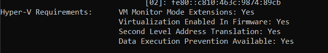
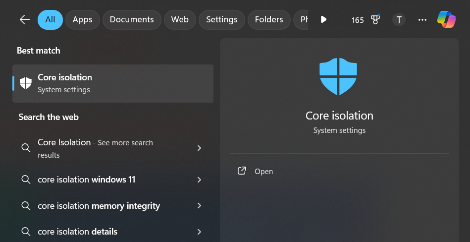
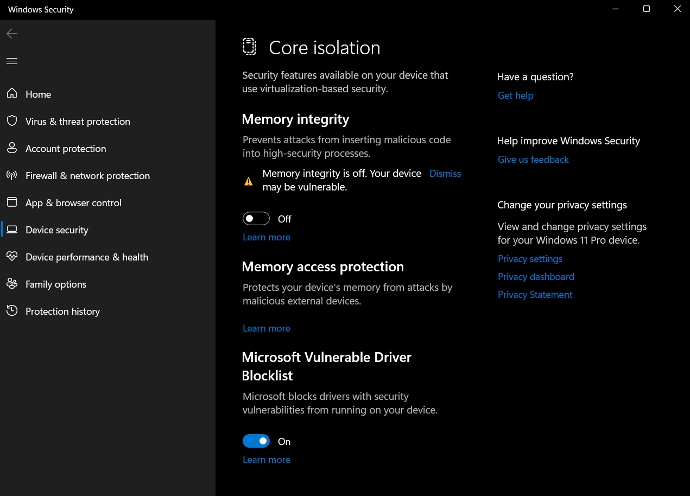

# Hướng Dẫn Bật Hỗ Trợ Ảo Hóa Trên Window

# 1. Kiểm tra hỗ trợ ảo hóa trên máy ảo 
Để kiểm tra máy có hỗ trợ ảo hóa hay không, ta dùng lệnh sau trên 1 VM
```
egrep -c "svm|vmx" /proc/cpuinfo
```

Nếu kết quả trả về 0 thì máy không hỗ trợ ảo hóa. Còn khác 0 tức là máy có hỗ trợ ảo hóa.

Nếu trên VMware, ta bật hỗ trợ ảo hóa trong Virtual Machine Settings của máy ảo. Đánh dấu vào 2 ô như hình dưới đây:


Sau khi ta bật hỗ trợ ảo hóa trên VMWare nhưng vẫn không thể chạy được thì đó là do thiết bị của bạn chưa hỗ trợ ảo hóa

# 2. Kiểm tra hỗ trợ ảo hóa trên thiết bị 

Để có thể kiểm tra thiết bị của bạn đã được bật hỗ trợ ảo hóa chưa có 1 số cách sau  
1. Sử dụng CMD trên Window   

Mở CMD sau đó nhập vào lệnh `systeminfo`


Kết quả trả về như hình thì là có hỗ trợ ảo hóa 

2. Bạn tải phần mềm có tên là LeoMoon CPU-V và kiểm tra 


Nếu như VT-x Supported và VT-x Enabled đều tích xanh thì thiết bị của bạn đã được bật hỗ trợ ảo hóa 

# 3. Bật hỗ trợ ảo hóa

1. Enable VT-x trên BIOS
Sau khi truy cập BIOS, tìm những mục có thể có như 
Intel VT-x’, ‘Intel  Virtualization Technology’, ‘Virtualization Extensions’, ‘Vanderpool’… và Enable nó lên là được.

2. Gỡ bỏ Hyper-V
Hyper-V không cho phép các ứng dụng ảo hóa khác truy cập vào tính năng tăng tốc phần cứng. Chính vì thế để có thể sử dụng được các phần mềm ảo hóa như VirtualBox hay VMware thì bạn hãy gỡ bỏ Hyper-V đi trước.

- Mở Program and Features vào mục Turn Windows features on or off

- Bạn bỏ dấu tích ở dòng Hyper-V như hình bên dưới => sau đó nhấn OK để đồng ý.


3. VT enable nhưng hiển thị [disable]

- Tìm kiếm `Core Isolation` trong tìm kiếm của Windows


- Tắt Memory Integrity nếu nó đang bật


- Khởi động lại máy tính của bạn khi được nhắc…
