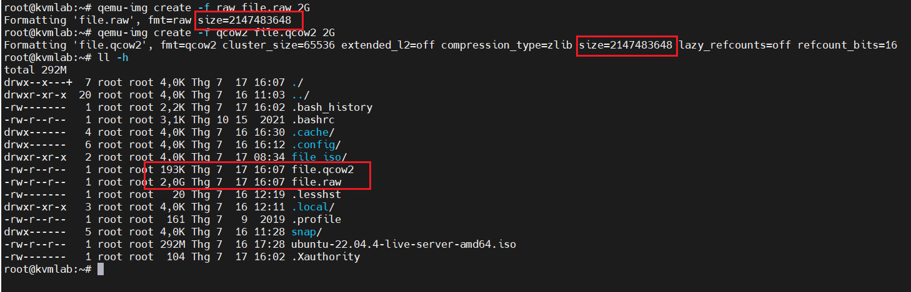
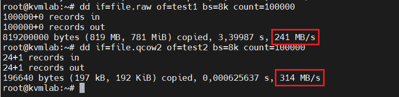
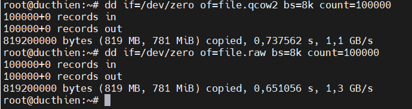
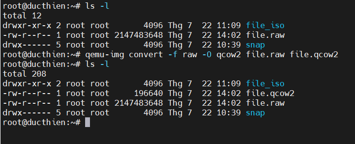

# PHÂN BIỆT 3 ĐỊNH DẠNG Ổ ĐĨA RAW - QCOW2 - ISO TRONG KVM


# 1. Tổng quan về file image trong KVM

- File image của đĩa CD/DVD là một dạng file có định dạng theo các chuẩn tạo file ảnh. File image là một file đóng gói hết tất cả nội dung của một đĩa CD/DVD vào trong đó 
- Trong KVM Guest có 2 thành phần chính đó là `KVM definition` được lưu dưới dạng file XML tại `/etc/libvirt/qemu`, file này chứa các thông tin của máy ảo như tên, thông tin về tài nguyên của VM(RAM,CPU,...). File còn lại là `storage` thường được lưu dưới dạng image tại thư mục `/etc/lib/libvirt/images`
- 3 định dạng thông dụng nhất của file image sử dụng trong KVM đó là `ISO , raw và qcow2`

# 2. Định dạng file images phổ biến trong KVM

## 2.1. Định dạng ISO
- File ISO là images file của 1 đĩa CD/DVD, nó chứa toàn bộ dữ liệu của đĩa CD/DVD đó. File ISO thường được sử dụng để cài đặt hệ điều hành của VM, người dùng có thể import trực tiếp hoặc tải trên internet về 
- Boot từ file ISO cũng là một trong số những tùy chọn mà người dùng có thể sử dụng khi tạo máy ảo 

**Đặc điểm**
- Read only
- Kích thước cố định: Kích thước của file ISO là cố định
**Ưu điểm**
- Thường được sử dụng để cài đặt hệ điều hành cho máy ảo
- Có thể dễ dàng lắp đặt và sử dụng như ổ đĩa CD/DVD ảo 
**Nhược điểm**
- Dung lượng lớn, tốn bộ nhớ lưu trữ
- Không hỗ trợ tính năng snapshot, resize, copy-on-write


## 2.2. Định dạng RAW

- Là định dạng file image phi cấu trúc
- Khi tạo mới một máy ảo có disk format là raw thì dung lượng của file disk sẽ đúng bằng dung lượng của ổ đĩa máy ảo bạn đã tạo 
- Định dạng raw là image theo dạng nhị phân (bit by bit) của ổ đĩa 
- Mặc định khi tạo máy ảo với virt-manager hoặc không khai báo khi tạo VM bằng virt-install thì định dạng ổ đĩa sẽ là raw, hay raw chính là định dạng mặc định của QEMU

**Đặc điểm**
- Cung cấp hiệu suất I/O tốt nhất vì nó chỉ tốn rất ít chi phí
- Tương thích với hầu hết nền tảng ảo hóa 
**Ưu điểm**
- Hoạt động đọc, ghi nhanh
- Đơn giản và được hỗ trợ 
**Nhược điểm**
- Sử dụng không gian ổ đĩa không hiệu quả 
- Không có tính năng nâng cao như snapshot

## 2.3. Định dạng QCOW2
- QCOW2 (QEMU Copy On Write) sử dụng mô hình tối ưu hóa lưu trữ đĩa để trì hoãn phân bổ dung lượng lưu trữ .
- Qcow2 là một phiên bản cập nhật của qcow, nhằm thay thế nó. Qcow2 hỗ trợ nhiều snapshots thông qua một mô hình mới 
- Qcow2 hỗ trợ copy-on-write với những tính năng đặc biệt như snapshot, mã hóa, nén dữ liệu...

**Đặc điểm**
- Hỗ trợ hoạt động sao chép khi ghi, có thể tạp snapshot và sử dụng dung lượng ổ đĩa hiệu quả 
- Hỗ trợ nén , tiết kiệm dung lượng đĩa
- Hỗ trợ mã hóa tăng cường bảo mật 

**Ưu điểm**
- Tiết kiệm không gian và khả năng hỗ trợ các tập tin 
- Các tính năng nâng cao như snapshot , mã hóa...
**Nhược điểm**
- Hiệu suất truy cập dữ liệu thấp hơn so với RAW
- Phức tạp hơn RAW

# 3. So sánh giữa QCOW2 và RAW

## 3.1. Dung lượng 
Để kiểm tra dung lượng 2 định dạng này, ta sẽ dùng lệnh `qemu-img` để tạo ra một file có định dạng raw và một file có định dạng qcow2 cả 2 file nàu đều có dung lượng là 2G.
**File raw** :
```
qemu-img create -f raw file.raw 2G
```
**File qcow2** :
```
qemu-img create -f qcow2 file.qcow2 2G
```


Ta có thể thấy, khi tạo thì 2 file đều có dung lượng là 2G, nhưng sau đó, kiểm tra thực tế thì ta thấy file có định dạng qcow2 chỉ có dung lượng là 193K, còn file định dạng raw thì vẫn là 2G.

## 3.2. Performance (hiệu năng)
Để test hiệu năng giữa 2 định dạng này ta sử dụng câu lệnh `dd` để đọc và ghi dữ liệu từ các file trên.

**Đọc dữ liệu**

```
dd if=file.raw of=test1 bs=8k count=100000
dd if=file.qcow2 of=test2 bs=8k count=100000
```


**Ghi dữ liệu**

```
dd if=/dev/zero of=file.raw bs=8k count=100000
dd if=/dev/zero of=file.qcow2 bs=8k count=100000
```


## 3.3. Tạo snapshot
Chỉ có qcow2 hỗ trợ tạo snapshot

## 3.4. Chuyển đổi giữa raw và qcow2
Chuyển từ `qcow2` sang `raw` :

```
qemu-img convert -f qcow2 -O raw file.qcow2 file.raw
```


Chuyển từ `raw` sang `qcow2` :

```
qemu-img convert -f raw -O qcow2 file.raw file.qcow2
```




*Tài liệu tham khảo*  
[1] [https://ductam.info/tong-quan-ve-file-image-trong-kvm/](https://ductam.info/tong-quan-ve-file-image-trong-kvm/)  
[2] [https://www.vinchin.com/vm-tips/raw-vs-qcow2.html](https://www.vinchin.com/vm-tips/raw-vs-qcow2.html)