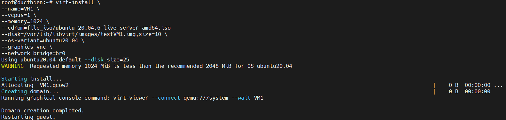
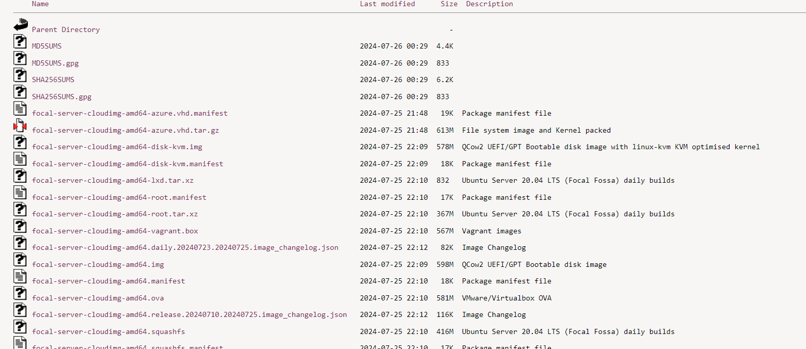

# TẠO VÀ QUẢN LÝ MÁY ẢO BẰNG GIAO DIỆN CLI VIRSH

# 1. Tạo máy ảo với Virsh
Sử dụng lệnh `virt-install` với các tham số, giá trị truyền vào để tạo máy ảo với thông tin cấu hình mong muốn. Hầu hết các options là không bắt buộc, virt-install chỉ yêu cầu 1 số thông tin tối thiểu sau
```
--name
--ram
--disk
--filesystem or --nodisks
```
**Các tham số đối với virt-install:**

- **--name**: đặt tên cho máy ảo
- **--ram**: set dung lượng RAM cho máy ảo (MB)
- **--disk path = xx, size = xx**: đường vẫn lưu file .img máy ảo và dung lượng disk mount
- **--vspus**: set giá trị số vCPU
- **--os-type**: kiểu hệ điều hành (linux, windows)
- **--os-variant**: kiểu của GuestOS
- **--network**: dải network mà máy ảo tạo ra sẽ cắm vào
- **--graphics**: set chế độ đồ họa, đặt là none -> không sử dụng chế độ đồ họa
- **--console**: lựa chọn kiểu console
- **--location**: đường dẫn tới file cài đặt
- **--extra-args**: set tham số cho kernel

## 1.1. Tạo VM bằng file iso

```
virt-install \
--name=VM1 \
--vcpus=1 \
--memory=1024 \
--cdrom=file_iso/ubuntu-20.04.6-live-server-amd64.iso
--disk=/var/lib/libvirt/images/testVM1.img,size=10 \
--os-variant=ubuntu20.04 \
--graphics vnc \
--network bridge=br0
```



## 1.2. Tạo VM bằng file image
Có thể tạo máy ảo từ các disk image có sẵn, đã được cài hệ điều hành trước đó, có thể tải từ một số trang cung cấp cloud image như `https://cloud-images.ubuntu.com/`  



Để tạo máy ảo từ image có sẵn, sử dụng câu lệnh sau :


```
virt-install \
--name testVM3 \
--ram 1024 \
--vcpus 1 \
--os-variant=ubuntu20.04 \
--disk path=/var/lib/libvirt/focal-server-cloudimg-amd64-disk-kvm.img,size=20 \
--network network=default \
--hvm --virt-type kvm \
--vnc --noautoconsole \
--import
```


# 2. Thao tác quản lý virt-manager

1. Hiển thị danh sách máy ảo 

```
virsh list --all
```

2. Tắt máy ảo 

```
virsh shutdown <tên_máy_ảo>
```

3. Bật máy ảo 

```
virsh start <tên_máy_ảo>
```
4. Reboot máy ảo 

```
virsh reboot <tên_máy_ảo>
```
5. Xóa máy ảo 
```
virsh undefine <tên_máy_ảo>
```
6. Tạo snapshot

```
virsh snapshot-create-as --domain tên_máy --name tên_bản_snapshot --description "mô tả bản snapshot"
```
**Lưu ý**: `snapshot` chỉ tạo được khi định dạng disk ảo của ta sử dụng là `qcow2` chính vì vậy nếu bạn đang sử dụng định dạng raw mà muốn tạo `snapshot` thì cần phải chuyển sang định dạng `qcow2`.

7. Xem các bản snapshot của 1 VM

```
virsh snapshot-list <tên_máy_ảo>
```
8. Xem thông tin chi tiết của 1 bản snapshot

```
virsh snapshot-info --domain <tên_máy_ảo> --snapshotname <tên_bản_snapshot>
```

9. Revert lại bản snapshot đã tạo 
```
virsh snapshot-revert <tên_máy_ảo> <tên-bản-snapshot>
```

10. Xóa 1 bản snapshot

```
virsh snapshot-delete --domain <tên_máy_ảo> --snapshotname <tên_bản_snapshot>
```
11. Sửa thông tin CPU hoặc Memory
```
virsh edit <tên_VM>
```
12. Xem thông tin chi tiết file disk của VM

```
qemu-img info <đường_dẫn_file-disk>
```

13. Xem thông tin cơ bản của 1 VM
```
virsh dominfo <tên_VM>
```