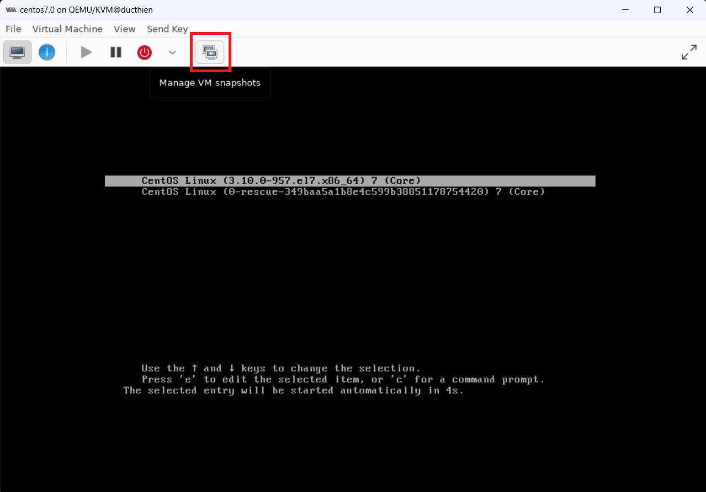
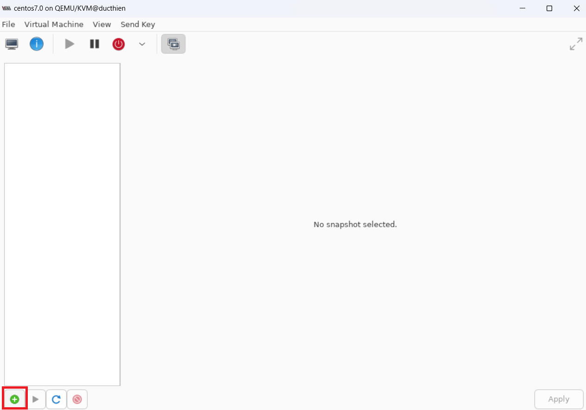
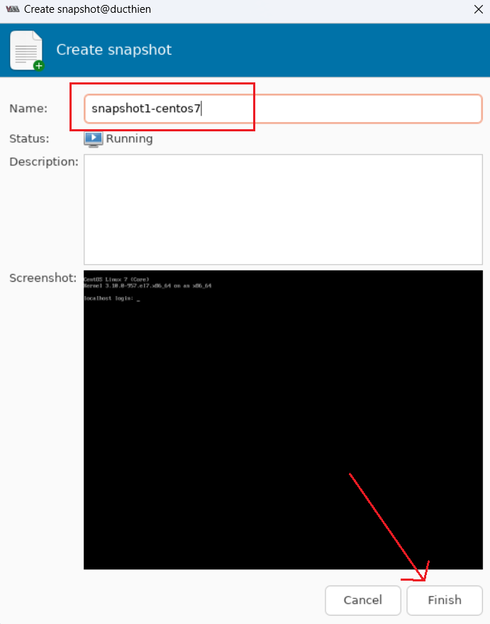
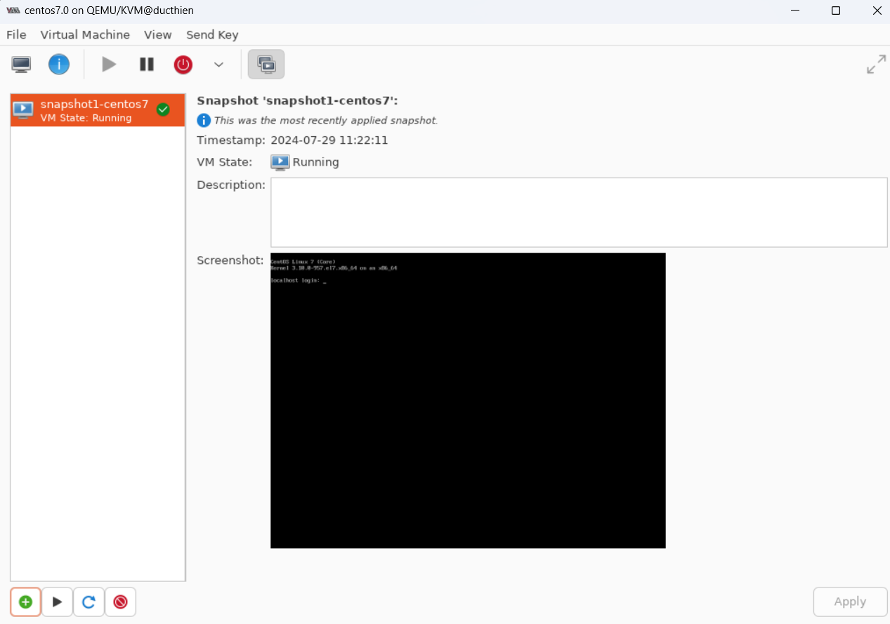
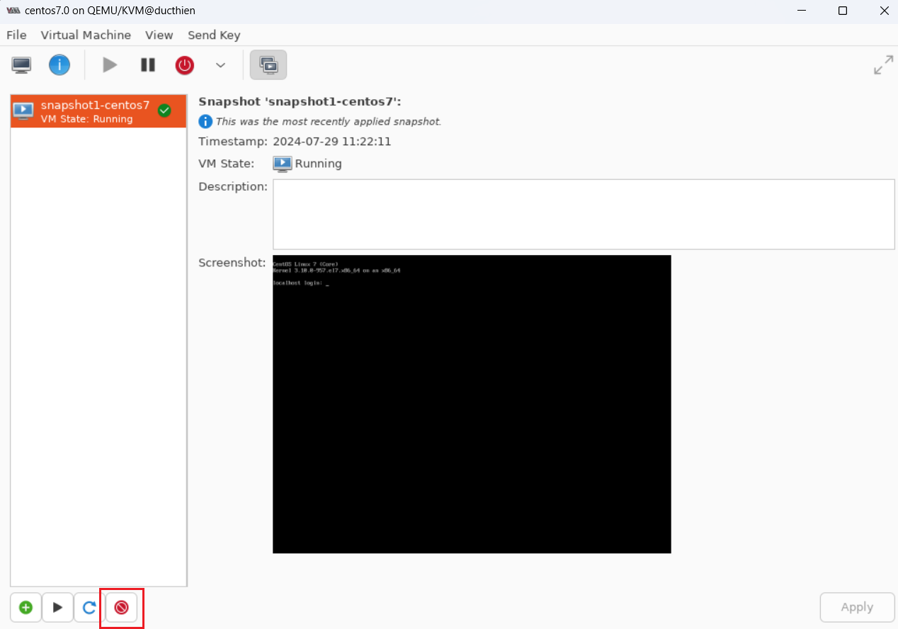
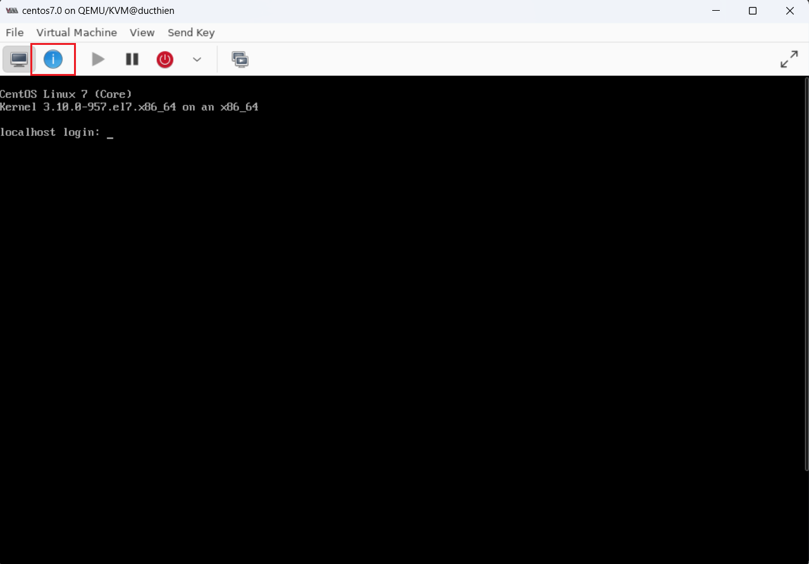
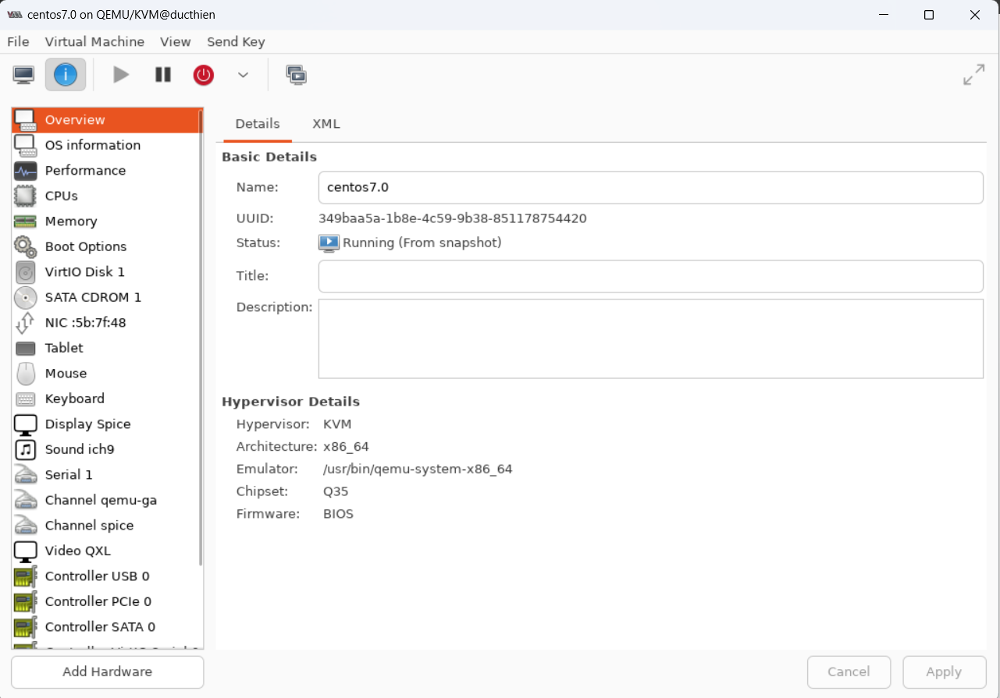

# TẠO VÀ QUẢN LÝ MÁY ẢO BẰNG VIRT MANAGER

# 1. Kiểm tra thiết bị có hỗ trợ cài đặt máy ảo không 

Tham khảo mục : 

# 2. Cài đặt máy ảo 

Tham khảo mục : 

# 3. Snapshot

**Bước 1** : Trên cửa sổ của máy ảo đang bật, chọn vào biểu tượng snapshot ở cuối thanh công cụ :

**Bước 2** : Chọn biểu tượng dấu “+” ở dưới góc trái màn hình để tạo snapshot :

**Bước 3** : Tại option Name , đặt tên cho bản snapshot -> Finish :

=> Kết quả sau khi tạo :

**Bước 4**: Chọn biểu tượng … để reverse bản snapshot :

**Bước 5** : Chọn biểu tượng … để xóa bản snapshot :

# 4. Xem và sửa thông tin hardware của VM

**Bước 1** : Trên cửa sổ của máy ảo đang bật, chọn vào biểu tượng info trên thanh công cụ :

*Lưu ý* : Phải tắt máy ảo trước khi sửa đổi thông tin

**Bước 2** : Cửa sổ thông tin phần cứng của máy ảo hiện ra, có thể tùy chỉnh sau đó chọn Apply :
