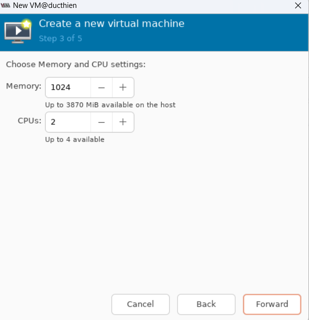
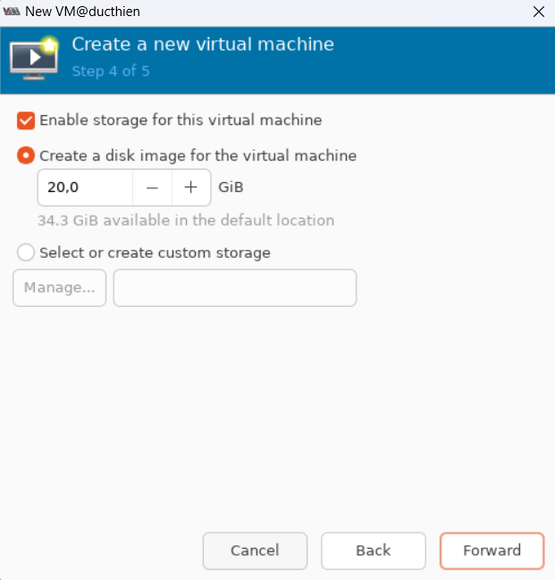
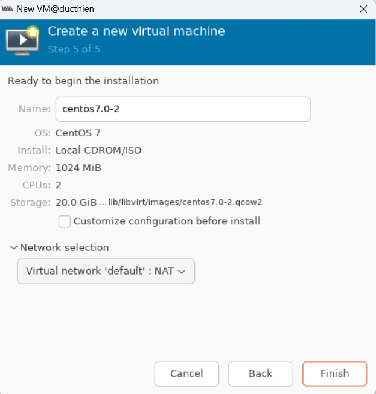

# CÁC OPTION KHI TẠO MỘT VM (CPU, DISK, NIC)

# 1. Options của CPU
Ta có thể tùy chỉnh dung lượng của RAM và số CPU ảo cho VM

Virt-manager

# 2. Options của Disk
Khi tạo một VM đến mục tùy chọn option cho Disk

Tạo 1 Disk image để lưu máy ảo

# 3. Options của NIC
Tùy vào mục đích tạo VM để chọn kiểu card mạng cho thích hợp. Có thể để kết nối ra ngoài mạng internet hoặc để dạng NAT

