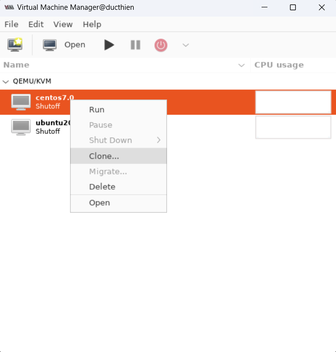
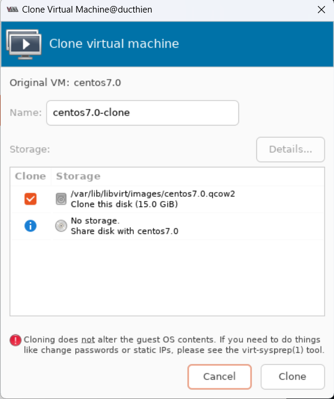
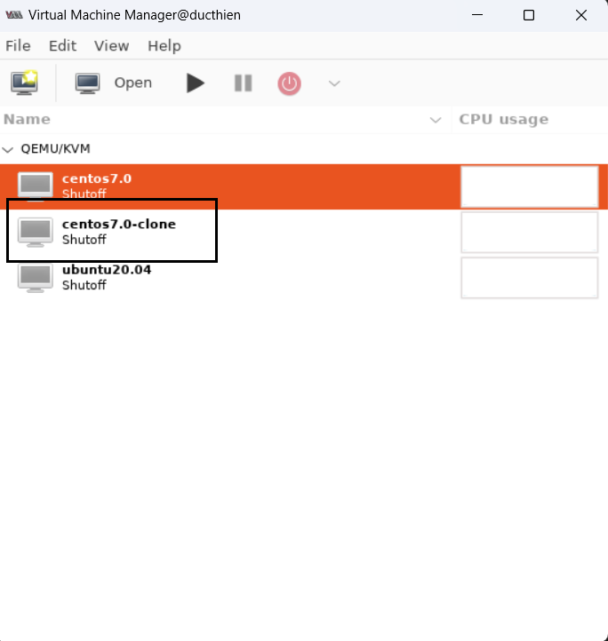
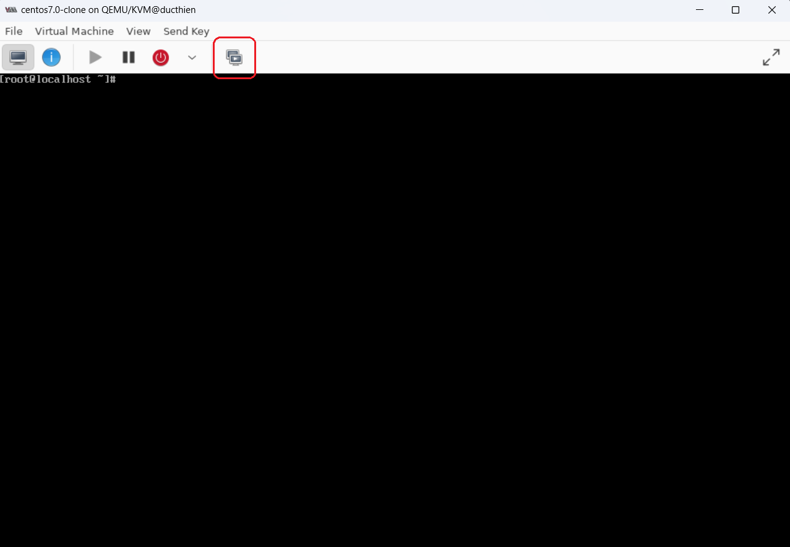
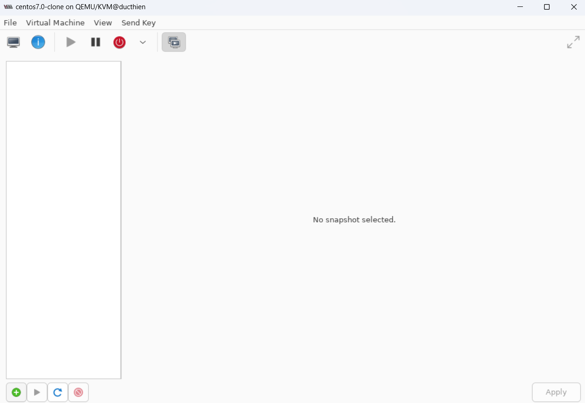
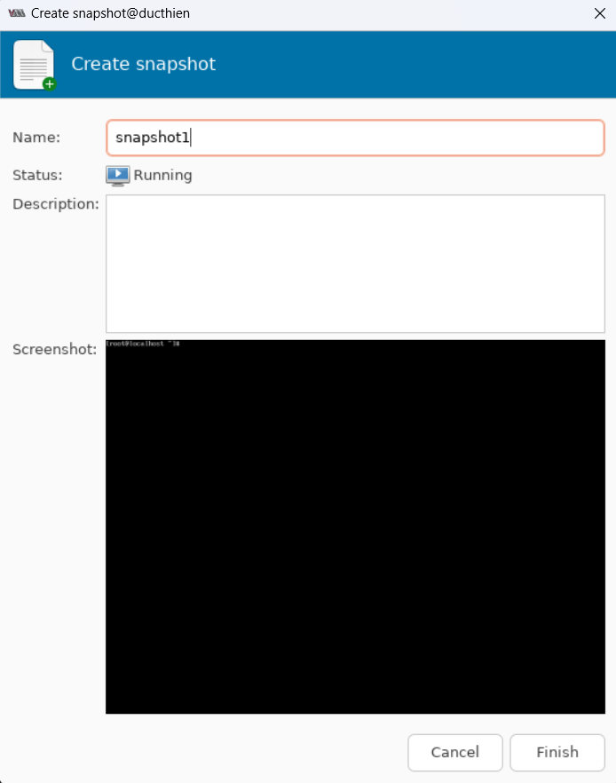
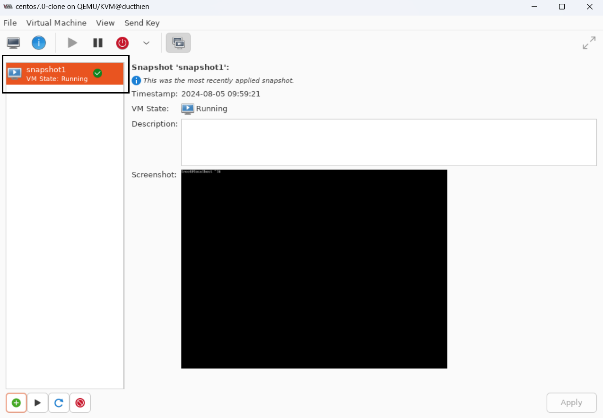

# CÁC TÍNH NĂNG CỦA KVM ĐỐI VỚI VM

# 1. Thêm VM
# 2. Sửa VM
# 3. Xóa VM
# 4. Clone

Để clone 1 VM ta thực hiện các bước sau:

Chuột phải vào VM muốn Clone rồi click chuột Clone

Sau đó, cửa sổ Clone virtual machine hiện ra. Ta sẽ chỉnh sửa các thông số cơ bản của VM clone như tên, Storage. Rồi click Clone để tiến hành Clone VM đã chọn

Đợi quá trình Clone thực hiện xong, ta sẽ thấy 1 VM được tạo ra. Đó chính là bản clone của VM ta đã thực hiện vừa xong

# 5. Snapshot
Để tạo Snapshot cho VM, ta làm theo các bước sau

Chọn vào mục Manager VM Snapshot:

Click chọn thêm Snapshot

Điền tên cho Snapshot

Như vậy là đã tạo xong 1 snapshot

