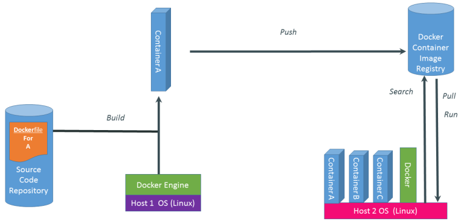

# TÌM HIỂU VỀ DOCKER

# 1.Tổng quan về Docker

## 1.1.Docker là gì 
Docker là một ứng dụng mã nguồn mở cho phép đóng gói các ứng dụng, các phần mềm phụ thuộc lẫn nhau vào trong cùng một container. Container này sau đó có thể mang đi triển khai trên bất kỳ một hệ thống Linux phổ biến nào. Các container này hoàn toàn độc lập với các container khác.

- Với Docker, chúng ta có thể đóng gói mọi ứng dụng vd như webapp, backend, MySQL, BigData…thành các containers và có thể chạy ở “hầu hết” các môi trường vd như Linux, Mac, Window…
- Docker Containers có một API cho phép quản trị các container từ bên ngoài. Giúp cho chúng ta có thể dễ dàng quản lí, thay đổi, chỉnh sửa các container.
- Hầu hết các ứng dụng Linux có thể chạy với Docker Containers.

## 1.2.Những lợi ích và hạn chế
1. Lợi ích

- **Sử dụng ít tài nguyên**: Thay vì phải ảo hóa toàn bộ hệ điều hành thì chỉ cần build và chạy các container độc lập sử dụng chung kernel duy nhất.
- **Tính đóng gói và di động**: Tất cả các gói dependencies cần thiết đều được đóng gói vừa đủ trong container. Và sau đó có thể mang đi triển khai trên các server khác.
- **Cô lập tài nguyên**: Server không biết ở trong container chạy gì và container cũng không cần biết nó là CentOs hay Ubuntu . Các container độc lập với nhau và có thể giao tiếp với nhau bằng một interface
- **Hỗ trợ phát triển và quản lý ứng dụng nhanh**: Đối với Dev, sử dụng docker giúp họ giảm thiểu thời gian setup môi trường, đóng gói được các môi trường giống nhau từ Dev - Staging - Production
- **Mã nguồn mở**: Cộng đồng support lớn, các tính năng mới được release liên tục.

2. Hạn chế
- Docker base trên Linux 64bit và các tính năng cgroup, namespaces. Vì thế Linux 32bit hoặc môi trường Window không thể chạy được docker (đối với phiên bản CE).
- Sử dụng container tức là bạn sử dụng chung kernel của hệ điều hành. Trong trường hợp bạn download image có sẵn và trong đó có một số công cụ có thể kiểm soát được kernel thì server của bạn có thể bị mất kiểm soát hoàn toàn.
- Các tiến trình chạy container một khi bị stop thì sẽ mất hoàn toàn dữ liệu nếu không được mount hoặc backup. Điều này có thể sẽ gây ra một số bất tiện…
## 1.3.Các khái niệm liên quan 

1. **Image**

Image là một template được đóng gói sẵn và không đổi trong toàn bộ quá trình chạy container (trừ khi build lại image). Liên tưởng đến lập trình hướng đối tượng, Image là class và container là object của class đó.

Các bạn có thể tự build image cho riêng mình, hoặc download các image có sẵn của cộng đồng từ Docker Hub.

2. **Container**

Container được khởi chạy từ các Image, bên trong sẽ có đầy đủ các ứng dụng cần thiết mà bạn định nghĩa từ Image

3. **Docker Registry**

Là một kho chứa các image. Bạn có thể dựng riêng một con Docker Registry cho riêng mình

# 2.Các thành phần Docker

1. *Docker Engine*

Docker Engine là công cụ client-server hỗ trợ công nghệ container để xử lý các nhiệm vụ và quy trình công việc liên quan đến việc xây dựng các ứng dụng dựa trên vùng chứa (container) .Engine tạo ra một quy trình daemon phía máy chủ lưu trữ images, container, networks, storage volumes. Deamon cũng cung cấp giao diện dòng lệnh phía máy khách (CLI) cho phép người dùng tương tác với deamon thông qua giao diện lập trình ứng dụng Docker. Có 2 phiên bản Docker Engine phổ biến là : 
- **Docker Community Edition (CE)**: Là phiên bản miễn phí và chủ yếu dựa vào các sản phầm nguồn mở khác.
- **Docker Enterprise**: Khi sử dụng phiên bản này bạn sẽ nhận được sự support của nhà phát hành, có thêm các tính năng quản lý và security. 

Các thành phần chính của Docker Engine gồm có:

- **Server** hay còn được gọi là docker daemon (dockerd): chịu trách nhiệm tạo, quản lý các Docker objects như `images`, `containers`, `networks`, `volume`.
    - **Images**: là thành phần để đóng gói ứng dụng và các thành phần mà ứng dụng phụ thuộc để chạy. Và image được lưu trữ ở trên local hoặc trên một Registry (là nơi lưu trữ và cung cấp kho chứa các image)
    - **Containers**: là một instance của image, và nó hoạt động như một thư mục, chứa tất cả những thứ cần thiết để chạy một ứng dụng
    - **Network**: cung cấp một private network chỉ tồn tại giữa container và host
    - **volume**: Volume trong Docker được dùng để chia sẻ dữ liệu cho container

- **REST API**: docker daemon cung cấp các api cho Client sử dụng để thao tác với Docker

- **Client** là thành phần đầu cuối cung cấp một tập hợp các câu lệnh sử dụng api để người dùng thao tác với Docker. (Ví dụ docker images, docker ps, docker rmi image v.v..)

2. *Distribution tools*

Là các công cụ phân tán giúp chúng ta lưu trữ và quản lý các Docker Images như: `Docker Registry`, `Docker Trusted Registry`, `Docker Hub`      
`Docker Hub `là một công cụ phần mềm như một dịch vụ cho phép người dùng public hay private các images của chúng ta. Dịch vụ cung cấp hơn 100.000 ứng dụng có sẵn công khai, cũng như các cơ quan đăng ký container công cộng và tư nhân

3. *Orchestration tools*   

- **Docker Machine**: Machine tạo Docker Engine trên laptop của bạn hoặc trên bất cứ dịch vụ cloud phổ biến nào như AWS, Azure, Google Cloud, Softlayer hoặc trên hệ thống data center như VMware, OpenStack. Docker Machine sẽ tạo các máy ảo và cài Docker Engine lên chúng và cuối cùng nó sẽ cấu hình Docker Client để giao tiếp với Docker Engine một cách bảo mật
- **Docker Compose**: là công cụ giúp định nghĩa và khởi chạy multi-container Docker applications
- **Docker Swarm**: là một công cụ giúp chúng ta tạo ra một clustering Docker. Nó giúp chúng ta gom nhiều Docker Engine lại với nhau và ta có thể "nhìn" nó như duy nhất một virtual Docker Engine

# 3. Các phiên bản Docker

Có hai phiên bản chính của Docker là `Docker EE`, và `Docker CE`

1. **Docker EE (Docker Enterprise Edition)**

- Docker EE có 3 versions chính là `Basic`, `Standard`, `Advanced`. Bản `Basic` bao gồm Docker platform, hỗ trợ support và certification. Bản `Standard` và `Advanced` thêm các tính năng như container management (Docker Datacenter) và Docker Security Scanning.
- Docker EE được support bởi Alibaba, Canonical, HPE, IBM, Microsoft…
- Docker cũng cung cấp một certification để giúp các doanh nghiệp đảm bảo các sản phẩm của họ được hoạt động với Docker EE.

2. **Docker CE (Docker Community Edition)**

- Docker CE, đúng như tên gọi, nó là một phiên bản Docker do cộng đồng support và phát triển, hoàn toàn miễn phí.

- Có hai phiên bản của Docker CE là `Edge` và `Stable`. Bản `Edge` sẽ được release hàng tháng với các tính năng mới nhất, còn `Stable` sẽ release theo quý.

Tóm lại Docker CE là free còn EE thì là mất tiền . Cả hai phiên bản Docker CE vào Docker EE tuy hướng vào các đối tượng khác nhau nhưng chúng không có quá nhiều sự khác biệt. Cả hai đều dựa vào Docker open source được phát triển bởi cả cộng đồng và các đối tác của Docker.

Để phân biệt Docker CE và Docker EE thì các bạn tham khảo thêm tại đây hoặc tại đây nhé.

Và tất nhiên phiên bản mình sử dụng để tìm hiểu là Docker CE do đó mình sẽ cài đặt Docker CE.

# 4. Kiến trúc Docker

Docker sử dụng kiến trúc client-server. Docker server (hay còn gọi là daemon) sẽ chịu trách nhiệm build, run, distrubute Docker container. Docker client và Docker server có thể nằm trên cùng một server hoặc khác server. Chúng giao tiếp với nhau thông qua REST API dựa trên UNIX sockets hoặc network interface.

- **Docker daemon**

Docker daemon (dockerd) là thành phần core, lắng nghe API request và quản lý các Docker object. Docker daemon host này cũng có thể giao tiếp được với Docker daemon ở host khác.

- **Docker client**

Docker client (docker) là phương thức chính để người dùng thao tác với Docker. Khi người dùng gõ lệnh docker run imageABC tức là người dùng sử dụng CLI và gửi request đến dockerd thông qua api, và sau đó Docker daemon sẽ xử lý tiếp.

Docker client có thể giao tiếp và gửi request đến nhiều Docker daemon.

- **Docker registry**

Docker registry là một kho chứa các Image. Nổi tiếng nhất chính là Docker Hub, ngoài ra bạn có thể tự xây dựng một Docker registry cho riêng mình.

- **Docker object**

Các object này chính là các đối tượng mà bạn thường xuyên gặp phải khi sử dụng Docker gồm có

**Image** là một template read-only sử dụng để chạy container.    
Một image có thể base trên một image khác. Ví dụ bạn muốn tạo một image nginx, tất nhiên nginx phải chạy trên linux ubuntu chẳng hạn. Khi đó image nginx trước hết sẽ phải base trên ubuntu trước đã.   
Bạn có thể tự build image cho riêng mình hoặc tải các image có sẵn của người khác trên Docker registry.

**Container** được chạy dựa trên 1 image cụ thể. Bạn có thể tạo, start, stop, move, delete container.   
Bạn cũng có thể kết nối các container với nhau hoặc attach storage cho nó, thậm chí là tạo lại một image từ chính state hiện tại của container   
Container cô lập tài nguyên với host và các container khác.

# 5.Cách thức hoạt động 

Một hệ thống Docker được thực thi với 3 bước chính :

Build -> Push -> Pull,Run

**Bước 1: Build**

Đầu tiên chúng ta sẽ tạo một dockerfile, trong dockerfile này chính là code của chúng ta.   
Dockerfile này sẽ được `Build` tại một máy tính đã cài đặt Docker Engine.    
Sau khi `build` ta sẽ thu được Container, trong Container này chứa bộ thư viện và ứng dụng của chúng ta.

**Bước 2: Push**

Sau khi có được Container, chúng ta thực hiện `push` Container này lên đám mây và lưu trữ ở đó.
Việc `push` này có thể thực hiện qua môi trường mạng Internet.

**Bước 3: Pull, Run**

Giả sử một máy tính muốn sử dụng Container chúng ta đã `push` lên đám mây (máy đã cài Docker Engine) thì bắt buộc máy phải thực hiện việc `Pull container` này về máy. Sau đó thực hiện `Run Container` này.

*Tài liệu tham khảo*

[1] [https://blog.cloud365.vn/container/tim-hieu-docker-phan-3/](https://blog.cloud365.vn/container/tim-hieu-docker-phan-3/)  
[2] [https://viblo.asia/p/docker-va-nhung-kien-thuc-co-ban-YWOZrp075Q0](https://viblo.asia/p/docker-va-nhung-kien-thuc-co-ban-YWOZrp075Q0)  
[3] [https://luanbn.wordpress.com/2015/08/27/docker-part3-cai-dat-docker-tren-ubuntu-14-04/](https://luanbn.wordpress.com/2015/08/27/docker-part3-cai-dat-docker-tren-ubuntu-14-04/)