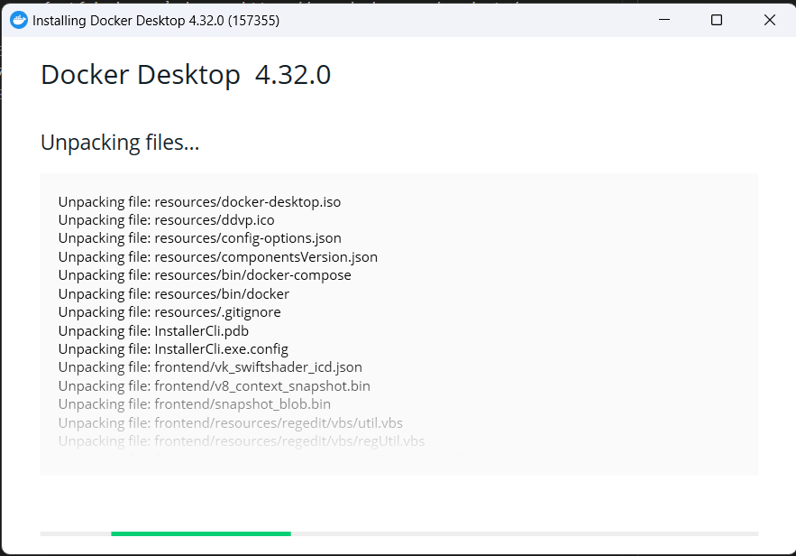
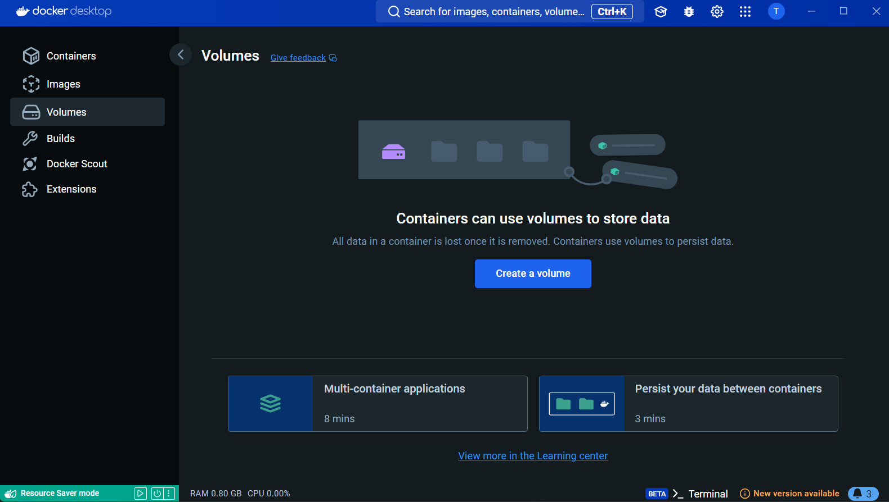
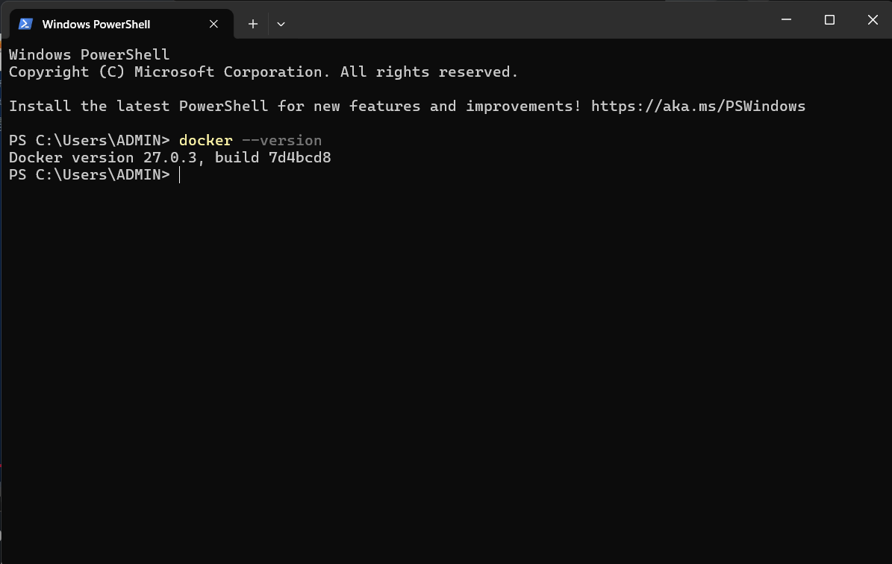

# CÀI ĐẶT DOCKER TRÊN WINDOW 

# 1. CÀI ĐẶT DOCKER TRÊN WINDOW 

**Bước 1**: Truy cập link sau và tải phiên bản phù hợp với máy tính đang sử dụng : https://www.docker.com/products/docker-desktop/

**Bước 2**: Chạy chương trình đã tải về 

Lần đầu mở ứng dụng, bạn cần đăng nhập để có thể sử dụng. Dưới đây là giao diện sau khi đăng nhập

**Bước 3**:Kiểm tra lại bằng window powershell  
Như vậy là ta đã cài đặt thành công Docker version 27.0.3

