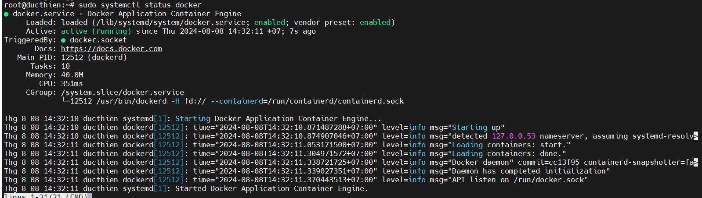

# Cài đặt Docker trên Ubuntu 22.04

Bước 1: Cập nhật repositories

```
sudo apt update
sudo apt upgrade
```

Bước 2: Cài đặt các gói cần thiết
```
sudo apt install lsb-release apt-transport-https ca-certificates curl software-properties-common -y
```

Bước 3: Thêm repository Docker vào system source

Để thêm repo Docker vào system source, nhập Docker GPG key để kết nối với kho Docker:
```
curl -fsSL https://download.docker.com/linux/ubuntu/gpg | sudo gpg --dearmor -o /usr/share/keyrings/docker-archive-keyring.gpg
```

Sau đó, chạy lệnh sau để thêm repo Docker vào source list của hệ điều hành:
```
echo "deb [arch=$(dpkg --print-architecture) signed-by=/usr/share/keyrings/docker-archive-keyring.gpg] https://download.docker.com/linux/ubuntu $(lsb_release -cs) stable" | sudo tee /etc/apt/sources.list.d/docker.list > /dev/null
```

Bước 5: Cài đặt Docker trên Ubuntu 22.04

```
sudo apt install docker-ce -y
```

Bước 6: Kiểm tra trạng thái Docker

```
sudo systemctl status docker
```




Bước 6: Kiểm tra hoạt động Docker trên Ubuntu 22.04

Sau khi cài đặt Docker, bạn có thể sử dụng Docker để tải và chạy test container bất kỳ.
Ví dụ, lệnh bên dưới sẽ tải “hello-world” test container:
```
sudo docker run hello-world
```