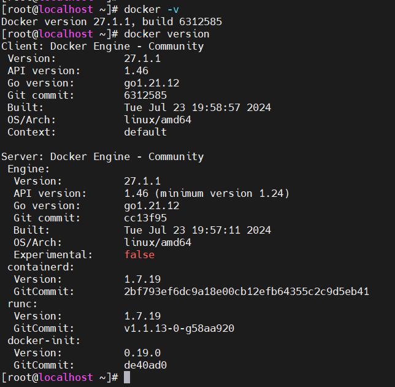
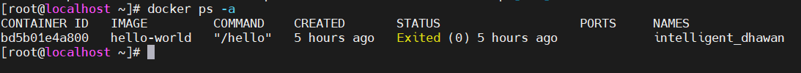

# Docker Command Cơ Bản

# 1.Cú pháp chung
```
docker [OPTIONS] COMMAND [ARG...]
```
hoặc
```
docker [MANAGERMENT_CATEGORY] [OPTIONS] COMMAND [ARG...]
```

Trong đó 

- **docker**: Bản thân lệnh Docker.
- **[MANAGEMENT_CATEGORY]**: Chỉ định những gì bạn muốn quản lý (ví dụ: vùng chứa, hình ảnh, ổ đĩa, mạng, v.v.).
- **[OPTIONS]**: Các flag hoặc thiết lập tùy chọn để sửa đổi hành vi của lệnh.
- **COMMAND**: Hành động bạn muốn thực hiện (ví dụ: run, start, stop, build).
- **[ARG...]**: Các đối số bổ sung cần thiết cho lệnh, chẳng hạn như tên vùng chứa, thẻ hình ảnh hoặc đường dẫn.

# 2.Version
Hiển thị thông tin chi tiết về các phiên bản docker (docker client và docker server).

```
docker -v
docker version
```



# 3.Login

Đăng nhập vào docker registry. Docker registry sẽ là nơi lưu trữ và phân phối docker image của chính bạn.

```
docker login
```

Mặc định docker sẽ đăng nhập vào Docker Hub. Nếu bạn muốn đăng nhập vào một host khác ngoài Docker Hub thì rất đơn giản, bạn chỉ cần thêm nó vào đằng sau lệnh trên. Chẳng hạn
```
docker login localhost:8080
```

# 4.ps

Liệt kê các container đang chạy. Và option hay dùng với lệnh ps đó là `-a ` - liệt kê tất cả các container đang có trong hệ thống

```
docker ps -a 
```


Cột status, Up có nghĩa là đang chạy còn Exited là đã stop.

# 5.docker system
docker system là các lệnh dùng để quản lý docker

- Hiển thị thông tin dung lượng bộ nhớ (disk space) được sử dụng bởi docker bao gồm image, container, volume, cache.

```
docker system df
```

- Hiển thị realtime event từ phía server

```
docker system events
```

- Hiển thị thông tin của toàn hệ thống như số lượng container (đang chạy, dừng), số lượng image, ...

```
docker system info
```

- Xóa bỏ những thành phần không sử dụng

```
docker system prune
```

# 6.prune
Lệnh này giúp chúng ta loại bỏ tất cả container, image, network, và build cache không được sử dụng. Và một option bổ sung nữa đó là loại bỏ tất cả volume không sử dụng. Giúp phóng kha khá dung lượng bộ nhớ.

- Loại bỏ tất cả container, image, network, và build cache không được sử dụng

```
docker system prune
```

- Loại bỏ tất cả container, image, network, build cache và volume không được sử dụng

```
docker system prune -a --volumes
```

# 7.image

Cú pháp
```
docker image COMMAND
```

Các lệnh thường dùng với docker image

- Thực hiện build image từ Dockerfile

```
docker image build
```

- Hiển thị history của một image như thời gian tạo, kích thước và cách image được tạo ra.

```
docker image history IMAGE
```

- Hiển thị thông tin chi tiết của một image, đặc biệt là các layer tạo ra nó.
```
docker image inspect IMAGE
```

- Hiển thị danh sách các image (có thể dùng docker images thay thế) với các thông tin về tên image, tag, image id, size và thời gian tạo
```
docker image ls
```

- Xóa bỏ các image không sử dụng (dangling image)
```
docker image prune
```

- Push image của bạn lên docker registry. Để làm được điều này bạn cần phải thực hiện docker login trước
```
docker image push
```

- Xóa bỏ một hoặc nhiều image được chỉ định.

```
docker image rm
```

# 8.build

Cú pháp

```
docker image build [OPTIONS] PATH | URL | -
```

# 9.Container

Cú pháp 

```
docker container COMMAND
```

- `docker container create IMAGE`: khởi tạo container từ một image

- `docker container inspect CONTAINER`: hiển thị chi tiết thông tin của container

- `docker container logs CONTAINER`: hiển thị logs của một container

- `docker container ls`: liệt kê tất cả container hiện có

- `docker container prune`: xóa bỏ tất cả các container không hoạt động

- `docker container rm`: xóa bỏ một hoặc nhiều container

- `docker container run IMAGE`: khởi tạo và chạy một container từ một image

- `docker container start`: khởi chạy container

- `docker container stop`: chấm dứt hoạt động của container đang chạy

# 10.Create, start và run
Đây là 3 lệnh thường sử dụng khi bắt đầu làm việc với container. Để thực thi một container thì bạn cần khởi tạo container từ image và chạy nó. Để làm được điều này bạn có 2 cách 
- Cách 1: dùng docker container create để tạo container từ image và dùng docker container start để khởi chạy

```
docker container create --name CONTAINER_NAME IMAGE
docker container start CONTAINER
```

- Cách 2: dùng docker run để tạo container từ image và chạy nó

```
docker container run --name CONTAINER_NAME -d IMAGE --rm
```

# 11.Stop and kill

Có 2 cách để dừng một container đang chạy đó là dùng lệnh `docker container stop` và lệnh `docker container kill`

- `docker container stop CONTAINER` : mặc định cung cấp 10 giây để container có thể hoàn thành nốt các task của nó trước khi dừng hoạt động.

- `docker container kill CONTAINER` : dừng hoạt động ngay lập tức.