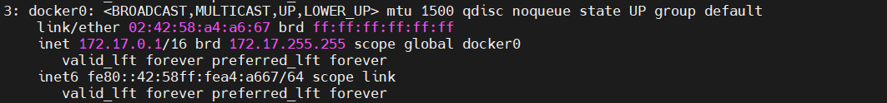

# TÌM HIỂU VỀ DOCKER NETWORK

# 1. Docker network là gì 

Docker network sẽ đảm nhiệm nhiệm vụ kết nối mạng giữa các container với nhau, kết nối giữa container với bên ngoài, cũng như kết nối giữa các cụm (swarm) docker containers.

# 2. Các loại network drivers của Docker

Hệ thống network Docker là dạng plugable, sử dụng drivers. Hầu hết các driver được cung cấp mặc định, với các chức năng cốt lõi của các chức năng mạng thông thường.

**1. BRIDGE**   
Đây là driver mạng default của Docker. Nếu không chỉ định driver thì bridge sẽ là driver mạng mặc định khi khởi tạo.
Khi chúng ta cài đặt Docker, virtual bridge docker0 sẽ được tạo ra, docker tìm một subnet chưa được dùng trên host và gán một địa chỉ cho `docker0`

Bridge network thường được sử dụng khi cần chạy ứng dụng dưới dạng các container độc lập cần giao tiếp với nhau. Các container trong cùng mạng có thể giao tiếp với nhau qua địa chỉ IP. Docker không hỗ trợ nhận diện host ở mạng này, vì vậy muốn connect thì phải dùng options links để docker có thể hiểu được địa chỉ của các service.

Bridge là driver tốt nhất cho việc giao tiếp multiple containers ở một host đơn.

**2. HOST**   
Dùng khi container cần giao tiếp với host và sử dụng luôn mạng ở host, vì sử dụng mạng của máy chủ đang chạy nên không còn lớp mạng nào giữa container với Docker Host phù hợp khi cần connect từ container ra thẳng ngoài host

**3. OVERLAY**   
Mạng lớp phủ - Overlay network tạo một mạng phân tán giữa nhiều máy chủ Docker. Kết nối nhiều Docker daemons với nhau và cho phép các cụm services giao tiếp với nhau. Chúng ta có thể sử dụng overlay network để giao tiếp dễ dàng giữa cụm các services với một container độc lập, hay giữa 2 container với nhau ở khác máy chủ Docker daemons.

Nhờ Overlay network, không cần các công việc thiết lập routing giữa các container thông qua hệ điều hành. Overlay network tạo nên một lớp phủ trên mạng của máy chủ và cho phép container kết nối đến (bao gồm cả các cụm containers) để giao tiếp một cách bảo mật. Docker đảm bảo định tuyến các gói tin đến và đi đúng container đích.

**4. MACVLAN**  
Mạng Macvlan cho phép chúng ta gán địa chỉ MAC cho container, điều này làm cho mỗi container như là một thiết bị vật lý trong mạng. Docker daemon định tuyến truy cập tới container bởi địa chỉ MAC. Sử dụng driver macvlan là lựa chon tốt khi các ứng dụng khác cần phải connect đến theo địa chỉ vật lý hơn là thông qua các lớp mạng của máy chủ.

**5. NONE**  
Với container không cần networking hoặc cần disable đi tất cả mọi networking, chúng ta sẽ chọn driver này. Thường được dùng với mạng tùy chỉnh. Driver này không thể dùng trong cụm swarm.