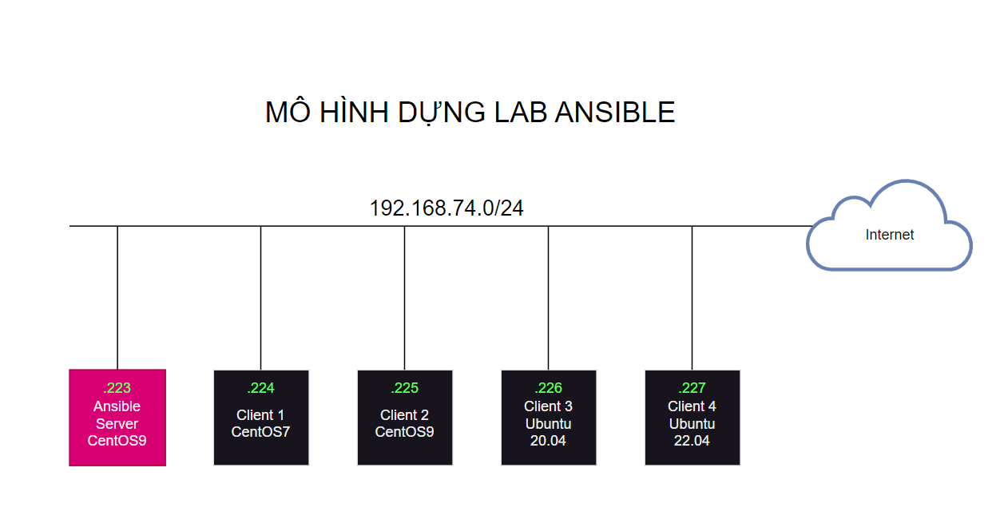
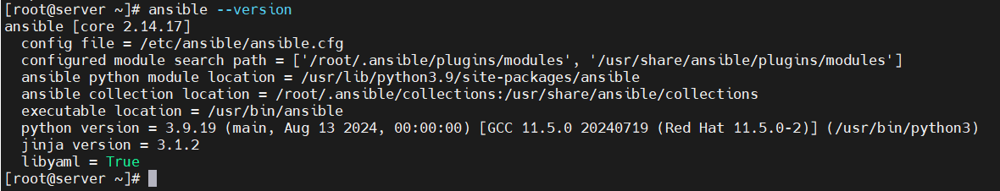

# Cài đặt Ansible trên Centos 9

# 1. Mô hình 



Trong mô hình này mình sẽ sử dụng những hệ điều hành phổ biến hiện nay 

- Dải mạng : 192.168.74.0/24
- Ansible Server: CentOS 9
- Client : CentOS 7, CentOS 9, Ubuntu 20.04, Ubuntu 22.04

# 2. IP Planning


|Hostname|	OS|	IP|
|---|---|---|
|AnsibleServer|	CentOS9|	192.168.74.223|
|Client1|	CentOS7|	192.168.74.224|
|Client2|	CentOS9|	192.168.74.225|
|Client3|	Ubuntu 20.04|	192.168.74.226|
|Client4|	Ubuntu 22.04|	192.168.74.227|

# 3. Cài đặt ansible trên node Ansible Server

Cài đặt kho lưu trữ và update

```
yum install -y epel-release 
yum update -y
```

Cài đặt ansible 
```
yum install -y ansible
```
Kiểm tra lại phiên bản ansible sau khi cài bằng lệnh `anssible --version`. Ta có kết quả phiên bản ở dưới.

