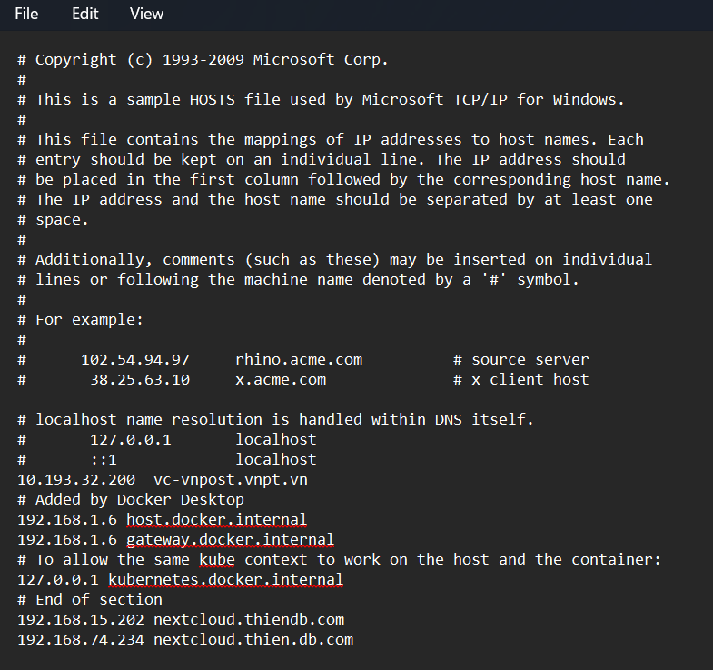

# CÀI ĐẶT NEXTCLOUD TRÊN UBUNTU 22.04


# 1.Update cập nhật lại hệ thống 
```
sudo apt update && sudo apt upgrade -y
```

# 2.Cài đặt apache2
```
apt-get install apache2 -y
systemctl start apache2
systemctl enable apache2
```

# 3.Cài đặt Mariadb
```
apt install mariadb-server -y
systemctl start mariadb
systemctl enable mariadb
```

# 4.Tạo user và mật khẩu cho NextCloud:
```
mysql -u root -p
CREATE DATABASE nextcloud;
CREATE USER 'nc_bdt'@'localhost' IDENTIFIED BY 'abc123';
GRANT ALL PRIVILEGES ON nextcloud.* TO 'nc_bdt'@'localhost';
FLUSH PRIVILEGES;
exit
```

# 5.Cài đặt PHP
```
apt install -y libapache2-mod-php php-gd php-mysql \
php-curl php-mbstring php-intl php-gmp php-bcmath php-xml php-imagick php-zip
```

# 6.Cài đặt NextCloud

**Truy cập trang web lựa chọn version muốn cài đặt** : https://download.nextcloud.com/server/releases/   
**Tài source NextCloud từ trang chủ về**
```
wget https://download.nextcloud.com/server/releases/nextcloud-29.0.6.tar.bz2
wget https://download.nextcloud.com/server/releases/nextcloud-29.0.6.tar.bz2.asc
wget https://download.nextcloud.com/server/releases/nextcloud-29.0.6.tar.bz2.md5
wget https://nextcloud.com/nextcloud.asc
```
**Kiểm tra source tải về**
```
md5sum -c nextcloud-29.0.6.tar.bz2.md5 < nextcloud-29.0.6.tar.bz2
gpg --import nextcloud.asc
gpg --verify nextcloud-29.0.6.tar.bz2.asc nextcloud-29.0.6.tar.bz2
```

**Giải nén giữ liệu**
```
tar -xjvf nextcloud-29.0.6.tar.bz2
```

**Sao chép thư mục Nextcloud đến đường dẫn thư mục chung cấu hình web**
```
sudo cp -r nextcloud /var/www
```

**Thay đổi quyền sở hữu các thư mục Nextcloud**
```
sudo chown -R www-data:www-data /var/www/nextcloud
```

# 7.Cấu hình vhost cho Nextcloud:

**Truy cập file cấu hình**: cat `/etc/apache2/sites-available/nextcloud.conf`    
Thêm nội dung phía dưới vào trong file

```
<VirtualHost *:80>
  ServerAdmin admin@localhost.local
  DocumentRoot /var/www/nextcloud/
  ServerName  192.168.74.234

  <Directory /var/www/nextcloud/>
    Require all granted
    AllowOverride All
    Options FollowSymLinks MultiViews

    <IfModule mod_dav.c>
      Dav off
    </IfModule>
  </Directory>
  ErrorLog /var/log/apache2/nextcloud.yourdomain.com-error.log
  CustomLog /var/log/apache2/nextcloud.yourdomain.com-access.log combined
</VirtualHost>
```

**Kích hoạt tệp cấu hình Nextcloud**

```
systemctl reload apache2
a2ensite nextcloud.conf
```
**Kích hoạt mô-đun rewrite**
```
systemctl restart apache2
a2enmod rewrite
```
**Enable các mode hỗ trợ**
```
systemctl restart apache2
a2enmod headers
a2enmod env
a2enmod dir
a2enmod mime
```
**Đổi tên file dafault apache**
```
mv /etc/apache2/sites-available/000-default.{conf,conf.bk}
```
# 8. Chỉnh sửa file host 
Truy cập file host thêm domain phân giải tên miền (tùy nhu cầu ): `etc/hosts`
```
192.168.74.234 nextcloud.thien.db.com
```


Thêm domain trên máy tính của bạn: `C:\Windows\System32\drivers\etc`
Chỉnh sửa file hosts



# 9. Truy cập web Nextcloud

Vào đường dẫn : `http://192.168.74.234` hoặc tên miền `http://nextcloud.thien.db.com`

Tạo tài khoản admin như sau:
- User: nc_bdt
- Password: abc123

Nhập thông tin kết nối Database đã khởi tạo ở trên:
- nc_bdt
- abc123
- nextcloud
- localhost  

Sau đó chọn Install. Đợi 1-2 phút để hệ thống cài đặt và hiện ra giao diện gợi ý các app nên cài đặt. Có thể thực hiện cài đặt hoặc bỏ qua.


*Tài liệu tham khảo*

[1] [https://docs.nextcloud.com/server/latest/admin_manual/installation/example_ubuntu.html#next-steps](https://docs.nextcloud.com/server/latest/admin_manual/installation/example_ubuntu.html#next-steps)   
[2] [https://docs.nextcloud.com/server/latest/admin_manual/installation/source_installation.html#installation-wizard](https://docs.nextcloud.com/server/latest/admin_manual/installation/source_installation.html#installation-wizard)   
[3] [https://docs.nextcloud.com/server/29/admin_manual/installation/installation_wizard.html#trusted-domains](https://docs.nextcloud.com/server/29/admin_manual/installation/installation_wizard.html#trusted-domains)