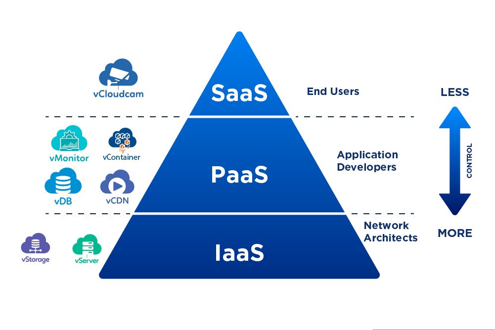
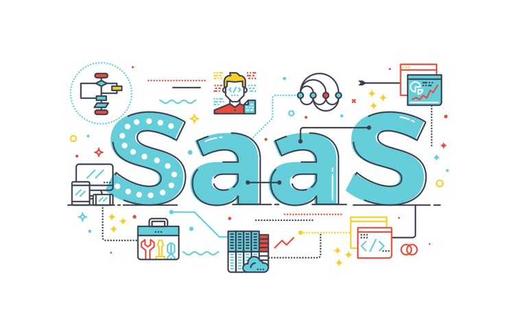
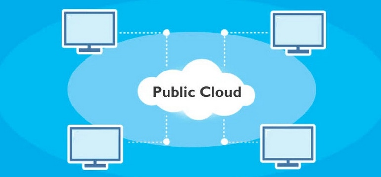

# TÌM HIỂU VỀ CLOUD COMPUTING - ĐIỆN TOÁN ĐÁM MÂY 

# 1.Cloud computing
## 1.1. Cloud computing là gì
Cloud computing hay Cloud compute (Điện toán đám mây) là mô hình cung cấp tài nguyên máy tính như máy chủ, lưu trữ dữ liệu, mạng, và ứng dụng thông qua internet. Thay vì phải mua và quản lý cơ sở hạ tầng máy tính riêng, người dùng có thể thuê hoặc sử dụng các dịch vụ này từ các nhà cung cấp dịch vụ đám mây.

## 1.2. Mô hình dịch vụ

Cloud computing chia ra làm 3 mô hình dịch vụ chính.

**1. Infrastructure as a Service (IaaS)**:  
Cung cấp tài nguyên cơ bản như máy chủ ảo, mạng và lưu trữ. Người dùng có toàn quyền kiểm soát hệ điều hành và ứng dụng 

**2. Platform as a Service (PaaS)**:  
Cung cấp môi trường phát triển ứng dụng, bao gồm cơ sở hạ tầng và các công cụ phát triển. Người dùng chỉ quan tâm đến việc phát triển ứng dụng mà không cần lo lắng về hạ tầng

**3. Software as a Service (SaaS)**:   
Cung cấp các ứng dụng sẵn sàng sử dụng qua mạng. Người dùng không cần cài đặt hoặc quản lý ứng dụng mà chỉ cần truy cập chúng qua trình duyệt web.

## 1.3. Mô hình triển khai 

Cloud computing chia thành 4 mô hình cơ bản. Mô hình điện toán đám mây lại có ưu điểm và hạn chế nhất định 

**1. Public Cloud**

Đây là mô hình cloud computing ứng dụng phổ biến nhất hiện nay. Phần lớn dịch vụ trên public cloud thường nằm trong cùng hệ thống cloud. Có nghĩa tất cả người dùng có quyền sử dụng nguồn tài nguyên trong hệ thống này. Chuyển nhà cung cấp giữ vai trò trực tiếp quản lý, đảm bảo an toàn phần dữ liệu nằm trên hệ thống điện toán đám mây công khai 

**Ưu điểm**
- Có thể cùng lúc phục vụ nhiều người dùng, không giới hạn bởi không gian và thời gian truy cập.
- Phí đầu tư thấp, tiết giảm đáng kể khi không cần xây dựng hệ thống máy chủ quá đồ sộ
- Tiết giảm nhân lực và thời gian quản lý cơ sở hạ tầng
- Linh hoạt thay đổi theo nhu cầu sử dụng thực tế một người dùng

**Nhược điểm**
- Độ an toàn thấp
- Hệ thống public cloud khó kiểm soát 

**2. Private Cloud**

Private Cloud - dịch vụ điện toán đám mây riêng tư, cung cấp cho doanh nghiệp giải pháp lưu trữ an toàn. Mô hình cloud computing này có nhiệm vụ bảo vệ dữ liệu trong tường lửa, trực tiếp quản lý bởi cá nhân hoặc doanh nghiệp

**Ưu điểm**
- Chủ động linh hoạt trong quá trình sử dụng, quản lý kho dữ liệu
- Bảo mật thông tin một cách hiệu quả

**Nhược điểm**

- Quy trình triển khai công nghệ phức tạp 
- Tiêu tống chi phí quản lý, duy trì hoạt động của hệ thống
- Chủ yếu phục vụ trong phạm vi nội bộ doanh nghiệp, người dùng bên ngoài hệ thống khó tiếp cận

**3. Hybird Cloud**

Hybird cloud - Đây là mô hình kết hợp giữa public cloud và private cloud. Mô hình này khắc phục tốt nhược điểm của mô 2 mô hình trên 

**Ưu điểm**
- Lưu trữ các dữ liệu quan trọng một cách an toàn 
- Tích hợp nhiều dịch vụ điện toán đám mây hữu ích, không bị giới hạn

**Nhược điểm**
- Quá trình triển khai, quản lý hệ thống vẫn còn khó khăn 
- Tiêu tốn chi phí đầu tư xây dựng hạ tầng

**4. Community Cloud**

Đây là mô hình cloud computing công cộng yêu cầu chia sẻ hạ tầng, dữ liệu tới các tổ chức, người dùng cá nhân. 

**Ưu điểm**
- Mỗi tổ chức doanh nghiệp, cá nhân hoạt động trong cùng lĩnh vực được tạo điều kiện để chia sẻ thông tin
- Đảm bảo yếu tố riêng tư, an toàn và tuân thủ đầy đủ các chính sách bảo mật

**Nhược điểm**
- Quy trình quản lý, điều hành còn hơi phức tạp
- Yêu cầu phí đầu tư triển khai cao

# 2. Ứng dụng và lợi ích

## 2.1. Ứng dụng của mô hình cloud computing

- **Cở sở dữ liệu đám mây**: Cloud computing cung cấp khả năng lưu trữ và quản lý cơ sở dữ liệu trực tuyến một cách hiệu quả, giúp doanh nghiệp truy cập dữ liệu mọi lúc mọi nơi
- **Kiểm tra, phát triển website và ứng dụng**: Những người phát triển website có thể sử dụng môi trường điện toán đma mây để kiểm tra và phát triển website, ứng dụng một cách linh hoạt, tiết kiệm hơn
- **Phân tích và quản lý dữ liệu (Big data)**: Cloud Computing cung cấp khả năng xử lý và phân tích dữ liệu lớn, giúp các doanh nghiệp đưa ra quyết định dựa trên dữ liệu
- **Lưu trữ dữ liệu website thông qua cloud server**: Doanh nghiệp có thể lưu trữ dữ liệu trên các máy chủ cloud nhằm đảm bảo tính an toàn và sẵn sàng của dữ liệu
- **Chia sẻ dữ liệu dễ dàng**: Cloud computing cũng cho phép người dùng lưu trữ, chia sẻ tệp và dữ liệu qua các nền tảng trực tuyến một cách thuận tiện

## 2.2. Lợi ích của Cloud Computing

- Chi phí: Tiết kiệm hơn khi không phải đầu tư cả một hệ thống máy chủ để lưu trữ dữ liệu, chi phí vận hành, bảo dưỡng hàng năm 
- Tính mở rộng: Bạn được phân phối đúng lượng tài nguyên cần thiết với nhu cầu sử dụng, bổ sung bất cứ khi nào phát sinh nhu cầu
- Hiệu năng: cloud computing chạy trên mạng lưới trung tâm dữ liệu an toàn trên thế giới, được thường xuyên nâng cấp để tăng hiệu quả và mức độ bảo mật. 
- Bảo mật: Nhà cung cấp dịch vụ cloud sẽ đi kèm các chính sách, công nghệ và kiểm soát nhằm củng cố tính bảo mật của bạn.
- Tốc độ: Đáp ứng dịch vụ sử dụng nhanh chóng, nhu cầu có thể thay đổi và tài nguyên đáp ứng nhanh chóng
- Độ tin cậy: Các đơn vị trung gian cung cấp dịch vụ cloud, máy chủ luôn có các biện pháp giúp người dùng sao lưu và bảo vệ dữ liệu, ngoài ra còn có thể khôi phục dữ liệu nếu bị tấn công 
