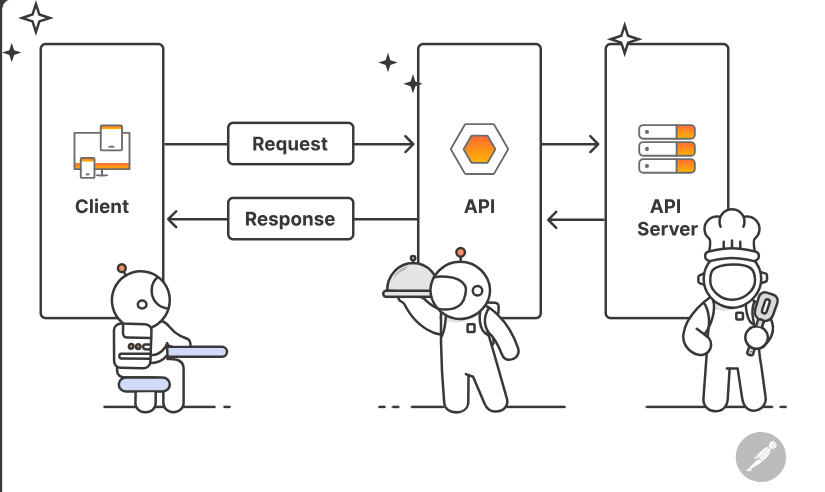
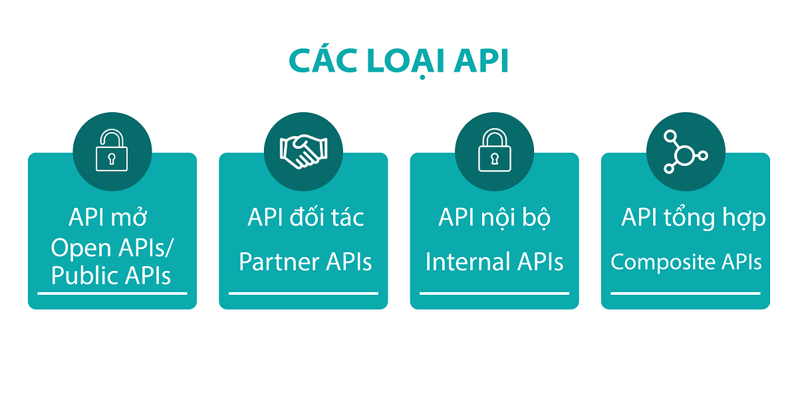

# TÌM HIỂU VỀ API VÀ SỬ DỤNG CURL ĐỂ GỌI API

# 1. Tổng quan API
## 1.1.API là gì

Về mặt kỹ thuật, API là viết tắt của Giao diện lập trình ứng dụng (Application Programming Interface).

API là một trung gian phần mềm cho phép hai ứng dụng giao tiếp với nhau, có thể sử dụng cho web-based system, operating system, database system, computer hardware, or software library.

Ở dạng đơn giản nhất, API là giao diện cho phép một ứng dụng giao tiếp với ứng dụng khác thông qua các lệnh đơn giản và cách các lệnh này được gửi và định dạng mà dữ liệu được truy xuất thông qua API có thể khác với API SOAP hoặc REST.

## 1.2. Các loại API

API được phân loại theo cả kiến trúc và phạm vi sử dụng. Có 4 loại API:
- **Open APIs hoặc Public APIs (API mở)**: Còn có tên gọi khác là API công khai, có sẵn nên có thể được sử dụng bởi bất kỳ nhà phát triển nào. Đổi lại, các Open APIs thông thường sẽ yêu cầu các biện pháp xác thực hoặc ủy quyền thấp và bị hạn chế chức năng khi chia sẻ công khai. Một số Open APIs sẽ được chia sẻ miễn phí, một số khác sẽ yêu cầu tính phí khi sử dụng. Chi phí này thường được tính dựa trên số lượng “lệnh gọi” (calls) đến API được sử dụng.
- **Partner APIs (API đối tác)**: API này cần có quyền hoặc giấy phép cụ thể mới truy cập được. Thường dành cho các nhà phát triển bên ngoài ủy quyền để hỗ trợ đầu mối hợp tác giữa doanh nghiệp với doanh nghiệp. Một số doanh nghiệp lựa chọn Partner APIs vì muốn kiểm soát tốt hơn người dùng có thể truy cập vào tài nguyên của họ và chỉ rõ cách thức sử dụng các tài nguyên đó.
- **Internal APIs (API nội bộ)**: Không giống như API mở hay API đối tác, API nội bộ không dành cho các bên thứ ba sử dụng, thường dùng trong phạm vi công ty. Công ty sử dụng API này để để kết nối các hệ thống cũng như dữ liệu nội bộ của công ty/tổ chức.
- **Composite APIs (API tổng hợp)**: Kết hợp hai hay nhiều API khác nhau để giải quyết các yêu cầu phức tạp của hệ thống. Nếu cần dữ liệu từ các ứng dụng hoặc từ nhiều nguồn dữ liệu khác nhau, bạn nên sử dụng API tổng hợp. Ngoài ra, bạn có thể sử dụng API tổng hợp để thiết lập một chuỗi các “lệnh gọi” (calls) và phản hồi tự động mà không cần chủ động can thiệp vào.

## 1.3. Cách hoạt động 

API giao tiếp thông qua một tập hợp các quy tắc để xác định phương thức mà các máy tính, ứng dụng hoặc máy móc có thể tương tác với nhau. API hoạt động như một người trung gian giữa hai thiết bị bất kỳ muốn kết nối với nhau phục vụ cho một tác vụ được chỉ định.

**Về request**

Một cái request đúng chuẩn cần có 4 thứ:

1. URL
- URL là địa chỉ duy nhất cho 1 request, thường là đường dẫn tới một hàm xử lí logic.
2. Method   
HTTP request có tất cả 9 loại method , 2 loại được sử dụng phổ biến nhất là GET và POST
- **GET**: Sử dụng để lấy thông tin từ server theo URI đã cung cấp.
- **HEAD**: Giống với GET nhưng response trả về không có body, chỉ có header.
- **POST**: Gửi thông tin tới sever thông qua các parameters HTTP.
- **PUT**: Ghi đè tất cả thông tin của đối tượng với những gì được gửi lên.
- **PATCH**: Ghi đè các thông tin được thay đổi của đối tượng.
- **DELETE**: Xóa resource trên server.
- **CONNECT**: Thiết lập một kết nối tới server theo URI.
- **OPTIONS**: Mô tả các tùy chọn giao tiếp cho resource.
- **TRACE**: Thực hiện một bài test loop-back theo đường dẫn đến resource.
3. Headers   
- Là nơi chứa các thông tin cần thiết của 1 request nhưng end-users không biết có sự tồn tại của nó.   
Ví dụ: độ dài của request body, thời gian gửi request, loại thiết bị đang sử dụng, loại định dạng cái response mà client có đọc được…
4. Body  
- Là nơi chứa thông tin mà client sẽ điền.

**Về response**

Sau khi nhận được request từ phía client, server sẽ xử lý cái request đó và gửi ngược lại cho client 1 cái response. Cấu trúc của 1 response tương đối giống phần request nhưng Status code sẽ thay thế cho URL và Method. Tóm lại, nó có cầu trúc 3 phần:

- Status code
- Headers
- Body
Phần Header và body tương đối giống với request.

**Status code của response**

Status code (Mã hóa trạng thái thường được gọi là mã trạng thái) là một số nguyên 3 ký tự, trong đó ký tự đầu tiên của Status-Code định nghĩa loại Response và hai ký tự cuối không có bất cứ vai trò phân loại nào. Có 5 giá trị của ký tự đầu tiên:

- **1xx**: Information (Thông tin): Khi nhận được những mã như vậy tức là request đã được server tiếp nhận và quá trình xử lý request đang được tiếp tục.
- **2xx**: Success (Thành công): Khi nhận được những mã như vậy tức là request đã được server tiếp nhận, hiểu và xử lý thành công
- **3xx**: Redirection (Chuyển hướng): Mã trạng thái này cho biết client cần có thêm action để hoàn thành request
- **4xx**: Client Error (Lỗi Client): Nó nghĩa là request chứa cú pháp không chính xác hoặc không được thực hiện.
- **5xx**: Server Error (Lỗi Server): Nó nghĩa là Server thất bại với việc thực hiện một request nhìn như có vẻ khả thi.

# 2. RESTful API là gì?